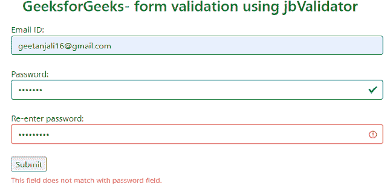
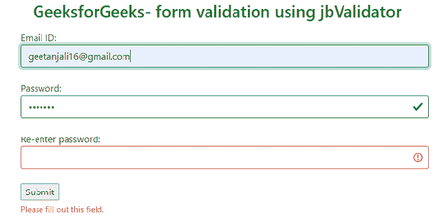
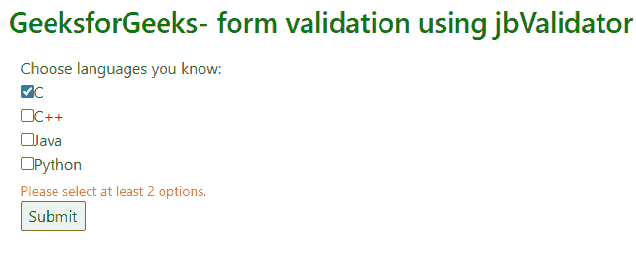
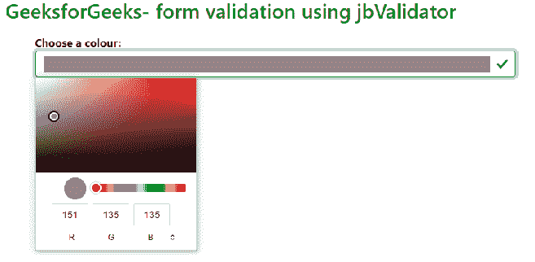
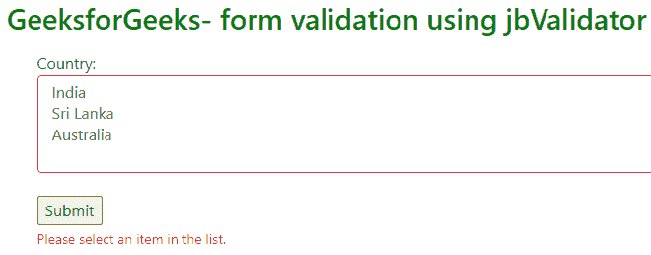
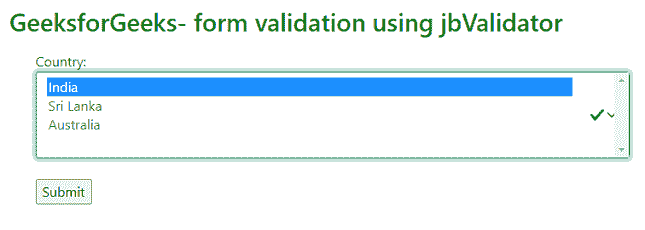
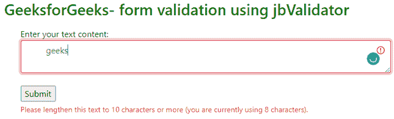
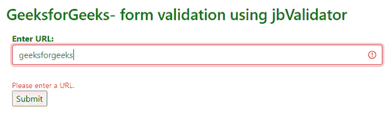
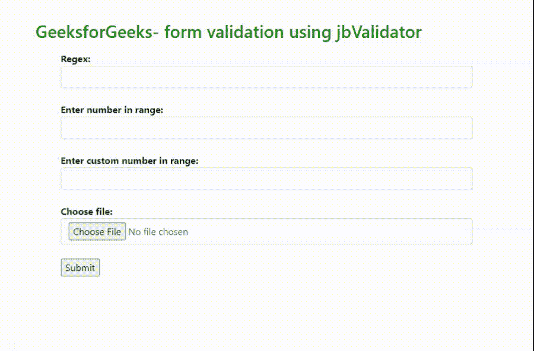

# 使用 jbvalidator 插件进行表单验证

> 原文:[https://www . geesforgeks . org/form-validator-使用-jbvalidator-plugin/](https://www.geeksforgeeks.org/form-validation-using-the-jbvalidator-plugin/)

**jbvalidator** 是一个基于 jQuery 和 Bootstrap 的插件，支持客户端和服务器表单验证。提供的 HTML 数据属性易于使用和理解。该插件提供多语言功能以及自定义验证规则和消息。

从[官网下载需要的预编译文件即可使用该插件。](https://github.com/emretulek/jbvalidator)脚本文件可以包含在需要验证的页面中。

以下示例演示了不同类型的可用验证:

**示例 1:** 以下代码演示了电子邮件 id 和密码的表单验证。

## 超文本标记语言

```html
<!DOCTYPE html>
<html>
<head>
  <!-- Include Bootstrap CSS and JavaScript file -->
  <link href=
"https://cdn.jsdelivr.net/npm/bootstrap@5.0.0-alpha3/dist/css/bootstrap.min.css"
        rel="stylesheet">
  <script
src="https://stackpath.bootstrapcdn.com/bootstrap/5.0.0-alpha2/js/bootstrap.bundle.min.js">
  </script>

  <!-- Include jQuery -->
  <script
src="https://code.jquery.com/jquery-3.5.1.min.js"
          crossorigin="anonymous">
  </script>

  <!-- Include the jbvalidator script -->
  <script src="dist/jbvalidator.min.js">
  </script>
</head>
<body>
  <br>
  <h2 style="color:green; padding: 10px 60px;">
    GeeksforGeeks- form validation using jbValidator
  </h2>
  <div class="container">
    <form class="needs-validation" novalidate>

      Email ID:<br>
      <input type="email" class="form-control"
             placeholder="name@mailid.com" required>
      <br>
      Password:<br>
      <input type="password" class="form-control"
             id="password" title="password" required>
      <br>
      Re-enter password:<br>
      <input name="repassword" type="password"
             class="form-control"
             data-v-equal="#password" required>
      <br>
      <input type="submit" value="Submit">
    </form>
  </div>
  <script>
    $(function () {

      // Select the form elements that
      // need validation and
      // initialize the validator
      let validator = $('form.needs-validation')
                                  .jbvalidator({

        // Show error message
        errorMessage: true,

        // Change the appearance of the form
        // when correct information is entered
        successClass: true,

        // Specify the language file for
        // the error and help text
        language: 'dist/lang/en.json'
      });
    })
  </script>
</body>
</html>
```

**输出:**

*   当用户输入的密码不匹配时。



当密码不匹配时

*   当用户给出不完整的信息时。



**示例 2:** 下面的代码片段演示了复选框的验证。请在**表单**元素中使用上述 HTML 代码中的代码片段。

## 超文本标记语言

```html
<form class="needs-validation" novalidate>

  <!-- The data-v-min-select attribute specifies
       that a minimum of 2 options must
       be checked -->
  <div data-checkbox-group data-v-min-select="2"
       data-v-required>
    Choose languages you know:
    <br>
    <input type="checkbox" name="C"
           value="yes">C
    <br>
    <input type="checkbox" name="C++"
           value="yes">C++
    <br>
    <input type="checkbox" name="Java"
           value="yes">Java
    <br>
    <input type="checkbox" name="Python"
           value="yes">Python
    <br>

  </div>
  <input type="submit" value="Submit">
</form>
```

**输出:**



**示例 3:** 下面的代码片段演示了在用户表单元素中使用颜色面板。

## 超文本标记语言

```html
<form class="needs-validation" novalidate>
  <b>Choose a colour: </b>
  <br>

  <!-- The required attribute makes it
       necessary to specify a color -->
  <input type="color" name="color"
         class="form-control"
         required>
  <br>
  <input type="submit" value="Submit">
</form>
```

**输出:**



**示例 4:** 下面的代码片段演示了用户表单元素中选择框的使用。

## 超文本标记语言

```html
<form class="needs-validation" novalidate>

  <label for="country">Country:</label>
  <!-- The multiple data-v-min-select attribute
       specifies the minimum number of options
       the user has to select -->
  <!-- The multiple data-v-max-select attribute
       specifies the maximum number of options
       the user has to select -->
  <select name="country" id="country" class="form-select"
          multiple data-v-min-select="1"
          data-v-max-select="3"
          required>
    <option value="India">India</option>
    <option value="Sri Lanka">Sri Lanka</option>
    <option value="Australia">Australia</option>
  </select><br>
  <input type="submit" value="Submit">
</form>
```

**输出:**

 

**示例 5:** 下面的代码片段演示了在用户表单元素中使用< textarea >元素。

## 超文本标记语言

```html
<form class="needs-validation" novalidate>
  Enter your text content:<br>

  <!-- The minlength attribute specifies
       the minimum length of the text allowed -->
  <!-- The maxlength attribute specifies
       the maximum length of the text allowed -->
  <textarea class="form-control"
            minlength="10"
            maxlength="120">
  </textarea>
  <br>
  <input type="submit" value="Submit">
</form>
```

**输出:**



**示例 6:** 下面的代码片段演示了 URL 控件在用户表单元素中的使用。

## 超文本标记语言

```html
<form class="needs-validation" novalidate>
  <div>
    <b>Enter URL: </b>
    <br>

    <!-- The placeholder attribute holds the
         text to be used as a placeholder -->
    <!-- The required attribute makes it
         necessary to fill the text -->
    <input type="url" class="form-control"
           placeholder="https://www" required><br>
  </div>
  <input type="submit" value="Submit">
</form>
```

**输出:**



**示例 7:** 下面的代码片段演示了用户表单元素中的其他控件。

## 超文本标记语言

```html
<form class="needs-validation" novalidate>
  <b>Regex:</b>
  <br>

  <!-- The pattern attribute is the regex pattern -->
  <!-- The title attribute is the error text -->
  <input type="text" class="form-control"
         pattern="[0-9]+"
         title="Only numbers." required>
  <br>

  <b>Enter number in range:</b>
  <!-- The min attribute is the
       minimum number allowed -->
  <!-- The max attribute is the
       maximum number allowed -->
  <input type="number" class="form-control"
         min="50"
         max="500" required>
  <br>

  <b>Enter custom number in range:</b>
  <!-- The data-v-min attribute is the
       custom minimum length allowed
       The data-v-max attribute is the
       custom maximum length allowed -->
  <input type="number" class="form-control"
         data-v-min="20"
         data-v-max="100" required>
  <br>

  <b>Choose file:</b>
  <!-- The data-v-min-size attribute is the
       custom minimum file size allowed
       The data-v-max-size attribute is the
       custom maximum file size allowed -->
  <input type="file" class="form-control"
         data-v-min-size="100"
         data-v-max-size="1000">
  <br>

  <input type="submit" value="Submit">
</form>
```

**输出:**

