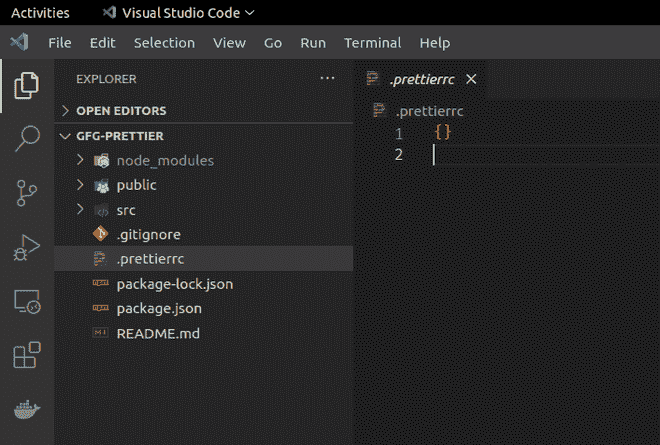
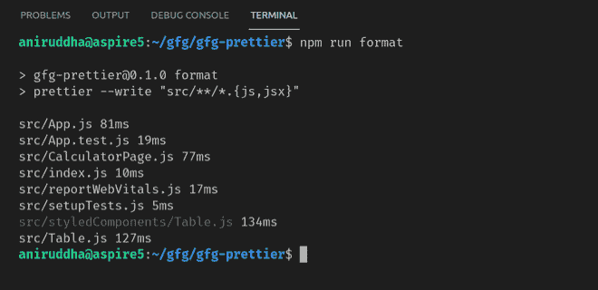
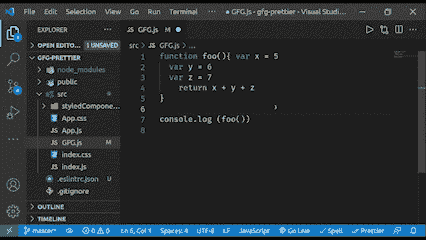

# 用更漂亮的

格式化代码

> 原文:[https://www . geesforgeks . org/formatting-code-with-Beatle/](https://www.geeksforgeeks.org/formatting-code-with-prettier/)

更漂亮的是一个固执己见的代码格式化程序，它将接受您的所有代码，消除代码样式化中代码库中的不一致，并通过在更漂亮的中使用预定义的样式来确保输出代码应该以所需的模式格式化。使用更漂亮的原因如下:

*   它有助于进行适当的对齐，并在代码中的单词之间留出空间，从而增强大尺寸代码的整体可读性。
*   读者可以很容易地理解结构，这将使一个想法的逻辑代码一目了然。
*   由于代码的适当缩进，整个代码的长度和宽度也减少了。代码通常会溢出到右边界，这需要水平滚动，或者会以非结构化的方式换行来破坏形状。
*   如果代码没有遵循任何语法，提供错误消息将有助于我们生成语法正确的代码。
*   它在整个代码库中强制执行正确一致的代码库样式。因此，大规模代码的可维护性要容易得多。
*   更漂亮的支持的语言:JavaScript、TypeScript、JSX、Angular、Vue、CSS、HTML、JSON、GraphQL 等等。

还有很多其他的原因来使用更漂亮的，但是我们不会在这里讨论这些原因。

**但为什么要用更漂亮？**如果一个项目有一个通用的编码风格指南，这通常被认为是一个好的实践，因此，对于维护者来说，维护代码库变得更加容易，对于新手来说，适应这些风格也将最终导致对语法有很好的理解。即使你有你的旧代码库，你也可以在你的代码库上运行更漂亮的代码，它将在几秒钟内重新格式化你所有的海量代码文件。最重要的是，它给了你自由去写你想要的代码，因为你可以立即正确地格式化它。如果你担心接受度，以下是可能的统计数据:

*   被各种大公司使用，如脸书、Spotify、Discord、PayPal、Dropbox、ESLint 等等。
*   Github 上超过 40k+颗星。
*   每周下载量超过 1300 万次。

**安装程序:**为了实现我们代码库中的漂亮器，我们需要遵循某些步骤。

**步骤 1:** 通过运行以下命令，在项目中安装更漂亮的东西:

```
npm install -D prettier
```

**第二步:**在添加了 bearry 作为 devDependency 之后，让我们创建一个名为`的文件。*pretierrc*`这是一个用于更漂亮的配置文件，位于项目目录的根目录下，只需在该文件中添加大括号` {} '，这样任何人都会知道您的项目使用默认配置的更漂亮。



。项目根目录下的 prettierrc 文件

**第 3 步:**现在，让我们在 package.json 的“scripts”属性中添加一个命令来运行 bearry。

```
  "scripts": {
    "format": "prettier --write \"src/**/*.{js,jsx}\""
  },
```

` *npm 运行格式*`命令将格式化每一个` **。js* 或` **。jsx* `文件在“src/”中，即使你的“src/”文件夹包含多个目录在里面，这个 regex 命令也会递归下去并格式化它们。

**输出:**



**编辑器集成:**与代码编辑器配合使用，可以最大限度地发挥 beatric 的优势，beatric 支持 Emacs、Atom、VS Code、Sublime Text、Vim 等多种编辑器。按照以下步骤在 Visual studio 代码中安装更漂亮的程序:

*   在扩展侧边栏搜索扩展“更漂亮-代码格式化程序”并安装它，或者您可以通过[VS market Link](https://marketplace.visualstudio.com/items?itemName=esbenp.prettier-vscode)下载它。
*   在“设置”中，将“更漂亮”设为默认代码格式化程序，搜索此设置“ *editor.defaultFormatter* ”，并将其设为“更漂亮”。
*   如果你需要代码保存后更漂亮地自动格式化，那么搜索这个设置“*editor . formationsave*”并勾选它来打开它。

有时，某些项目可能不使用更漂亮的设置，在这种情况下，您需要禁用此设置，因为即使您的项目没有更漂亮的设置，它也会格式化您的代码。但是我们极客确实有一个解决方案，在设置中，菜单搜索这个设置“*bearry . require config*”并勾选它来打开它，这样做将确保 bearry 只有在有 bearry config 文件(*)的情况下才会格式化代码。pretierrc*)出现在项目目录中。



**ESLint** **集成:**如果您的项目使用 ESLint，那么您可以有一个设置，其中更漂亮的将用于格式化目的，ESLint 将做捕捉 bug 和维护代码质量的工作。请参阅[这篇](https://www.geeksforgeeks.org/how-to-configure-eslint-for-react-projects/)文章，了解在您的项目中设置的 ESLint。
要将 below 与 ESLint 集成，请执行以下步骤:

安装 eslint-config-bearry，这将关闭一些在使用 bearry 时发生冲突的 ESLint 规则

```
npm install -D eslint-config-prettier
```

将“*更漂亮的“*”附加到您的“*. eslintrc **”文件的扩展数组中的最后一个

```
{
  "extends": [
    "eslint:recommended",
    "plugin:import/errors",
    "plugin:react/recommended",
    "plugin:jsx-a11y/recommended",
    "prettier"                        
  ],
  ...
}
```

**结论:**在安装了 ready 并将其与我们的 Code Editor 和 eslit 集成之后，我们已经准备好了一个完美的开发设置，在这里，我们不必在编写代码时担心代码的样式、记住正确的语法或项目的任何其他格式规则，因为 eslit 和 ready 会处理这些，我们可以更专注于构建我们的项目。