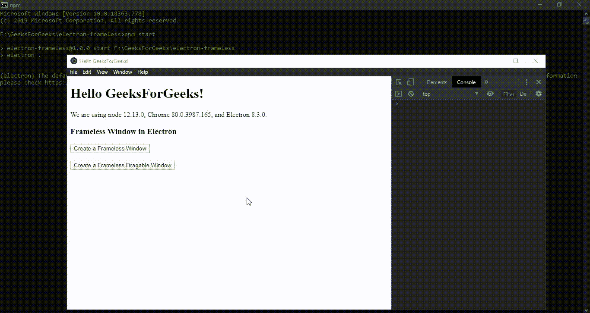
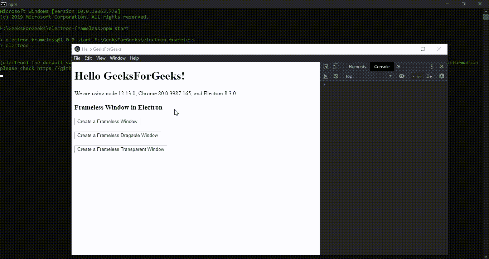
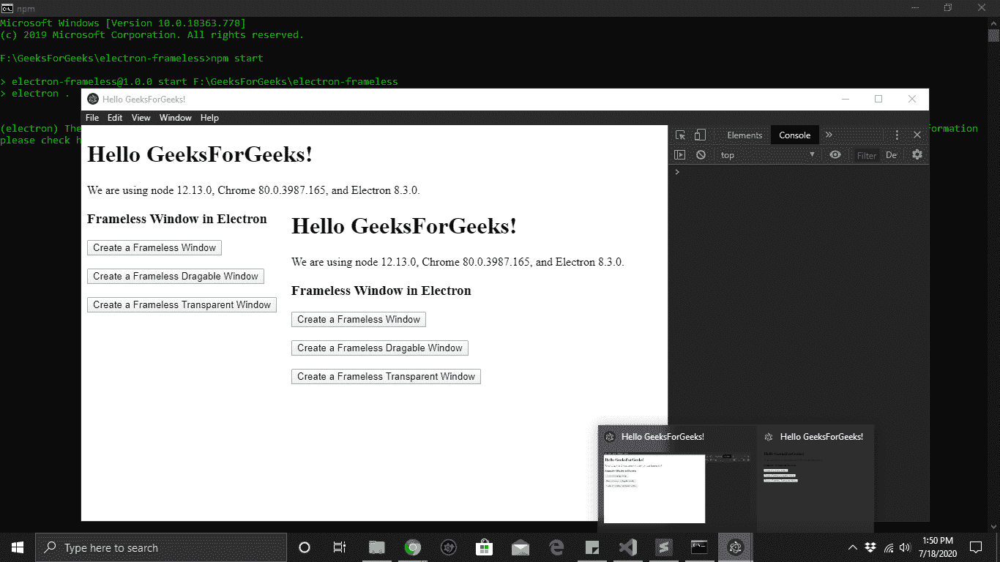

# 电子表格中的无框窗口

> 原文:[https://www . geeksforgeeks . org/无框架电子窗口/](https://www.geeksforgeeks.org/frameless-window-in-electronjs/)

[**electronijs**](https://www.geeksforgeeks.org/introduction-to-electronjs/)是一个开源框架，用于使用能够在 Windows、macOS 和 Linux 操作系统上运行的 HTML、CSS 和 JavaScript 等网络技术构建跨平台的本机桌面应用程序。它将铬引擎和[T5 节点 T7】结合成一个单一的运行时。](https://www.geeksforgeeks.org/introduction-to-nodejs/)

在复杂的桌面应用程序中，可能会出现这样一种情况，即开发人员不得不在不中断用户体验的情况下并行执行额外的后台进程和计算任务。这些在并行框架内运行的后台进程不应该作为附加的图形用户界面窗口对用户可见，而应该在需要时相应地被激活。我们可以在许多现代桌面应用程序中看到这种行为，比如谷歌浏览器。此外，开发人员可能希望将用户限制在功能有限的特定框架内，例如在显示许可协议或条款和条件窗口时。在这样的窗口中，标题栏、导航栏、上下文菜单被禁用，用户不能关闭/跳过/最小化窗口框架。Electron 为我们提供了一种方法，通过这种方法，我们可以打开一个没有工具栏、边框或任何其他图形组件的窗口，或者使用新的**浏览器窗口**对象的**选项**中的属性使整个窗口透明。这种窗户在电子产品中被称为**无框**窗户。本教程将演示如何在电子中创建无框架窗口及其功能。

我们假设您熟悉上述链接中介绍的先决条件。电子要工作， [**节点**](https://www.geeksforgeeks.org/introduction-to-nodejs/) 和 [**npm**](https://www.geeksforgeeks.org/node-js-npm-node-package-manager/) 需要预装在系统中。

*   **项目结构:**


**示例:**按照 [**中给出的步骤，设置基本的电子应用程序。复制文章中提供的 **main.js** 文件和**index.html**文件的样板代码。此外，对**包进行必要的更改，以启动电子应用程序。我们将继续使用相同的代码库构建我们的应用程序。设置电子应用程序所需的基本步骤保持不变。
**package.json:******](https://www.geeksforgeeks.org/dynamic-styling-in-electronjs/)

```htmlhtml
{
  "name": "electron-frameless",
  "version": "1.0.0",
  "description": "Frameless Window in Electron",
  "main": "main.js",
  "scripts": {
    "start": "electron ."
  },
  "keywords": [
    "electron"
  ],
  "author": "Radhesh Khanna",
  "license": "ISC",
  "dependencies": {
    "electron": "^8.3.0"
  }
}

```

**输出:**

[](https://media.geeksforgeeks.org/wp-content/uploads/20200512225834/Output-1105.png)

**电子中的无框窗口:****浏览器窗口**实例是**主进程**的一部分。要在**渲染器进程**中导入和使用**浏览器窗口**，我们将使用电子**远程**模块。无框窗是没有**镀铬**的窗。除了网页本身(例如，工具栏、菜单栏、边框等)，Chrome 是窗口的任何可见方面。通过指定**浏览器窗口**对象的属性，我们可以将**浏览器窗口**实例定义为**无框架**或**透明**窗口。

*   **index.html**:在该文件中添加以下片段。

## 超文本标记语言

```htmlhtml
<body style="-webkit-app-region: drag">

<h3>Frameless Window in Electron</h3>
  <button id="frame" style="-webkit-app-region: no-drag;">
      Create a Frameless Window
  </button>
  <br><br>
  <button id="frameless" style="-webkit-app-region: no-drag;">
      Create a Frameless Dragable Window
  </button>
  <br><br>
<!-- Adding Individual Renderer Process JS File -->
<script src="index.js"></script>
</body>
```

*   **index . js**:**创建无框架窗口**和**创建无框架可拖动窗口**按钮还没有任何相关功能。要更改这一点，请在 **index.js** 文件中添加以下代码。

## java 描述语言

```htmlhtml
const electron = require('electron')
// Import BrowserWindow using Electron remote
const BrowserWindow = electron.remote.BrowserWindow;
// let win = BrowserWindow.getAllWindows()[0];

var frame = document.getElementById('frame');
frame.addEventListener('click', (event) => {
    const win = new BrowserWindow({
        width: 800,
        height: 600,
        // Creating a Frameless Window 
        frame: false,
        webPreferences: {
            nodeIntegration: true
        }
    });
    win.loadURL('https://www.google.com/');
});

var frameless = document.getElementById('frameless');
frameless.addEventListener('click', (event) => {
    const win = new BrowserWindow({
        width: 800,
        height: 600,
        frame: false,
        webPreferences: {
            nodeIntegration: true
        }
    });
    win.loadFile('src/index.html');
    win.show();
});
```

要在电子中创建一个**无框架**窗口，**框架:假**属性在**浏览器窗口**实例的选项中设置。通过设置此属性，只有网页本身对用户可见，而没有任何附加的 chrome 或 GUI 组件。为了更好地理解，请参考输出。默认情况下，无框窗口是**不可拖动的**。应用程序需要指定 **-webkit-app-region:拖动** CSS 属性来告诉 Electron 哪些区域是可拖动的。为了使整个窗口可拖动，这个 CSS 属性被设置为 HTML 中**正文**标签的**样式**。应用程序也可以使用**-web kit-app-region:no-drag**CSS 属性来表示不可拖动区域。一旦我们定义了一个无框架窗口，我们就可以根据我们的外观和感觉对它进行定制，并提供一个自定义标题栏和自定义窗口控件。
**注意**–当 **-webkit-app-region:拖拽** CSS 属性设置为**主体**标签时，我们需要将**-web kit-app-region:no-拖拽** CSS 属性到**按钮**或窗口内任何可点击的组件。否则，我们将无法点击这些可点击的组件。

**注意:**有时在无框架窗口中，拖动行为可能与文本选择冲突。例如，当通过标题栏拖动窗口时，我们可能会意外地选择标题栏上的文本。当自定义标题栏的大小特别小时，就会出现这种情况。为了防止这种情况，我们需要使用**-网络工具包-用户选择:无来禁用文本选择；** CSS 属性。

**注意:**从电子的 **v8.3.0** 开始，可拖动区域目前只支持矩形。此外，**-网络工具包-应用程序-地区:拖动** CSS 属性已知有问题，而铬开发工具是开放的。
**注意**–在某些环境中，窗口内的可拖动区域可以被视为**非客户端框架**。这意味着每当我们在可拖动区域上**右键单击**时，系统上下文菜单可能会打开。为了使**上下文菜单**行为正确，我们不应该在可拖动区域上使用自定义上下文菜单。
**框架:所有操作系统平台都支持**浏览器窗口**实例的假**属性。此外，在 macOS 中，我们有更多的属性来定义无铬窗，而不是**框架**属性。如果我们在 macOS 中使用**框架**属性，它将禁用**标题栏**和**窗口控件**(也称为 macOS 中的*红绿灯*)。相反，我们可以使用**浏览器窗口**实例的选项中的**标题栏样式**属性来隐藏标题栏，并使内容扩展整个窗口大小，同时仍然保留窗口控件。

*   **标题栏样式:“隐藏”**该属性隐藏标题栏，使内容扩展到窗口的整个大小，但仍在无铬窗口的左上角显示窗口控件。
*   **标题栏样式:‘hiddenInset’**此属性隐藏标题栏，但提供了一种替代外观，其中窗口控件从无铬窗口的边缘稍微插入更多。
*   **title bar style:' customButtonsOnHover '**此属性使用微型按钮作为窗口控件，并在无铬窗口的左上角附近悬停时显示一个自定义抽屉。该属性只能与**框一起使用:false** 属性。

此时，在启动电子应用程序时，我们应该能够在应用程序中激活一个**无框架**窗口和一个**无框架可拖动**窗口。在本教程中，我们在无框架窗口中加载了一个外部网站，并在无框架可拖动窗口中再次加载了**index.html**文件，用于演示目的。
**输出:**

[](https://media.geeksforgeeks.org/wp-content/uploads/20200718135442/Output-1-GIF12.gif)

*   **index.html**:现在我们来看看如何在应用中让一个无框窗口完全透明，以及在 electronic 中看到一个**透明**窗口的一些特性和限制。

## 超文本标记语言

```htmlhtml
<body style="-webkit-app-region: drag">

<h3>Frameless Window in Electron</h3>
<button id="transparent" style="-webkit-app-region: no-drag;">
    Create a Frameless Transparent Window
</button>
<!-- Adding Individual Renderer Process JS File -->
<script src="index.js"></script>
</body>
```

*   **index . js**:**创建无框架透明窗口**按钮还没有任何相关功能。要进行更改，请在 **index.js** 文件中添加以下代码。

## java 描述语言

```htmlhtml
const electron = require('electron')
// Import BrowserWindow using Electron remote
const BrowserWindow = electron.remote.BrowserWindow;
// let win = BrowserWindow.getAllWindows()[0];

var transparent = document.getElementById('transparent');
transparent.addEventListener('click', (event) => {
    const win = new BrowserWindow({
        width: 800,
        height: 600,
        frame: false,
        webPreferences: {
            nodeIntegration: true
        },
        transparent: true,
    });
    win.show();
});
```

**说明:**要在电子中创建一个**透明**窗口，**透明:真**属性设置在**浏览器窗口**实例的选项中。这些透明窗口可用于加载外部脚本、执行后台进程和其他计算任务。但是，从 electronic 的 **v8.3.0** 开始，有一些与透明窗口相关的限制。下面列出了一些更重要的限制:

*   我们不能透过透明的窗户点击。
*   透明窗口不可调整大小。在**浏览器窗口**实例的选项中设置**可调整大小:真**属性会使透明窗口在某些操作系统环境中停止工作。
*   我们不能将**模糊**滤镜应用于透明窗口下方的内容，因为它只能应用于网页本身，因此透明窗口下方的内容将清晰可见。如上所述，我们将无法通过透明窗口点击。这也在输出中得到了证明。

要在**渲染器进程**中获取当前**浏览器窗口**实例，我们可以使用**浏览器窗口**对象提供的一些静态方法。

*   **BrowserWindow . getallwindow():**此方法返回一个活动/打开的 BrowserWindow 实例数组。在这个应用程序中，我们只有一个活动的**浏览器窗口**实例，它可以直接从数组中引用，如代码所示。
*   **浏览器窗口. getFocusedWindow():** 此方法返回在应用程序中聚焦的**浏览器窗口**实例。如果没有找到当前浏览器窗口实例，则返回**空值**。在这个应用程序中，我们只有一个活动的**浏览器窗口**实例，可以使用这个方法直接引用它，如代码所示。

此时，在启动电子应用程序时，我们应该能够在应用程序中激活一个**透明**窗口。
T3】输出:

[](https://media.geeksforgeeks.org/wp-content/uploads/20200718135536/Output-2-GIF3.gif)

**注意:**在创建透明窗口时，当我们在选项中指定**透明:真**属性，但同时使用**浏览器窗口**对象的 **win.loadFile(文件路径)**或 **win.loadURL(网址)**实例方法时，实例方法优先，相应的包含内容的窗口被加载到应用程序中。然而，在 **win.loadFile(文件路径)**实例方法的情况下，只有没有任何背景的文件内容被加载到应用程序中。这也可以用来增强应用程序的图形用户界面。请参考下面的输出以获得更好的理解。
**输出:**

[](https://media.geeksforgeeks.org/wp-content/uploads/20200718135625/Output-388.png)