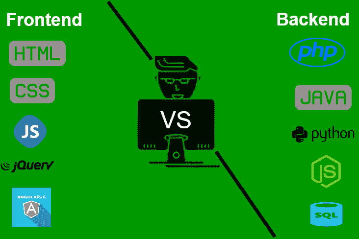

# 前端 vs 后端

> 原文:[https://www.geeksforgeeks.org/frontend-vs-backend/](https://www.geeksforgeeks.org/frontend-vs-backend/)

**前端和后端:**前端和后端是 web 开发中最常用的两个术语。这些术语对于 web 开发来说非常重要，但是彼此之间有很大的不同。每一方都需要作为一个单位与另一方进行有效的沟通和运作，以提高网站的功能。

**前端开发:**用户直接交互的网站部分称为前端。它也被称为应用程序的“客户端”。它包括用户直接体验到的一切:文本颜色和样式、图像、图形和表格、按钮、颜色和导航菜单。HTML、CSS 和 JavaScript 是用于前端开发的语言。当网站、网络应用程序或移动应用程序打开时，浏览器屏幕上看到的所有内容的结构、设计、行为和内容都由前端开发人员实现。响应能力和性能是前端的两个主要目标。开发人员必须确保网站具有响应性，即无论屏幕大小如何，网站的任何部分都不应出现异常。

**前端语言:**前端部分使用以下讨论的一些语言构建:

*   **HTML:** HTML 代表超文本标记语言。它用于使用标记语言设计网页的前端部分。HTML 是超文本和标记语言的结合。超文本定义了网页之间的链接。标记语言用于在定义网页结构的标签中定义文本文档。
*   **CSS:** 层叠样式表被亲切地称为 CSS，是一种简单设计的语言，旨在简化网页呈现的过程。CSS 允许您将样式应用于网页。更重要的是，CSS 使您能够独立于组成每个网页的 HTML 来完成这项工作。
*   **JavaScript:** JavaScript 是一种著名的脚本语言，用于在网站上创造魔法，使网站对用户具有交互性。它用于增强网站的功能，以运行很酷的游戏和基于网络的软件。

根据框架可以进行前端开发的语言还有很多，例如 *Flutter* 用户 *Dart* 、 *React* 使用 *JavaScript* 、 *Django* 使用 *Python* 等等。

**前端框架和库:**

*   **AngularJS:** AngularJs 是一个 JavaScript 开源前端框架，主要用于开发单页 web 应用程序(SPAs)。它是一个不断增长和扩展的框架，为开发 web 应用程序提供了更好的方法。它把静态的 HTML 变成了动态的 HTML。这是一个可以免费的开源项目。它用指令扩展 HTML 属性，数据用 HTML 绑定。
*   **React.js:** React 是一个声明性的、高效的、灵活的 JavaScript 库，用于构建用户界面。ReactJS 是一个开源的、基于组件的前端库，只负责应用程序的视图层。它由脸书维护。
    Bootstrap: Bootstrap 是一个免费的开源工具集合，用于创建响应性网站和网络应用程序。它是最流行的 HTML、CSS 和 JavaScript 框架，用于开发响应迅速、移动优先的网站。
*   **jQuery:** jQuery 是一个开源的 JavaScript 库，它简化了 HTML/CSS 文档，或者更准确地说是文档对象模型(DOM)和 JavaScript 之间的交互。通过阐述这些术语，jQuery 简化了 HTML 文档遍历和操作、浏览器事件处理、DOM 动画、Ajax 交互和跨浏览器 JavaScript 开发。
*   **SASS:** 它是最可靠、最成熟、最健壮的 CSS 扩展语言。它用于轻松扩展站点现有 CSS 的功能，包括从变量、继承和嵌套的所有内容。
*   **Flutter:** Flutter 是谷歌管理的开源 UI 开发 SDK。它由 Dart 编程语言提供动力。它从一个单一的代码库为移动(Ios、Android)、网络和桌面构建高性能和好看的本机编译应用程序。flutter 的关键卖点是扁平开发变得更容易、更有表现力、更灵活的用户界面和本机性能。2021 年 3 月，flutter 宣布推出 Flutter 2，升级 Flutter 以构建网络发布应用程序，桌面处于测试状态。
*   其他一些库和框架有语义用户界面、基础、物化、主干、烬等。

**后端开发:**后端是网站的服务器端。它存储和整理数据，并确保网站客户端的一切正常运行。它是网站中你看不到也无法与之互动的部分。它是软件中不与用户直接接触的部分。后端设计人员开发的部分和特性由用户通过前端应用程序间接访问。像编写应用编程接口、创建库以及在没有用户界面甚至没有科学编程系统的情况下使用系统组件等活动也包含在后端中。

**后端语言:**后端部分使用一些语言构建，下面讨论:

*   **PHP:** PHP 是一种专门为 web 开发设计的服务器端脚本语言。由于 PHP 代码在服务器端执行，所以它被称为服务器端脚本语言。
*   **C++:** 是一种通用编程语言，如今广泛用于竞技编程。它也被用作后端语言。
*   **Java:** Java 是目前最流行、应用最广泛的编程语言和平台之一。它是高度可扩展的。Java 组件很容易获得。
*   **Python:** Python 是一种编程语言，可以让你快速工作，更高效地集成系统。
*   **JavaScript:** JavaScript 可以同时作为(前端和后端)编程语言使用。
*   **Node.js:** Node.js 是一个开源的跨平台运行时环境，用于在浏览器外执行 JavaScript 代码。你需要记住 NodeJS 不是框架，也不是编程语言。大多数人都很困惑，明白这是一个框架或者一种编程语言。我们经常使用 Node.js 来构建后端服务，比如像 Web App 或者移动 App 这样的 API。贝宝、优步、网飞、沃尔玛等大公司都在生产中使用。

**后端框架:**

*   后端框架的列表有:Express、Django、Rails、Laravel、Spring 等。
*   其他后端程序/脚本语言有 C#、Ruby、REST、GO 等。

**前端和后端的区别:**前端和后端开发有很大的不同，但仍然是同一情况的两个方面。前端是用户看到的和与之交互的东西，后端是一切工作的方式。

*   前端是用户可以看到并与之交互的网站部分，如图形用户界面和命令行，包括设计、导航菜单、文本、图像、视频等。相反，后端是用户无法看到和交互的网站部分。
*   用户可以看到和体验的网站视觉方面是前端。另一方面，在后台发生的一切都可以归因于后端。
*   用于前端的语言有 HTML、CSS、JavaScript，而用于后端的语言有 Java、Ruby、Python、. Net。