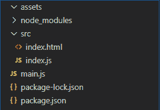

# 在电子 JS 中生成 PDF

> 原文:[https://www.geeksforgeeks.org/generate-pdf-in-electronjs/](https://www.geeksforgeeks.org/generate-pdf-in-electronjs/)

[**electronijs**](https://www.geeksforgeeks.org/introduction-to-electronjs/)是一个开源框架，用于使用能够在 Windows、macOS 和 Linux 操作系统上运行的 HTML、CSS 和 JavaScript 等网络技术构建跨平台的本机桌面应用程序。它将铬引擎和[T5 节点 T7】结合成一个单一的运行时。
在某些桌面应用程序中，开发人员希望提供一个功能，用户可以下载页面内容并将其保存为 PDF 文件到他们的系统中。例如，在银行应用程序中，用户希望下载显示在屏幕上的他/她的账户对账单，并将其保存为 PDF 文件。电子提供了一种方法，通过这种方法，我们可以使用**浏览器窗口**对象和**网络内容**属性来实现这一功能。**网络内容**属性为我们提供了某些实例事件和方法，通过这些事件和方法，我们可以将正在显示的**浏览器窗口**的内容转换为 PDF 文件，或者将远程网址的内容保存为 PDF 文件。本教程将演示如何在电子版中生成 PDF 文件。
我们假设您熟悉上述链接中介绍的先决条件。电子工作需要在系统中预装](https://www.geeksforgeeks.org/introduction-to-nodejs/) [**节点**](https://www.geeksforgeeks.org/introduction-to-nodejs/) 和 [**npm**](https://www.geeksforgeeks.org/node-js-npm-node-package-manager/) 。

*   **项目结构:**



**示例:**我们将按照给定的步骤开始构建基本的电子应用程序。

*   **步骤 1:** 导航到空目录设置项目，运行以下命令，

```html
npm init

```

*   生成**包. json** 文件。安装 [**电子**](https://www.geeksforgeeks.org/introduction-to-electronjs/) 如果没有安装，使用 npm。

```html
npm install electron --save

```

*   This command will also create the **package-lock.json** file and install the required **node_modules** dependencies. Create the **assets** folder according to the project structure. We will save the generated PDF files to this folder.

    **package.json:**

```html
{
  "name": "electron-pdf",
  "version": "1.0.0",
  "description": "Generate PDF in Electron",
  "main": "main.js",
  "scripts": {
    "start": "electron ."
  },
  "keywords": [
    "electron"
  ],
  "author": "Radhesh Khanna",
  "license": "ISC",
  "dependencies": {
    "electron": "^8.2.5"
  }
}

```

*   **Step 2:** Create a **main.js** file according to the project structure. This file is the **Main Process** and acts as an entry point into the application. Copy the Boilerplate code for the **main.js** file as given in the following [link](https://www.electronjs.org/docs/tutorial/first-app#electron-development-in-a-nutshell). We have modified the code to suit our project needs.

    **main.js:**

```html
const { app, BrowserWindow } = require('electron')

function createWindow () {
  // Create the browser window.
  const win = new BrowserWindow({
    width: 800,
    height: 600,
    webPreferences: {
      nodeIntegration: true,
      //allows remote module
      enableRemoteModule: true
    }
  })

  // Load the index.html of the app.
  win.loadFile('src/index.html')

  // Open the DevTools.
  win.webContents.openDevTools()
}

// This method will be called when Electron has finished
// initialization and is ready to create browser windows.
// Some APIs can only be used after this event occurs.
// This method is equivalent to 'app.on('ready', function())'
app.whenReady().then(createWindow)

// Quit when all windows are closed.
app.on('window-all-closed', () => {
  // On macOS it is common for applications and their menu bar
  // to stay active until the user quits explicitly with Cmd + Q
  if (process.platform !== 'darwin') {
    app.quit()
  }
})

app.on('activate', () => {
    // On macOS it's common to re-create a window in the 
    // app when the dock icon is clicked and there are no 
    // other windows open.
  if (BrowserWindow.getAllWindows().length === 0) {
    createWindow()
  }
})

// In this file, you can include the rest of your 
// app's specific main process code. You can also 
// put them in separate files and require them here.
```

*   **步骤 3:** 在 **src** 目录下创建**index.html**文件和 **index.js** 文件。我们还将从上述链接中复制**index.html**文件的样板代码。我们已经修改了代码以适应我们的项目需求。
    **index.html:**

```html
<!DOCTYPE html>
<html>
  <head>
    <meta charset="UTF-8">
    <title>Hello World!</title>
    <!-- https://electronjs.org/docs/tutorial
                           /security#csp-meta-tag -->
    <meta http-equiv="Content-Security-Policy" 
          content="script-src 'self' 'unsafe-inline';" />
  </head>
  <body>
    <h1>Hello World!</h1>
    We are using node 
    <script>
        document.write(process.versions.node)
    </script>, Chrome 
    <script>
        document.write(process.versions.chrome)
    </script>, and Electron 
    <script>
        document.write(process.versions.electron)
    </script>.

     <!-- Adding Individual Renderer Process JS File -->
    <script src="index.js"></script>
  </body>
</html>
```

*   **输出:**此时，我们的基本电子应用程序设置完毕。要启动电子应用程序，请运行命令:

```html
npm start

```


**电子生成 PDF:****浏览器窗口**实例和**网站内容**属性是**主进程**的一部分。要在**渲染器进程**中导入和使用**浏览器窗口**，我们将使用电子**远程**模块。

*   **方法 1:** 转换当前活动的**浏览器窗口**实例的内容，并将其保存为 PDF 文件。
    **index.html**:在该文件中添加以下片段。

```html
<br><br>
   <button id="pdf">
     Convert Current BrowserWindow to PDF
   </button>
```

*   **index.js** :在该文件中添加以下代码片段。

```html
const electron = require('electron');
const path = require('path');
const fs = require('fs');

// Importing BrowserWindow from Main
const BrowserWindow = electron.remote.BrowserWindow;

var pdf = document.getElementById('pdf');
var filepath1 = path.join(__dirname, '../assets/print1.pdf'); 

var options = {
    marginsType: 0,
    pageSize: 'A4',
    printBackground: true,
    printSelectionOnly: false,
    landscape: false
}

pdf.addEventListener('click', (event) => {

    // let win = BrowserWindow.getAllWindows()[0];
    let win = BrowserWindow.getFocusedWindow();

    win.webContents.printToPDF(options).then(data => {
        fs.writeFile(filepath1, data, function (err) {
            if (err) {
                console.log(err);
            } else {
                console.log('PDF Generated Successfully');
            }
        });
    }).catch(error => {
        console.log(error)
    });
});
```

*   通过 Chromium 的预览打印自定义设置，**方法将**浏览器的**内容打印为 PDF。该方法返回一个**承诺**，并解析到一个包含要写入 PDF 文件的数据的**缓冲区**。它接受以下参数。有关**方法的更多详细信息，请参考此[链接](https://www.electronjs.org/docs/api/web-contents#contentsprinttopdfoptions)。****
    *   **选项:对象**我们可以传递一个空的**选项**对象，在这种情况下，它将采用所有各自的默认值。它接受以下参数，
        *   **边距类型:整数(可选)**指定要在 PDF 文件中使用的边距类型。它可以保存以下值:
            *   **0**–默认边距
            *   **1**–无边距
            *   **2**–最小余量
        *   **页面大小:对象/字符串(可选)**指定生成的 PDF 文件的页面大小。数值可以是 **A3** 、 **A4** 、 **A5** 、**合法**、**字母**、**小报**。它还可以容纳一个包含**高度**属性和**宽度**属性的对象，这些属性在**微米**中定义。
        *   **打印背景:布尔值(可选)**是否在 PDF 文件中包含 CSS 背景(如**背景色**)。默认值为**假**。
        *   **仅打印选择:布尔值(可选)**是否仅在 PDF 文件中打印选择或高亮显示。默认值为**假**。
        *   **横向:布尔型(可选)**指定 PDF 文件的模式。对于**景观**模式，值设置为**真**。对于 **potrait** 模式，该值设置为 **false** 。默认值为**假**。
    *   **BrowserWindow . getall windows():**这个方法返回一个活动/打开的 **BrowserWindow** 实例的数组。在这个应用程序中，我们只有一个活动的**浏览器窗口**实例，它可以直接从数组中引用，如代码所示。
    *   **浏览器窗口. getFocusedWindow():** 此方法返回在应用程序中聚焦的**浏览器窗口**实例。如果没有找到当前的**浏览器窗口**实例，则返回**空值**。在这个应用程序中，我们只有一个活动的**浏览器窗口**实例，可以使用这个方法直接引用它，如代码所示。
*   **方法 2:** 转换远程 URL 的内容，保存为 PDF 文件。
    **index.html**:在该文件中添加以下片段。

```html
<br><br>
    <button id="convert">Convert Google.com to PDF</button>
```

*   **index.js** :在该文件中添加以下代码片段。

```html
const electron = require('electron');
const path = require('path');
const fs = require('fs');
// Importing BrowserWindow from Main
const BrowserWindow = electron.remote.BrowserWindow;

var convert = document.getElementById('convert');
var filepath2 = path.join(__dirname, '../assets/print2.pdf'); 

var options2 = {
    marginsType: 1,
    pageSize: 'A4',
    printBackground: true,
    printSelectionOnly: false,
    landscape: false
}

convert.addEventListener('click', (event) => {
    let win = new BrowserWindow({
        show: false,
        webPreferences: {
          nodeIntegration: true
        }
      });

    win.loadURL('https://www.google.com/');

    win.webContents.on('did-finish-load', () => {
        win.webContents.printToPDF(options2).then(data => {
            fs.writeFile(filepath2, data, function (err) {
                if (err) {
                    console.log(err);
                } else {
                    console.log('PDF Generated Successfully');
                }
            });
        }).catch(error => {
            console.log(error)
        });
    });
});
```

*   在这种情况下，我们已经创建了一个新的浏览器窗口实例，并将**显示**属性设置为**假**。因此，新创建的窗口将永远不会显示。我们使用 **win.loadURL(路径)**方法在**浏览器窗口**中加载外部网址的内容。url 路径可以是 **http://** 协议指定的远程地址，也可以是使用**文件://** 协议指定的本地系统中文件的路径。该方法返回一个**承诺**，当页面加载完毕，并且**网页内容**属性的**完成加载**事件被发出时，该承诺被解决。更多详细信息，请参考[链接](https://www.electronjs.org/docs/api/browser-window#winloadurlurl-options)。
    完成加载实例事件属于**网络内容**属性。当导航完成并且页面完全加载时，它就会发出。当页面的微调器停止旋转，并且 **onload** 事件已经调度时，就会发生这种情况。如果不使用该事件发射器，调用**webcontents . printopdf()**方法，生成的 PDF 将是一个空白文档，因为内容没有在**浏览器窗口**中加载完毕。因此**承诺**中返回的数据为空。更多详细信息，请参考[链接](https://www.electronjs.org/docs/api/web-contents#event-did-finish-load)。
    **输出:**

<video class="wp-video-shortcode" id="video-414507-1" width="640" height="360" preload="metadata" controls=""><source type="video/mp4" src="https://media.geeksforgeeks.org/wp-content/uploads/20200514003719/Output-26.mp4?_=1">[https://media.geeksforgeeks.org/wp-content/uploads/20200514003719/Output-26.mp4](https://media.geeksforgeeks.org/wp-content/uploads/20200514003719/Output-26.mp4)</video>