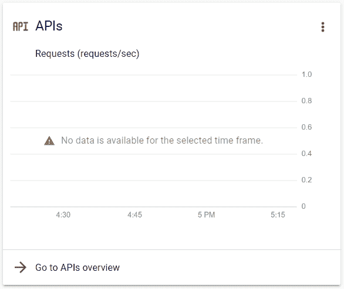
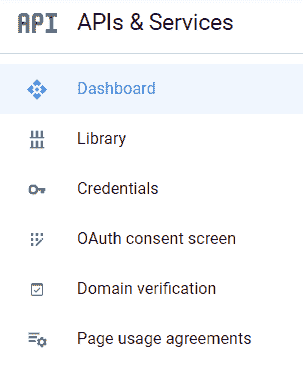
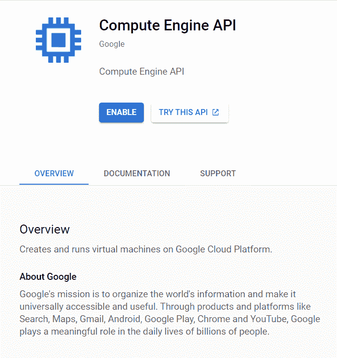
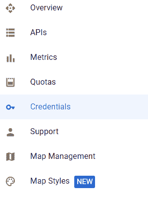
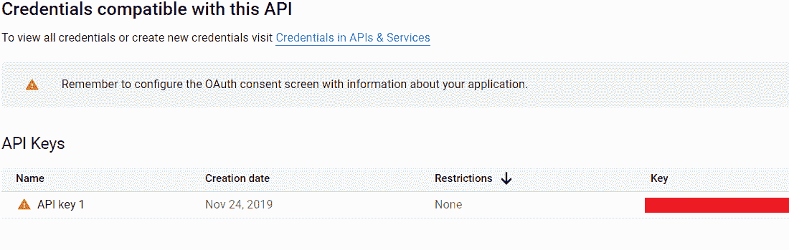
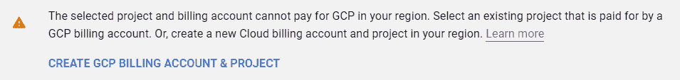

# 为使用任何谷歌应用编程接口生成应用编程接口密钥

> 原文:[https://www . geeksforgeeks . org/generating-API-keys-for-use-any-Google-API/](https://www.geeksforgeeks.org/generating-api-keys-for-using-any-google-apis/)

像大多数软件巨头一样，谷歌为其热情的开发者社区提供其应用编程接口、软件开发工具包和服务。这些来自谷歌的应用编程接口托管在他们的云平台上，俗称谷歌云平台(GCP)。谷歌地图、YouTube、Gmail 等软件。，使用相同的 API，现在可以根据使用情况以极低的成本向公众提供。人们可以在他们的项目和应用程序中使用这些 API 来集成类似的特性。

通过这篇文章，我们想与您分享如何访问这些 API。最重要的是，由于这些服务是付费的，所以每个注册的开发人员都获得了一个访问 API 特性的 API 密钥，这确实是独一无二的。因此，在开始开发特性之前，需要有一个 API 键。让您感到舒适的是，我们为您带来了以下生成 API 密钥的步骤。

### 生成密钥的步骤:

**步骤 1:** 要生成使用特定谷歌应用编程接口的应用编程接口密钥，您必须拥有一个与启用计费的谷歌云平台(GCP)相关联的帐户。你可以参考[这篇文章](https://www.geeksforgeeks.org/google-cloud-platform-creating-google-cloud-console-account-projects/)设置一个，创建一个项目。

**步骤 2:** 项目创建后，转到您的项目仪表板。您将看到下面的应用编程接口窗口。单击转到应用编程接口概述。

**步骤 3:** 现在您将看到流量、错误和中位延迟窗口。在左边，你会有一个下拉菜单。点击图书馆。

**第四步:**在 API 库页面，我们可以访问谷歌提供的多个 API 和 SDK，可以选择感兴趣的 API。

**第五步:**为了演示，我们点击了计算引擎 API。我们现在获得了该 API 的概述、文档和支持。要使用此应用编程接口，只需单击“启用”选项，如果需要，请按照步骤操作。

**步骤 6:** 一旦启用了应用编程接口，请转到凭据。您将找到关于您的应用编程接口密钥的详细信息。

 

**第 7 步:**在你的应用中使用这个键来使用特定的 Google API。

**注意(针对印度账单账户):***“12 月 4 日，RBI 已指示所有银行，包括 rrb、NBFCs 和支付网关，在不符合 AFA 的安排/惯例下，使用卡或预付支付工具(PPI)或统一支付接口(UPI)处理经常性交易(国内或跨境)的行为将不会持续到 2021 年 3 月 31 日之后。”*来源:印度教

因此，从 2021 年 4 月 1 日起，谷歌设置账单账户或结算的过程将失败，因为付款是每月自动进行的。为了避免这种情况，你必须确保你的国有银行选择自动支付。