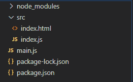
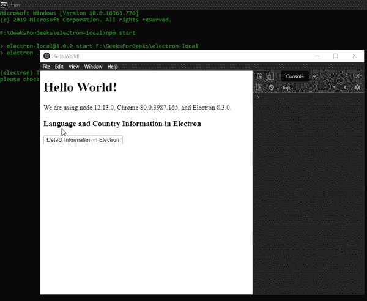

# 电子地图中的地理信息

> 原文:[https://www . geesforgeks . org/geo-information-in-electronijs/](https://www.geeksforgeeks.org/geo-information-in-electronjs/)

[**electronijs**](https://www.geeksforgeeks.org/introduction-to-electronjs/)是一个开源框架，用于使用能够在 Windows、macOS 和 Linux 操作系统上运行的 HTML、CSS 和 JavaScript 等网络技术构建跨平台的本机桌面应用程序。它将铬引擎和[T5 节点 T7】结合成一个单一的运行时。](https://www.geeksforgeeks.org/introduction-to-nodejs/)

Electron 为我们提供了一种方法，通过该方法，我们可以使用内置的 **app** 模块的实例方法来获取本地系统的**国家**代码和**语言**代码。电子获取的国家代码遵循某些国际标准组织标准。因此，我们可以进一步使用这些代码，使用第三方 REST APIs 获取更多关于国家和用户语言的信息，并以人类可读的格式呈现给用户。该特性对于检测语言、添加 **i18n** 国际化以及获取特定于国家的信息(如**货币**)非常有用。本教程将演示如何获取电子版的国家和语言信息。

我们假设您熟悉上述链接中介绍的先决条件。电子要工作， [**节点**](https://www.geeksforgeeks.org/introduction-to-nodejs/) 和 [**npm**](https://www.geeksforgeeks.org/node-js-npm-node-package-manager/) 需要预装在系统中。

*   **项目结构:**



**电子地理信息:****应用程序**模块是**主流程**的一部分。要导入和使用**渲染器流程**中的**应用程序**模块，我们将使用电子**远程**模块。有关远程模块的更多详细信息。
**示例:**按照给出的步骤在电子中获取国家和语言信息。

*   **第一步:**按照[中给出的步骤进行设置中的**动态样式，设置基本的电子应用。复制文章中提供的 **main.js** 文件和**index.html**文件的样板代码。我们将继续使用相同的代码库构建我们的应用程序。另外，使用 **npm** 安装 **axios** 套装。这个包是一个基于**承诺**的 HTTP 客户端。它用于对 REST APIs 进行 HTTP 调用。我们将使用这个包为用户获取地理信息。有关 axios 的更多信息。**](https://www.geeksforgeeks.org/dynamic-styling-in-electronjs/)

```htmlhtml
npm install axios --save

```

*   还要对**包. json** 文件进行必要的更改，以启动电子应用程序。
    T3

```htmlhtml
{
  "name": "electron-local",
  "version": "1.0.0",
  "description": "Locales in Electron",
  "main": "main.js",
  "scripts": {
    "start": "electron ."
  },
  "keywords": [
    "electron"
  ],
  "author": "Radhesh Khanna",
  "license": "ISC",
  "dependencies": {
    "axios": "^0.19.2",
    "electron": "^8.3.0"
  }
}

```

*   **输出:**此时，我们的基本电子应用程序设置完毕。启动应用程序后，我们应该会看到以下结果。

[](https://media.geeksforgeeks.org/wp-content/uploads/20200512225834/Output-1105.png)

*   **步骤 2:** 在**index.html**和 **index.js** 文件中添加以下代码片段，用于获取电子版中的语言和国家信息。
    **index.html:** 在该文件中添加以下代码片段。“检测电子信息”按钮还没有任何相关功能。要更改这一点，请在 **index.js** 文件中添加以下代码片段。

## 超文本标记语言

```htmlhtml
<h3>
  Language and Country Information in Electron
</h3>
  <button id="detect">
    Detect Information in Electron
  </button>
```

*   **index.js:** 在该文件中添加以下代码片段。

## java 描述语言

```htmlhtml
const electron = require("electron");
const axios = require("axios");

// Importing app Module using Electron remote
const app = electron.remote.app;

var detect = document.getElementById("detect");
detect.addEventListener("click", () => {
    var locale = app.getLocale();
    var country = app.getLocaleCountryCode();

    console.log("Locale Detected - ", locale);
    console.log("Country Detected - ", country);

    // Making an HTTP GET REST API call
    axios.get("https://restcountries.eu/rest/v2/alpha/"
              + country).then((res) => {
        console.log(res);
        console.log("Country - ", res.data.name);
    });
});
```

下面给出了代码中使用的 **app** 模块的所有实例方法的详细说明。有关**应用程序**模块的更多详细信息。

*   **app.getLocale()** 此方法用于返回当前应用的 Locale(语言代码)。它使用 Chromium 的 **l10n_util** 库从本地系统获取区域设置。对于此方法返回的所有可能值。该方法不接受任何参数，并返回带有当前检测到的区域设置的**字符串**值。在*窗口*上，该方法只能在 **app** 模块的**就绪**事件发出后使用。所有操作系统环境都支持这种方法。
    **注意:**我们也可以使用 electronic 中的命令行开关来设置自定义区域设置。我们可以在应用程序启动时简单地传递命令行开关，方法是使用**应用程序**模块的 [**命令行**](https://www.electronjs.org/docs/api/command-line) 属性，或者在启动电子应用程序时更改**包的 **start** 脚本。我们可以使用**–lang**命令行开关来设置自定义区域设置。
    **package.json:** 在该文件中进行以下更改。**

```htmlhtml
"scripts": {
  "start": "electron --lang=hi . "
},

```

*   如果我们现在使用 **app.getLocale()** 方法，它将返回自定义区域设置的值。有关**方法的更多详细信息。**
*   **app . getlocaleecountrycode()**此方法用于返回用户操作系统的区域设置*双字母* **ISO 3166** 国家代码。该值是从本机操作系统应用程序接口获取的。该方法返回带有检测到的国家代码的**字符串**值。当此方法无法使用本机操作系统应用编程接口检测到国家代码时，它将返回一个空的**字符串。此方法不接受任何参数。有关**方法的更多详细信息。在我们的代码中，我们使用了这个国家代码值来使用第三方 REST APIs 获取地理信息。所有操作系统环境都支持这种方法。****

**输出:**

[](https://media.geeksforgeeks.org/wp-content/uploads/20200606205510/Output-1-GIF3.gif)