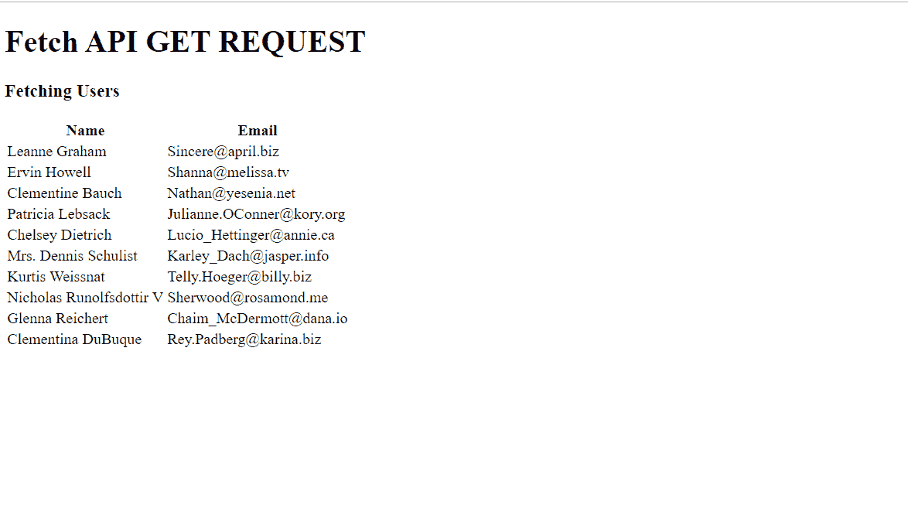
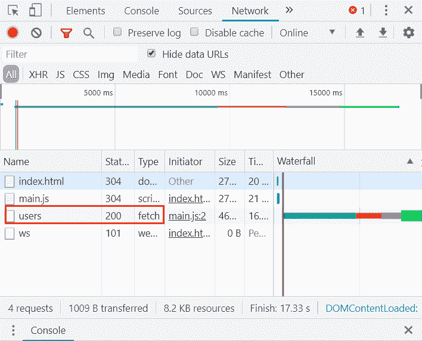
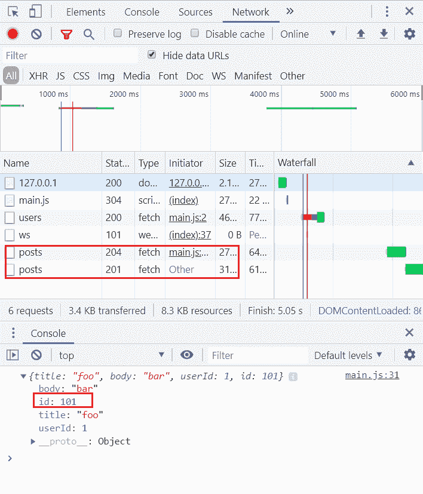

# 使用提取应用编程接口

的获取和发布方法

> 原文:[https://www . geesforgeks . org/get-and-post-method-use-fetch-API/](https://www.geeksforgeeks.org/get-and-post-method-using-fetch-api/)

**fetch()方法**用于在不刷新页面的情况下向服务器发送请求。它是 XMLHttpRequest 对象的替代。
fetch()请求的基本语法如下:

## java 描述语言

```html
fetch(url, {options})
.then(data => {
    // Do some stuff here
})
.catch(err => {
    // Catch and display errors
})
```

XMLHttpRequest 和 fetch 的区别在于 fetch 使用[承诺](https://www.geeksforgeeks.org/javascript-promises/)，这在处理多个异步操作时很容易管理，回调会创建回调地狱，导致无法管理的代码。
然而，仍然有一些浏览器不支持 fetch()方法，所以对于那些，我们不得不坚持使用 XMLHttpRequest 对象。
fetch()方法可用于多种类型的请求，如 **POST** 、 **GET** 、 **PUT** 和 **DELETE** 。
**使用 fetch API 的 GET 方法:**
在本例中，我们将使用 [JSONPlaceholder](https://jsonplaceholder.typicode.com/) ，它提供 REST API 获取和发布帖子、用户等随机数据。
首先，创建一个 HTML 文件，代码如下:

## 超文本标记语言

```html
<!DOCTYPE html>
<html lang="en">
  <head>
    <title>Fetch API</title>
  </head>
  <body>
    <div>
      <h1>Fetch API GET REQUEST</h1>
      <h3>Fetching Users</h3>

      <!-- Table to display fetched user data -->
      <table id="users"></table>
    </div>

    <!-- Link JavaScript file -->
    <script src="main.js"></script>
  </body>
</html>
```

在 JavaScript 中，文件包含以下代码

## java 描述语言

```html
//  main.js

//  GET request using fetch()
fetch("https://jsonplaceholder.typicode.com/users")

    // Converting received data to JSON
    .then(response => response.json())
    .then(json => {

        // Create a variable to store HTML
        let li = `<tr><th>Name</th><th>Email</th></tr>`;

        // Loop through each data and add a table row
        json.forEach(user => {
            li += `<tr>
                <td>${user.name} </td>
                <td>${user.email}</td>        
            </tr>`;
        });

    // Display result
    document.getElementById("users").innerHTML = li;
});
```

现在，当您打开 HTML 文件时，您将看到如下结果:



当你在 Chrome 中打开开发工具时(按 F12)，你会看到一个获取请求已经被发送给路由用户。



您可以从请求中获得更多数据，请参考[文档](https://jsonplaceholder.typicode.com/guide.html)。
**使用 fetch API 的 POST 请求:**
POST 请求广泛用于向服务器提交表单。Fetch 还支持 POST 方法调用。要进行开机自检请求，我们需要在请求中指定附加参数，如**方法**、**标题**等。
在这个例子中，我们将在同一个 JSONPlaceholder 上做一个 post 请求，并在 POST 中添加一个 POST。然后，它将返回带有标识的相同帖子内容。
在同一 JavaScript 文件中添加以下内容:

## java 描述语言

```html
//  main.js

// POST request using fetch()
fetch("https://jsonplaceholder.typicode.com/posts", {

    // Adding method type
    method: "POST",

    // Adding body or contents to send
    body: JSON.stringify({
        title: "foo",
        body: "bar",
        userId: 1
    }),

    // Adding headers to the request
    headers: {
        "Content-type": "application/json; charset=UTF-8"
    }
})

// Converting to JSON
.then(response => response.json())

// Displaying results to console
.then(json => console.log(json));
```

现在，如果您打开 javascript 控制台并刷新页面，您将看到如下结果–



应用编程接口返回状态 **201** ，这是**创建**的 HTTP 状态代码。