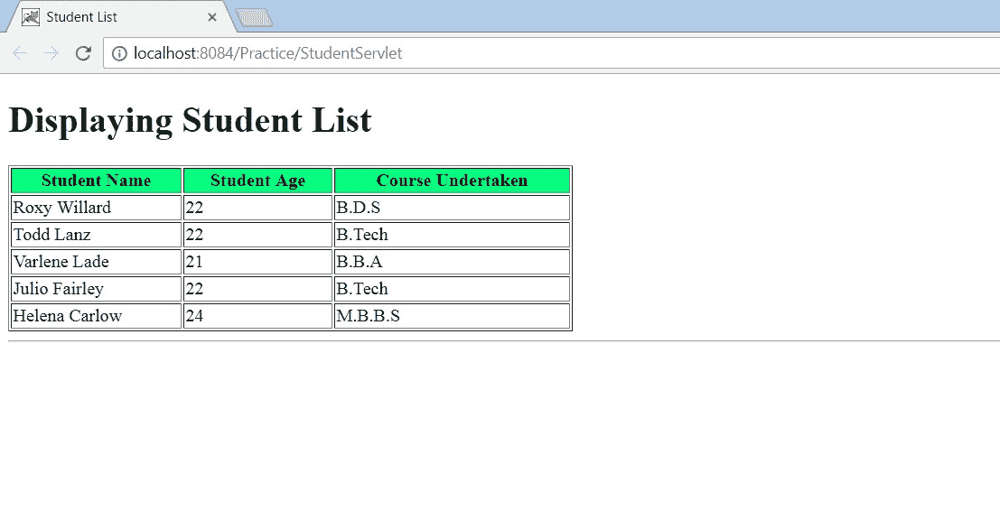

# getAttribute()–将数据从服务器传递到 JSP

> 原文:[https://www . geesforgeks . org/getattribute-传递数据-从服务器到 jsp/](https://www.geeksforgeeks.org/getattribute-passing-data-from-server-to-jsp/)

假设已经在服务器端创建了一些数据，现在为了在 JSP 页面中传递这些信息，需要 **request.getAttribute()** 方法。这实际上区分了 getAttribute()和 [getParameter()](https://www.geeksforgeeks.org/getparameter-passing-data-from-client-to-jsp/) 方法。后者用于将客户端数据传递给 JSP。

**实现**
**1)** 首先在服务器端创建数据，并将其传递给一个 JSP。这里将创建一个 servlet 中的学生对象列表，并使用 setAttribute()将其传递给 JSP。
**2)** 接下来，JSP 将使用 getAttribute()检索发送的数据。
**3)** 最后，JSP 将以表格形式显示检索到的数据。

**Servlet 创建数据并将其发送到 JSP:StudentServlet.java**

```htmlhtml
package saagnik;

import java.io.*;
import java.util.ArrayList;
import javax.servlet.*;
import javax.servlet.http.*;

public class StudentServlet extends HttpServlet {

  protected void processRequest(HttpServletRequest request,
                                HttpServletResponse response)
    throws ServletException, IOException
    {
     response.setContentType("text/html;charset=UTF-8");
     try (PrintWriter out = response.getWriter()) {
       out.println("<!DOCTYPE html>");
       out.println("<html>");
       out.println("<head>");
       out.println("<title>Servlet StudentServlet</title>");
       out.println("</head>");
       out.println("<body>");

       // List to hold Student objects
       ArrayList<Student> std = new ArrayList<Student>();

       // Adding members to the list. Here we are 
       // using the parameterized constructor of 
       // class "Student.java"
       std.add(new Student("Roxy Willard", 22, "B.D.S"));
       std.add(new Student("Todd Lanz", 22, "B.Tech"));
       std.add(new Student("Varlene Lade", 21, "B.B.A"));
       std.add(new Student("Julio Fairley", 22, "B.Tech"));
       std.add(new Student("Helena Carlow", 24, "M.B.B.S"));

       // Setting the attribute of the request object
       // which will be later fetched by a JSP page
         request.setAttribute("data", std);

       // Creating a RequestDispatcher object to dispatch
       // the request the request to another resource
         RequestDispatcher rd = 
             request.getRequestDispatcher("stdlist.jsp");

       // The request will be forwarded to the resource 
       // specified, here the resource is a JSP named,
       // "stdlist.jsp"
          rd.forward(request, response);
            out.println("</body>");
            out.println("</html>");
        }
    }
    /** Following methods are used to handle
        requests coming from the Http protocol request.
        Inspects method of HttpMethod type
        and if the request is a POST, the doPost() 
        method will be called or if it is a GET,
        the doGet() method will be called. 
    **/
    @Override
    protected void doGet(HttpServletRequest request,
                        HttpServletResponse response)
        throws ServletException, IOException
    {
        processRequest(request, response);
    }
    @Override
    protected void doPost(HttpServletRequest request,
                        HttpServletResponse response)
        throws ServletException, IOException
    {
        processRequest(request, response);
    }
    @Override
    public String getServletInfo()
    {
        return "Short description";
    }
}
```

**JSP 检索 servlet“studentservlet . Java”发送的数据并显示:stdlist.jsp**

```htmlhtml
<%@page import="saagnik.Student"%>
<%@page import="java.util.ArrayList"%>
<%@page contentType="text/html" pageEncoding="UTF-8"%>
<!DOCTYPE html>
<html>
  <head>
   <meta http-equiv="Content-Type" content="text/html; charset=UTF-8">
   <title>Student List</title>
  </head>
  <body>
      <h1>Displaying Student List</h1>
      <table border ="1" width="500" align="center">
         <tr bgcolor="00FF7F">
          <th><b>Student Name</b></th>
          <th><b>Student Age</b></th>
          <th><b>Course Undertaken</b></th>
         </tr>
        <%-- Fetching the attributes of the request object
             which was previously set by the servlet 
              "StudentServlet.java"
        --%> 
        <%ArrayList<Student> std = 
            (ArrayList<Student>)request.getAttribute("data");
        for(Student s:std){%>
        <%-- Arranging data in tabular form
        --%>
            <tr>
                <td><%=s.getName()%></td>
                <td><%=s.getAge()%></td>
                <td><%=s.getCrs()%></td>
            </tr>
            <%}%>
        </table> 
        <hr/>
    </body>
</html>
```

**Student.java 级**

```htmlhtml
package saagnik;

public class Student {
    private int age;
    private String name;
    private String crs;
    // Parameterized Constructor to set Student
    // name, age, course enrolled in.
    public Student(String n, int a, String c)
    {
        this.name = n;
        this.age = a;
        this.crs = c;
    }
    // Setter Methods to set table data to be
    // displayed
    public String getName() { return name; }
    public int getAge() { return age; }
    public String getCrs() { return crs; }
}
```

**运行应用**
**1)** 运行 servlet“studentervlet . Java”，将学生数据传递到 JSP 页面“stdlist.jsp”。
**2)**JSP 页面“stdlist.jsp”检索数据并以表格形式显示。

注意:整个应用程序已经在 NetBeans IDE 8.1 上进行了开发和测试

**输出**
**显示学生数据:stdlist.jsp**
