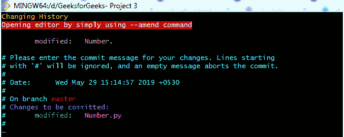
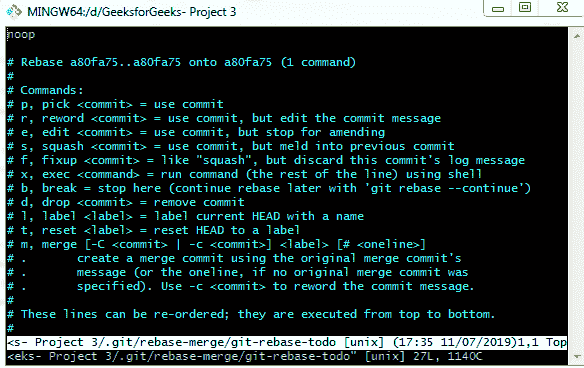

# Git–改变历史

> 原文:[https://www.geeksforgeeks.org/git-changing-history/](https://www.geeksforgeeks.org/git-changing-history/)

Git 提供了一个改变提交历史的非常重要的选项。作为 git 的主人，你可以控制它，让它按照你的意思运行。Git 赋予您更改提交顺序、更改消息、完全删除提交的权限。此外，它还允许您管理项目的历史。但是，建议在彻底审查后再提交工作。在这里你会知道以下事情。

*   git 提交修改
*   狐狸
*   git 过滤器分支

**git 提交––修改**
该命令允许您更改最近的提交。它有助于更改消息或添加或删除文件。该命令将之前的提交消息加载到编辑器会话中，您可以在其中对消息进行更改，保存这些更改并退出。当您保存并关闭编辑器时，编辑器会编写一个包含更新后的提交消息的新提交，并将其作为您的新的最后一次提交。这个命令用一个新的提交完全取代了上一个提交。

*   **git commit––amend-m“已更新消息”**该命令直接更新消息，无需打开编辑器。
    T3】
*   **git commit––amend–no-edit**此选项可帮助您提交剩余的更改(如果有)，而无需更改其提交消息。

**git rebase** 该命令用于修改提交返回提交历史。重定基准工具用于将一系列提交重定基准到它们最初基于的 HEAD，而不是将它们移动到另一个 HEAD。Rebase 就像将分支的基础或路线从一个提交更改为另一个提交，让它看起来像是你走了这条路线而不是另一条。

*   **git rebase -i** Here “i” stands for interactive. This option allows you to stop after each commit that is being rechanneled to modify and change the message, add or remove files and many other options. This command must know how far you have to track back. This is done by ***git rebase -i HEAD~3*** command. Where Head~3 refers to previous three commits.

    

*   **git rebase––continue**该选项在解决合并冲突后重新启动 rebase 进程。
*   **git 重定基础––中止**该选项中止重定基础过程，并将头部重置为原始分支/路线。如果在基础操作开始时提供了“分支”，那么 HEAD 将被重置为“分支”。否则，HEAD 将被重置为重新设置基础操作开始时的位置。
*   **git rebase––退出**该选项中止进程，但不将头复位到原始分支。

**git filter-branch** 这是重写大量提交的另一个选项。这并不常用，因为它可以改变一段很长的历史。然而，它有一些重要的用途，比如从每次提交中删除文件，创建一个子目录作为新根目录，以及全局更改电子邮件地址。

**总结:**我们了解到，如果您想要更改最近的提交，请使用**git commit–ammend**命令。该命令使用户能够修改自上次提交以来的消息和文件。 **git rebase** 用于需要修改提交历史的线程。 **git rebase -i** 以一种有礼貌的方式给你控制和管理项目历史的命令。 **git filter-branch** 命令也具有像 rebase 命令一样的基本功能，即操作大量提交的历史记录，但是由于其严格的操作而偶尔使用。