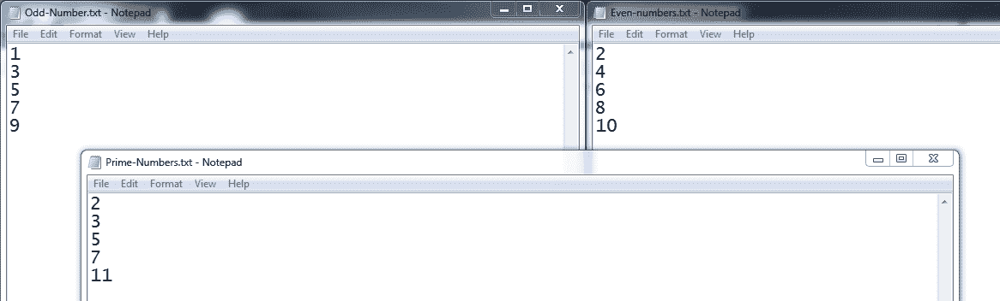
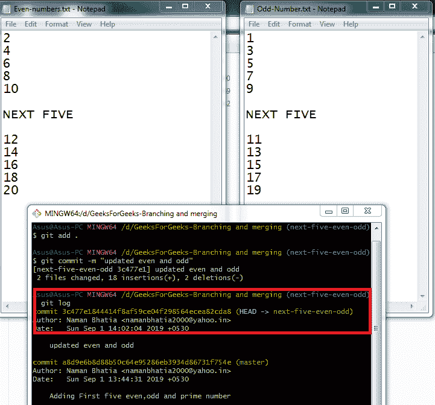
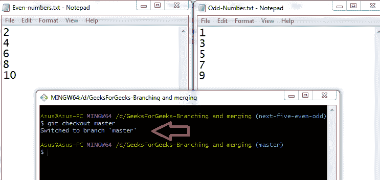
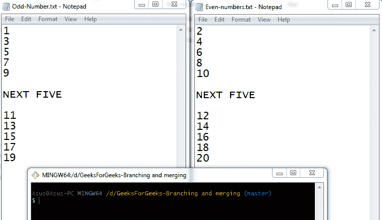

# Git-结账合并

> 原文:[https://www.geeksforgeeks.org/git-checkout-and-merge/](https://www.geeksforgeeks.org/git-checkout-and-merge/)

在本文中，我们将主要介绍有助于分支和合并的基本 git 命令。如果你想知道什么是 git 分支，请浏览这篇文章:[Git-分支介绍](https://www.geeksforgeeks.org/introduction-to-git-branch/)。和[Git 和 Github 终极指南](https://www.geeksforgeeks.org/ultimate-guide-git-github/)。这两篇文章将帮助你复习一些之前讨论过的概念。

**git check out:**git check out 是帮助切换分支的 navigator 命令。此选项为您准备在特定的工作分支上工作。它更新工作树中的文件，以匹配索引或指定树中的版本。如果没有给定路径，git checkout 也会更新 HEAD，将指定的分支设置为当前分支。

**git 分支**和**git check**命令就像是最好的朋友，他们总是一起闲逛，因为他们总是手拉手地工作。git branch 命令用于创建新分支，显示现有分支，git checkout 用于切换到指定分支。

**git 结账选项:**下面是一些基本 git 结账选项的列表，带有可视化示例。

*   **git 结账“新分支”:**用于在分支之间导航。
    T3】
*   **git checkout -b(或-b)“新分支”:**指定-B 会执行分支选项，并同时创建和检出新分支。如果给定-b，如果不存在，则创建“新分支”；否则，它将被重置。
    T3】
*   **git check out-q(or–quiet):**抑制反馈信息。
    T3】
*   **git check out-f(or–force)**:切换分支时，即使索引或工作树与 HEAD 不同，也能继续。
*   **git 检出–分离:**该选项不是检出要处理的分支，而是检出检验实验的提交。当“提交”不是分支名称时，这是 git 签出“提交”的默认行为。
    T3】

**git merge:**git merge 命令允许您将使用 git 分支创建的两个或多个开发工作加入到单个分支中。它合并了命名提交的更改，并将它们分散到当前分支中。在选择合并选项之前，请确保接收分支和合并分支是最新的远程更改。
**git 合并选项:**下面是一些基本 git 合并选项的列表。

*   **git 合并–提交:**该选项用于在提交的同时执行合并。
*   **git merge–no-commit:**该选项在创建合并提交之前执行合并并停止，以便用户有机会在提交之前检查合并结果。
    T3】
*   **git 合并–编辑:**该选项在提交成功合并之前调用编辑器，并使用户能够调整合并，而不是自动生成合并消息。
    T3】
*   **git 合并–不可编辑:**这仅用于接受自动生成的消息。
    T3】
*   **git merge-m“msg”:**这设置了用于合并提交的提交消息。
    T3】
*   **git merge -ff:** 当合并解析为快进时，它只更新分支指针，而不创建合并提交。
*   **git merge -no-ff:** 与默认行为相反，即使合并解析为快进，它也会创建一个合并提交。

**快进合并:**当当前分支头是所述提交的祖先时，快进合并发生。在这种情况下，不需要新的提交来存储组合历史；相反，HEAD 被更新为指向命名提交，而不创建额外的合并提交。但是，这可以通过–no-ff 选项忽略。

**让我们试着理解一个 git 分支的工作流程，git 结账和 git 合并**

*   我们创建三个文本文档，即:偶数. text、奇数. txt 和质数，并分别列出了前五个偶数、奇数和质数。现在我们使用 git 将它们置于版本控制之下。
    
*   我们使用 *git 分支“新分支”*创建另一个分支，即“下一个五个偶数和奇数”，以与主分支分开工作，并在各自的文档中添加下一个五个偶数和奇数。
    T3】
*   现在使用*git check*命令，我们切换到“下一个-五个-偶数-奇数”分支。
    T3】
*   我们更新偶数和奇数列表，并使用 *git add* 和 *git commit* 命令提交更改。现在，我们看到“下一个五个偶数-奇数”分支正在进行更改。
    
*   当我们切换回主分支时，我们观察到主分支不受任何其他分支所做更改的影响。
    
*   现在，我们合并两个分支，即“主”分支和“下一个五偶奇”分支。使用 *git 合并*命令。
    T3】
*   现在所有的变化都被提交给了“下一个五个奇偶”分支，也反映在我们的“主”分支
    和上

**总结:**在本文中我们了解到**git check**命令用于改变或切换分支。该命令与 **git 分支**命令协同工作。 **git merge** 命令将不同的工作路径连接到一个工作路径中。这些命令是 git 工作流的基本命令。