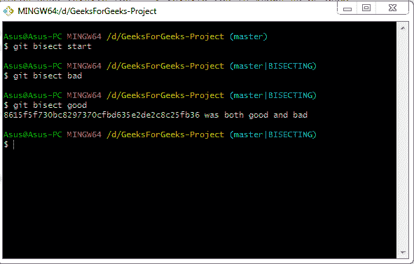
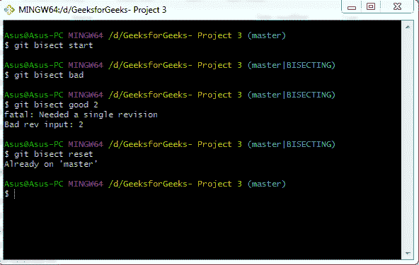
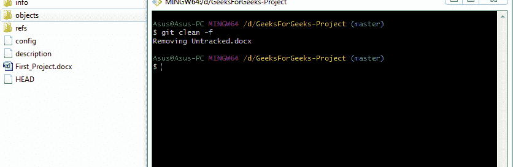

# Git-调试

> 原文:[https://www.geeksforgeeks.org/git-debugging/](https://www.geeksforgeeks.org/git-debugging/)

像传统的文字编辑器一样，我们不能简单地撤销更改。我们有各种 git 命令可用于调试和撤销更改。我们将在本文中讨论这样的命令。

**git 平分:**这个命令使用二分搜索法算法找出引入 bug 的提交。它的用法是首先告诉它“坏的”提交，即已知包含 bug 的提交和在引入 bug 之前已知的“好的”提交。然后 **git 平分**从“坏”提交中选择一个提交，并询问所选提交是好还是坏，然后运行直到达到“好”提交。

**它是如何工作的？**

*   **git 等分启动:**它启动 git 等分向导。
*   **git 平分不好的“版本”:**它让 git 平分巫师知道了一个不好的提交。
*   **git 等分好“版本”:**它让 git 等分向导知道了一个好的提交。

在接下来的一组命令之后，git 选择中间范围的提交，检查它并返回输出。

**注意:**在这张图中，我们没有提到任何版本的 **git 平分坏**和 **git 平分好**，所以当我们没有提到任何版本时，默认采用当前版本。

**git 饼干选项:**

*   **git bisect reset:** After one complete bisect session, git bisect reset command is used to return to original head.

    

*   **To undo the change of state:** Sometimes, rather than finding a bug in commit bisect command it can also be used to switch the previous state. So it can be used when we are looking to commit that caused a change between “old” and “new” state.

    **它是如何工作的？**
    不用坏与好，分别用旧与新。

    *   ***【git bisect start】***
    *   ***git 平分旧*改版**
    *   ***git 平分新*改版**
*   **git 平分日志:**经过好的和坏的修改后，这个命令被用来获得已完成工作的概述。
*   **git 平分跳过“版本 1”..版本 2:**用于跳过一系列提交。这意味着不应该测试从版本 1 到版本 2 的提交。

**git clean:**git clean 命令用于从 git 项目中删除未跟踪的文件。此命令将文件从工作树中完全删除，并且无法再次恢复。所以这个命令要谨慎使用。

**git 清洁选项:**

*   **-n 或–试运行**该命令不删除文件，但它是一个虚拟命令，告诉我们实际要做什么。它用于试运行。
    T3】
*   **-f 或–强制**该命令从当前目录中删除文件。这是一个必要的命令，除非*clean . required force*配置设置为 false。
    
*   **-d** 该命令删除未跟踪的目录和未跟踪的文件。
*   **-i 或–interactive**顾名思义，它是一个交互命令，告诉必须做什么。

**交互模式:**显示可用子命令的是命令循环。
T3】

*   **清理:**该命令删除此时未跟踪的目录/文件。
*   **按模式过滤:**我们可以输入一个模式，比如*_ 来排除删除文件/目录。例如:“*”。py”将从删除中排除所提到的文件扩展名。
*   **选择编号:**该命令为要删除的未跟踪文件/目录分配一个编号。我们也可以多选。例如:
    *   “3-5”删除文件编号“3，4，5”。
    *   " 3-5，8，9 "删除" 3，4，5，8，9 "。
    *   " 3-"删除从 3 到最后一个文件号的文件号。
    *   “*”删除所有内容。
*   **询问每个:**这将逐个询问是否删除特定文件。
*   **退出:**此选项允许您退出而不删除。