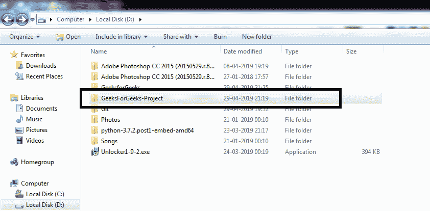
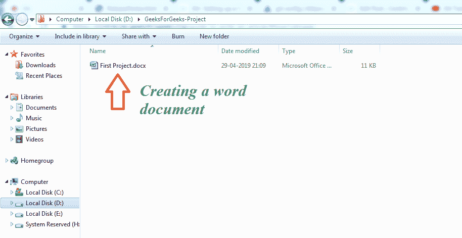
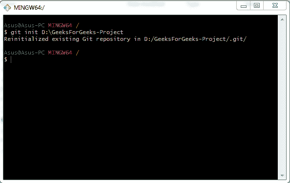
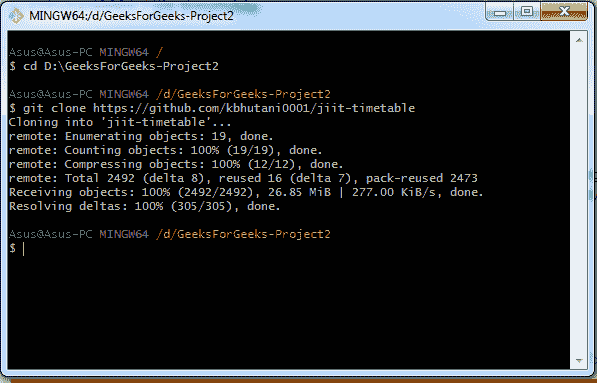
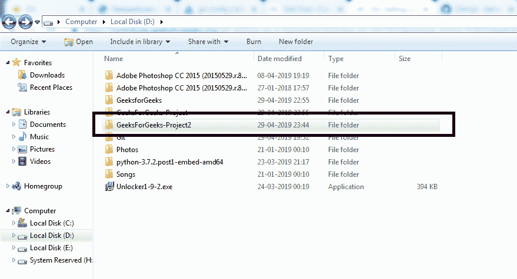
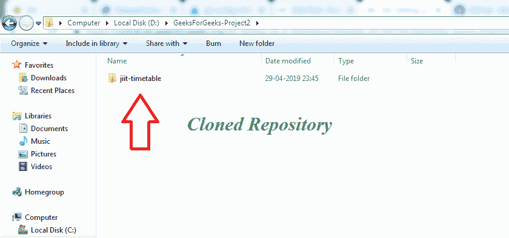

# Git-设置存储库

> 原文:[https://www.geeksforgeeks.org/git-setting-up-a-repository/](https://www.geeksforgeeks.org/git-setting-up-a-repository/)

**<font size="5px">什么是仓库？</font>**
简单来说，就是数据存储或管理的中心位置。一个 **git 存储库**虚拟存储一个特定的文件，并允许你保存和访问它的版本。

**<font size="5px">初始化存储库</font>**
要创建新的存储库，需要使用 ***git init*** 命令。它用于将现有项目转换为 git 存储库。这是我们在初始化新存储库时使用的第一个也是唯一一个命令。执行 git init 命令时， ***。git*** 子目录被创建。这包括对象、模板文件等的子目录。还会创建一个初始头文件或新的主分支。

```
git init (directory)
```

这将创建一个空的 git 存储库。







***git init 命令初始化仓库***

**注意:** *在已经包含的项目目录上运行 git init。git 子目录不会覆盖现有的。再次使用 git init 进行 git 配置。*

**<font size="3px">配置</font>**

*   **-q**
    **-安静**
    只打印错误和警告信息。所有其他输出被静音。
*   **–裸露的**
    它创建了一个裸露的存储库。当您与其他开发人员协作并需要一个空间来共享彼此的更改时，可以使用它。为此，在一个中心位置创建了一个空的存储库，每个人都可以在这里推进他们的更改。
*   **–template =(template _ directory)**
    它指定了将文件复制到存储库中的目录。
*   **–SHARED[=(FALSE | TRUE | UMASK | GROUP | ALL | WORLD | EVERYBODY | 0xx)]**
    它设置新存储库的访问权限。以下是几个例子
*   ***组(或真)*** :使存储库组可写。
*   ***【全部(或世界或所有人)***:-与组相同，但使存储库可供所有用户阅读。

**<font size="5px">【Git Clone】</font>**
当项目已经在中央存储库中时使用该命令。和 git init 一样，git clone 也是一次性命令。

```
git clone (repository URL) 
```

git clone 用于创建远程存储库的副本。我们通过 git 克隆一个存储库网址。



**下图显示了将存储库文件从 github 克隆到本地存储库目录**





**<font size="3px">选项</font>**

*   **–分支**
    它允许你指向指向克隆的存储库的头的分支，而不是指向新创建的头。
*   **–模板**
    它在克隆存储库，并将模板表单应用到新创建的本地分支。

其他选项有***–镜像、–裸、–原点*** 等等。

**<font size="5px">总结- *git init* VS *git 克隆*</font>**
区分它们非常简单的方法就是注意 git 克隆依赖 git init 这一点。git clone 用于创建现有存储库的副本，但是 git clone 本身首先调用 git init 来创建新的存储库。