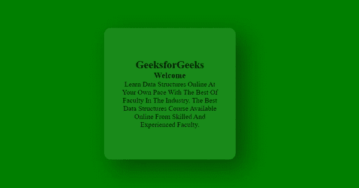

# 玻璃变形卡悬停效果

> 原文:[https://www . geesforgeks . org/glass morphism-card-hover-effect/](https://www.geeksforgeeks.org/glassmorphism-card-hover-effect/)

**玻璃变形**是一种为任何网页的网页元素设计样式并提供 3D 和玻璃效果的现代方式。这种动画效果可以通过使用 HTML、CSS 和 Vanilla-tilt JS 轻松生成。我们可以使用各种 CSS 属性来实现 Glassmorphism。它用于给给定元素添加玻璃效果，香草倾斜 JS 用于为卡片提供倾斜效果。

**安装:**

*   在继续之前，首先我们必须安装香草倾斜模块，通过在您的项目目录中运行以下命令，借助您的 SRC 文件夹中的终端，或者您也可以在您的项目文件夹中的 Visual Studio Code 的终端中运行该命令。

    ```htmlhtml
    npm install vanilla-tilt
    ```

*   香草倾斜 JS 也可以使用它的 CDN。

    > https://cdnjs . cloudflare . com/Ajax/libs/香草-tilt/1 . 7 . 0/香草-tilt.min.js

**HTML 代码:**在本节中，我们将进行卡片的布局。

**index.html**

## 超文本标记语言

```htmlhtml
<!DOCTYPE html>
<html>

<body>
    <div class="gfg">
        <div class="card">
            <div class="content">
                <h2>GeeksforGeeks</h2>
                <h3>Welcome</h3>
                <p>
                    Learn Data Structures Online At 
                    Your Own Pace With The Best Of 
                    Faculty In The Industry. The Best 
                    Data Structures Course Available
                    Online From Skilled And Experienced 
                    Faculty.
                </p>
            </div>
        </div>
    </div>
</body>

</html>
```

**CSS 代码:**在本节中，我们将使用一些 CSS 属性来设计卡片。

**index.css**

## 超文本标记语言

```htmlhtml
<style>
    *{
        margin:0;
        padding:0;
        box-sizing:border-box;

    }

    body{
        display:flex;
        justify-content:center;
        align-items:center;
        min-height:100vh;
        background:green;
    }

    .gfg{
        position:relative;
        display:flex;
        justify-content:center;
        align-items:center;
        max-width:1000px;
        flex-wrap:wrap;
        z-index:1;
    }

    .gfg .card{
        position:relative;
        width:300px;
        height:300px;
        margin:60px;
        box-shadow:20px 20px 50px rgb(0,0,0,0.4);
        border-radius:15px;
        background:rgba(255,255,255,0.1);
        overflow:hidden;
        display:flex;
        justify-content:center;
        align-items:center;
        backdrop-filter:blur(6px);
    }

    .gfg .card .content{
        padding:40px;
        text-align:center;

    }
</style>
```

**JavaScript 代码:**在本节中，我们将使用 Vanilla-tilt JS 为卡片提供倾斜效果。

**script.js**

## java 描述语言

```htmlhtml
<script>
    VanillaTilt.init(document.querySelector(".card"), {
        max: 40,
        speed: 800,
        glare:true,
        "max-glare":2.5,
    });
</script>
```

**完整代码:**在本节中，我们将结合以上三个部分来创建一个玻璃态效果。

## 超文本标记语言

```htmlhtml
<!DOCTYPE html>
<html>

<head>
    <meta charset="utf-8">
    <style>
        *{
            margin: 0;
            padding: 0;
            box-sizing: border-box;

        }

        body{
            display: flex;
            justify-content: center;
            align-items: center;
            min-height: 100vh;
            background: green;
        }

        .gfg{
            position: relative;
            display: flex;
            justify-content: center;
            align-items: center;
            max-width: 1000px;
            flex-wrap: wrap;
            z-index: 1;
        }

        .gfg .card{
            position: relative;
            width: 300px;
            height: 300px;
            margin: 60px;
            box-shadow: 20px 20px 50px rgb(0,0,0,0.4);
            border-radius: 15px;
            background: rgba(255,255,255,0.1);
            overflow: hidden;
            display: flex;
            justify-content: center;
            align-items: center;
            backdrop-filter: blur(6px);
        }

        .gfg .card .content{
            padding: 40px;
            text-align: center;
        }
    </style>
</head>

<body>
    <div class="gfg">
        <div class="card">
            <div class ="content">
                <h2>GeeksforGeeks</h2>
                <h3>Welcome</h3>
                <p>
                    Learn Data Structures Online At Your 
                    Own Pace With The Best Of Faculty In 
                    The Industry. The Best Data Structures 
                    Course Available Online From Skilled 
                    And Experienced Faculty.
                </p>
            </div>
        </div>
    </div>
    <script src="vanilla-tilt.js">
    </script>

    <script>
        VanillaTilt.init(document.querySelector(".card"), {
          max: 40,
          speed: 800,
          glare: true,
          "max-glare": 2.5,
        });
    </script>
</body>

</html>
```

**输出:**

