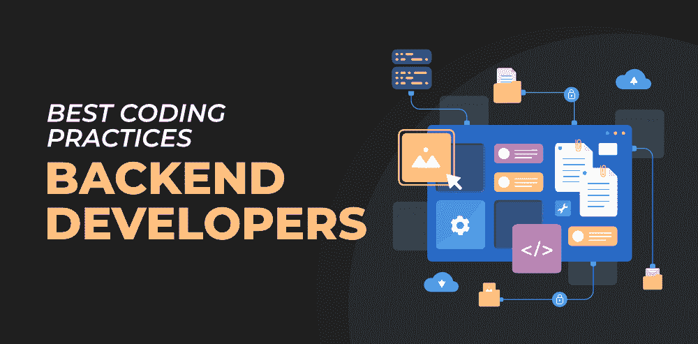
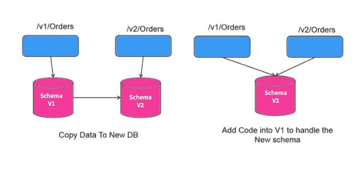

# 后端开发人员的良好编码实践

> 原文:[https://www . geesforgeks . org/good-coding-practices-for-back-developer/](https://www.geeksforgeeks.org/good-coding-practices-for-backend-developers/)

***API、认证、设计模式、MVC、缓存、Cookies、会话、JSON、端点、服务器、托管、邮递员、CRUD、Curl……***

***这些词你不都很熟悉吗？？？**T3】*

如果是的话，那么你肯定是一个后端开发人员，或者正在处理应用程序的后端部分。

客户经常低估后端开发人员的工作，尤其是那些只对前端部分印象深刻而对后端编码一无所知的人。客户端永远无法获得后端编码部分的复杂性。

问一个开发人员，他们会让你知道用最少的代码连接 4-5 个表有时有多难，他们在实现 API 的过程中会面临什么样的困难，在制作动态 URL 时，他们需要如何考虑所有的场景。

想象一个场景，你正在建立一个电子商务网站，你需要处理一个复杂的查询，你必须计算一个客户的价格，他将从你的网站上购物。如果你用=代替==，会发生什么。当然，整个结果会不同，客户可能会得到好处，也可能会损失很多钱。后端的一个小错误会产生很多 bug，而且会花很多钱(*当然，当你不得不面对你的高级工程师时，你会在你的公司遇到麻烦…lol* )。

后端开发涉及处理许多复杂的东西。为了提高应用程序的效率，开发人员在处理应用程序的后端部分时，需要真正关注逻辑和代码优化。

对于一个项目来说，当团队非常小的时候，开发人员不会太关注好的编码实践，但是当团队和应用程序发展的时候，在整个团队中遵循最佳的编码实践是很好的。

今天在这个博客中，我们将从后端开发人员的角度分享一些好的编码实践，这对在微服务或网格架构环境中工作的开发人员非常有用。

### 1.完善你的核心技能

这是在应用程序后端工作时需要适应的最重要的技能。你至少要有服务器端语言的工作知识，比如 [Java](https://www.geeksforgeeks.org/java/) 、 [Python](https://www.geeksforgeeks.org/python-programming-language/) 、 [PHP](https://www.geeksforgeeks.org/php/) 、 [C#](https://www.geeksforgeeks.org/csharp-programming-language/) 等。你在这些语言中的能力越强，开发应用程序就越容易。

此外，您应该有很强的 SQL 或数据库基础。后端开发人员处理保存在数据库中的大量数据。他们在日常工作中对其运行多个查询。因此，作为最低要求，接触一些数据库，如数据库管理系统、数据库服务器、蒙古数据库和邮政数据库是很好的。它们都有一个类似的将数据存储在行和列中的概念，但是在所有的数据库中都有一些不同。在开始构建应用程序之前，了解这些数据库的工作知识是很好的。

后端开发人员的另一项重要技能是了解 [JSON](https://www.geeksforgeeks.org/javascript-json/) 和/或 XML APIs。许多应用程序需要以 JSON 的形式进行数据检索，并连接到应用程序编程接口(API)。API 中最流行的数据检索格式是 JSON 格式和 XML。关于使用 API 和这些格式的知识将使您的后端开发之旅变得更加容易。

### 2.验证输入并处理错误

如果你写后端代码已经超过几个月了，那么你可能已经从高级工程师那里听到了“永远不要相信你的用户”这个词。作为后端开发人员，请确保您永远不要相信用户提交的数据。当应用程序在服务器上运行时，黑客可能会试图入侵系统。

为了确保系统的安全性，最好验证进入系统的输入。现在的问题是……*如何验证输入到您的系统？*

您可以在两个级别验证输入…

*   [**API Gateway**](https://docs.aws.amazon.com/apigateway/latest/developerguide/api-gateway-method-request-validation.html) **:这个可以通过策略来完成，主要是泛型验证、模式、格式。**
*   **微服务:**这包括检查实体的存在。您可以在微服务中使用开发栈的库进行输入验证。

一旦你完成了输入和错误的验证，你需要承担起正确处理的责任。在微服务/网格体系结构中，您需要仔细地做这件事，因为在这些类型的系统中，组件是相互连接的。如果其中一个服务崩溃，那么整个系统可能会受到影响。在这种情况下，您可能需要进行大量的故障排除。

您应该了解服务器上发生错误时生成的 HTTP 错误代码。为了处理这些错误，返回一个响应，而不使服务崩溃。正确的输入验证和错误处理不会对服务器造成任何问题。这也将减少对软件故障排除的需求

### 3.关注点分离后

*   ***如何组织自己的代码？**T3】*
*   ***如何构造代码？**T3】*
*   ***对于代码的可维护性，你是怎么做的？**T3】*

对上述问题的一个很好的回答是…在代码中使用关注点分离。作为一个后端开发人员，如果你在你的软件架构中遵循这个概念，那么你肯定会在代码的可维护性上节省很多时间和精力。

关注点分离将您的整个计算机程序分成不同的部分或不同的模块，以便更好地组织代码。这增加了代码的可读性，并使其他开发人员更容易在应用程序上进行协作。

您可以遵循任何设计模式来构建代码。网络应用程序中一个流行的是 [MVC](https://www.geeksforgeeks.org/mvc-design-pattern/) 框架。在软件架构中实现这种良好的实践对整个团队来说确实很有帮助。它减少了代码的学习曲线，并在应用程序开发期间提高了团队的整体速度和效率。

### 4.实施运行状况检查端点和日志记录

运行状况检查仅仅意味着监控系统的服务。我们确保数据库在工作，服务在整个系统中平稳运行。如果发现错误或问题，这有助于解决软件中的问题。如果运行状况检查失败，您的软件服务可能会被终止。因此，让我们讨论一些在您的系统中实现良好健康检查的方法。

*   **TCP 运行状况检查:**这是一个基本的运行状况检查，确保服务正常运行。此运行状况检查是通过 TCP 完成的，它不监控服务级别运行状况。大多数云平台都有自己的解决方案来实现这种运行状况检查。

*   **服务级健康检查:**服务级健康检查是健康检查的高级级别。它验证预期的输出，并确保服务平稳运行。

*   **日志记录:**这里我们关注的是将数据库查询、请求和响应等操作记录到集中的日志接收器中。为此，您可以使用一些日志库或日志管理工具。

### 5.为您的服务实现版本控制

随着时间的推移，您的应用程序需要频繁更改。为了有效地处理这些更改，您需要在当前版本仍在您的系统中运行时实现并测试应用程序。让我们讨论两种版本化服务的方法。

*   **URL:** 例如**“/users/v 2.1/{ id }”**
*   ****表头:**包含在表头为“X-版本:2.1。”**

**下面是一个网址版本控制方法的例子。**

****

### **6.自动化重复性任务**

***剧本总是一样的，但人类不是……***

**作为一名后端开发人员，您可能在日常工作中经历过一些重复的任务。学会自动化。不要浪费时间一次又一次地做同样的事情。自动化这些事情会让你的生活变得更容易，你不需要一遍又一遍地输入相同的命令。**

### **7.编写测试用例和文档**

**在进入实际的编码部分之前，如果您编写了测试用例，那么它肯定会帮助您规划和可视化最终产品。您不必频繁更改代码库，这将提高您的工作效率。此外，测试用例将帮助您识别您在代码库中所做更改的下游影响，尤其是当应用程序增长时。**

**[**【测试驱动开发(TDD)**](https://www.geeksforgeeks.org/test-driven-development-tdd/) **:** 这是在开始实际编码之前编写测试用例的好方法之一。TDD 有很多好处，但也有一些缺点。它会占用很多时间。如果服务是关键的，那么详细说明测试用例。**

**您所使用的语言中有很多测试框架。你可以从链接 [8 有用的测试工具、库](https://www.geeksforgeeks.org/8-useful-testing-tools-libraries-and-frameworks-for-react-developers/)、[和反应开发者框架](https://www.geeksforgeeks.org/8-useful-testing-tools-libraries-and-frameworks-for-react-developers/)中查看 JavaScript 的测试框架。**

**现在我们来看文档部分。**

**如果您不理解代码的一部分，并且需要要求其他开发人员澄清应用程序的特定部分在代码库中做什么，您会有什么感觉？**

**如果每次你都要嘲笑另一个开发人员来澄清代码库中的东西，这肯定会令人沮丧。您将花费大量时间理解代码，这只会妨碍工作效率。**

**当团队和应用程序很小时，开发人员不理解代码的文档部分的重要性。在大多数创业公司中，他们不维护他们正在开发的应用程序的文档。他们的主要重点是快速构建和运输产品。**

**为代码编写文档非常重要。它有助于整个团队正确理解代码，并顺利构建软件，没有任何麻烦。因此，找到一种最适合您的团队编写代码文档的方法是很好的。查看波兹曼的链接[应用编程接口文档，了解编写应用编程接口文档的各种方法。](https://www.postman.com/api-documentation-generator/)**

### **结论**

**作为一个后端开发人员，你将不得不处理许多复杂的东西和问题。不仅要开发应用程序，还要处理托管应用程序的备份和服务器。无论您在后端选择什么技术，请确保您在其上实现了最佳实践。作为一名后端开发人员，我们相信您的生活会变得更加轻松…**