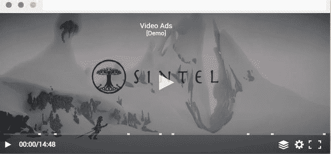
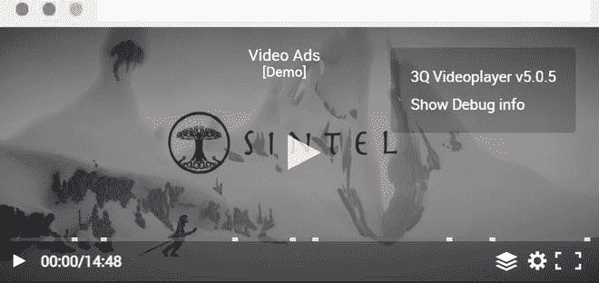
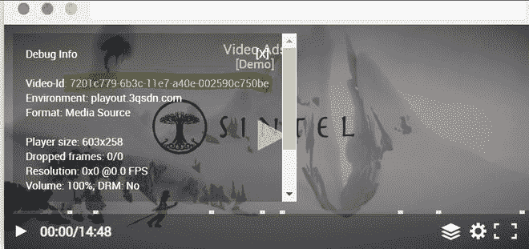
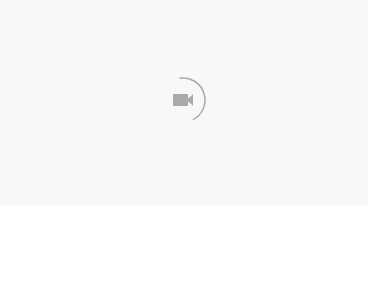

# 谷歌 amp-3q-player

> 原文:[https://www.geeksforgeeks.org/google-amp-amp-3q-player/](https://www.geeksforgeeks.org/google-amp-amp-3q-player/)


**简介:****3Q 播放器**是一款用 JavaScript 编写的视频播放器。播放器为流式视频内容实现媒体源扩展。在 **AMP HTML** 中嵌入一个 3Q 播放器，我们使用一个 **amp-3q 播放器组件**。3q-player 有许多功能，如云录制、视频流、网络广播等

**官方网站:**[https://3q.video/en/](https://3q.video/en/)

**所需脚本:**将 amp-3q-player 导入表头。

```htmlhtml
<script async custom-element="amp-3q-player" src=
"https://cdn.ampproject.org/v0/amp-3q-player-0.1.js">
</script>
```

**属性:**

*   **数据-id:** 是一个 3Q 播放器的视频 id，需要在一个 AMP 页面中嵌入一个 3Q 播放器。
*   **自动播放:**如果存在自动播放属性，那么视频一加载就会开始播放。

**示例:**要嵌入 3q 播放器，视频的数据 id 应该取数据 id。

*   转到视频

    

*   右键单击视频

    

*   单击显示调试信息并复制突出显示的代码

    

*   将 id 粘贴到 amp-3q 播放器标签的视频 id 中

    ```htmlhtml
    <!DOCTYPE html>
    <html amp>

    <head>
        <meta charset="utf-8" />
        <title>geeksforgeeks amp-3q-player</title>

        <script async src=
            "https://cdn.ampproject.org/v0.js">
        </script>

        <script async custom-element="amp-3q-player"
    src="https://cdn.ampproject.org/v0/amp-3q-player-0.1.js">
        </script>

        <!-- Import the `amp-ad` component in the header. -->
        <script async custom-element="amp-ad" 
    src="https://cdn.ampproject.org/v0/amp-ad-0.1.js">
        </script>

        <link rel="canonical" href=
    "https://amp.dev/documentation/components/amp-3q-player/?format=websites" />

        <meta name="viewport" content="width=device-width,
                           minimum-scale=1,
                           initial-scale=1" />

        <style amp-boilerplate>
            body {
                -webkit-animation: -amp-start 8s 
                    steps(1, end) 0s 1 normal both;

                -moz-animation: -amp-start 8s 
                    steps(1, end) 0s 1 normal both;

                -ms-animation: -amp-start 8s 
                    steps(1, end) 0s 1 normal both;

                animation: -amp-start 8s 
                    steps(1, end) 0s 1 normal both;
            }

            @-webkit-keyframes -amp-start {
                from {
                    visibility: hidden;
                }

                to {
                    visibility: visible;
                }
            }

            @-moz-keyframes -amp-start {
                from {
                    visibility: hidden;
                }

                to {
                    visibility: visible;
                }
            }

            @-ms-keyframes -amp-start {
                from {
                    visibility: hidden;
                }

                to {
                    visibility: visible;
                }
            }

            @-o-keyframes -amp-start {
                from {
                    visibility: hidden;
                }

                to {
                    visibility: visible;
                }
            }

            @keyframes -amp-start {
                from {
                    visibility: hidden;
                }

                to {
                    visibility: visible;
                }
            }
        </style>

        <noscript>
            <style amp-boilerplate>
                body {
                    -webkit-animation: none;
                    -moz-animation: none;
                    -ms-animation: none;
                    animation: none;
                }
            </style>
        </noscript>
    </head>

    <body>
        <amp-3q-player data-id=
            "7201c779-6b3c-11e7-ae0e-002590c750be" 
            layout="responsive" width="400" 
            height="400">
        </amp-3q-player>
    </body>

    </html>
    ```

    **输出:**
    