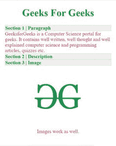

# 谷歌 AMP-AMP 手风琴

> 原文:[https://www.geeksforgeeks.org/google-amp-amp-accordion/](https://www.geeksforgeeks.org/google-amp-amp-accordion/)


**简介:**

有时候，我们有很多内容要展示，为了让网站看起来美观和简短，我们使用了可折叠的文本框。可折叠文本框是标题和内容的组合，通常只有标题是可见的，但是当它被点击时，内容就会显示出来。

**设置:**

*   您必须在标题中导入 amp-accordion 组件才能使用此标签。

```html
<script async custom-element="amp-accordion" 
        src="https://cdn.ampproject.org/v0/amp-accordion-0.1.js">
</script>
```

**示例:**

```html
<!DOCTYPE html>
<html ⚡>
    <head>
        <meta charset="utf-8" />
        <script async src="https://cdn.ampproject.org/v0.js">
      </script>
        <!--
    Import the `amp-accordion` component in the header.
  -->
        <script async custom-element="amp-accordion" 
                src="https://cdn.ampproject.org/v0/amp-accordion-0.1.js">
      </script>
        <link rel="canonical" 
              href=
"https://amp.dev/documentation/examples/components/amp-accordion/index.html" />
        <meta
            name="viewport"
            content="width=device-width, 
                       minimum-scale=1,
                       initial-scale=1"
        />
        <style amp-boilerplate>
            body {
                -webkit-animation: 
                  -amp-start 8s steps(1, end) 0s 1 normal both;
                -moz-animation: 
                  -amp-start 8s steps(1, end) 0s 1 normal both;
                -ms-animation:
                  -amp-start 8s steps(1, end) 0s 1 normal both;
                animation:
                  -amp-start 8s steps(1, end) 0s 1 normal both;
            }
            @-webkit-keyframes -amp-start {
                from {
                    visibility: hidden;
                }
                to {
                    visibility: visible;
                }
            }
            @-moz-keyframes -amp-start {
                from {
                    visibility: hidden;
                }
                to {
                    visibility: visible;
                }
            }
            @-ms-keyframes -amp-start {
                from {
                    visibility: hidden;
                }
                to {
                    visibility: visible;
                }
            }
            @-o-keyframes -amp-start {
                from {
                    visibility: hidden;
                }
                to {
                    visibility: visible;
                }
            }
            @keyframes -amp-start {
                from {
                    visibility: hidden;
                }
                to {
                    visibility: visible;
                }
            }
        </style>
        <noscript>
            <style amp-boilerplate>
                body {
                    -webkit-animation: none;
                    -moz-animation: none;
                    -ms-animation: none;
                    animation: none;
                }
            </style>
        </noscript>
        <!-- Custom Styling -->
        <style amp-custom>
            h1,
            h4 {
                color: forestgreen;
            }
            section {
                color: crimson;
            }

            amp-accordion section[expanded] .show-more {
                display: none;
            }

            amp-accordion section:not([expanded]) .show-less {
                display: none;
            }

            .nested-accordion h4 {
                font-size: 20px;
                background-color: #ddd;
            }

            amp-accordion.hidden-header section[expanded] h4 {
                border: none;
            }
            #content-head {
                display: flex;
            }
            .fruit-title {
                width: 50%;
            }
            .comp-data {
                display: flex;
            }
            .comp-value {
                width: 50%;
                border: 1px solid;
                padding: 5px 18px;
                display: flex;
            }

            /* these styles are not required
          for the samples to work */
            :root {
                --space-2: 1rem;
                /* 16px */
            }

            amp-accordion.sample {
                margin: var(--space-2);
            }
        </style>
        <meta name="robots" content="noindex, nofollow" />
    </head>
    <body>
        <!-- Body of the Page -->
        <center>
            <h1>
                Geeks For Geeks
            </h1>
        </center>
        <amp-accordion class="sample">
            <section expanded>
                <h4>Section 1 | Paragraph</h4>
                <p>GeeksforGeeks is a Computer Science portal 
                  for geeks. It contains well written, 
                  well thought and well explained
                  computer science and programming
                  articles, quizzes etc.</p>
            </section>
            <section>
                <h4>Section 2 | Description</h4>
                <p>
                    GeeksforGeeks is a Computer Science 
                  portal for geeks. It contains well written, 
                  well thought and well explained computer 
                  science and programming articles, quizzes
                  etc. <br />
                    <br />
                    GeeksforGeeks is a Computer Science
                  portal for geeks. It contains well written, 
                  well thought and well explained computer
                  science and programming articles, quizzes 
                  etc.
                </p>
            </section>
            <section>
                <h4>Section 3 | Image</h4>
                <figure>
                    <center>
                        <amp-img src=
"https://pbs.twimg.com/profile_images/1138375574726955008/1fNUyEdv.png"
                                 width="200px" 
                                 height="200px">
                      </amp-img>
                        <figcaption>
                          Images work as well.</figcaption>
                    </center>
                </figure>
            </section>
        </amp-accordion>
    </body>
</html>
```

**输出:**



这是输出窗口…

**定制造型:**

虽然这是一个非常简单的标签，但它可以根据用户需求进行定制，因为它有许多定制选项，例如:

*   动态标题
*   隐藏标题
*   嵌套手风琴
*   自动折叠手风琴
*   动画手风琴
*   比较手风琴

通过所有这些定制，制作一个漂亮的网站是非常容易的。

**参考文献:**

*   [**https://amp.dev/**T3】](https://amp.dev/)