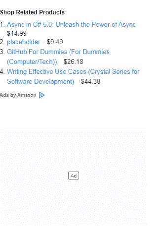

# 谷歌 amp-ad

> 原文:[https://www.geeksforgeeks.org/google-amp-amp-ad/](https://www.geeksforgeeks.org/google-amp-amp-ad/)


**简介:**

我们使用这个组件来制作一个容器，在 AMP HTML 文件中显示一个广告。

官方网站:[https://amp.dev/](https://amp.dev/)

**所需脚本:**

在标题中导入放大器组件

```htmlhtml
<script async custom-element="amp-ad" src="https://cdn.ampproject.org/v0/amp-ad-0.1.js">
</script>
```

**属性:**

*   **占位符**–amp-ad 支持带有占位符属性的子元素。当出现网络问题并且广告不可见时，将显示占位符

```htmlhtml
<amp-ad width="100" height="100">
  <div placeholder>No geeky ads to show</div>
</amp-ad>
```

*   **回退**–amp-ad 支持带有回退属性的子元素。当没有可用于该槽的广告时，显示该元素

```htmlhtml
<amp-ad width="100" height="100">
  <div fallback>geeks for geeks has no ad available at the moment</div>
</amp-ad>
```

**示例:**

```htmlhtml
<!doctype html>
<html ⚡>
<head>
<meta charset="utf-8">
  <title>amp-ad</title>
  <script async src=
          "https://cdn.ampproject.org/v0.js">
  </script>
  <!-- Import the `amp-ad` component in the header. -->
  <script async custom-element="amp-ad" 
          src="https://cdn.ampproject.org/v0/amp-ad-0.1.js">
  </script>
  <link rel="canonical" 
        href=
"https://amp.dev/documentation/examples/components/amp-ad/index.html">
  <meta name="viewport" 
        content="width=device-width, 
                 minimum-scale=1, 
                 initial-scale=1">
  <style amp-boilerplate>
    body
    {
      -webkit-animation:
        -amp-start 8s steps(1, end) 0s 1 normal both;
      -moz-animation:
        -amp-start 8s steps(1, end) 0s 1 normal both;
      -ms-animation:
        -amp-start 8s steps(1, end) 0s 1 normal both;
      animation:
        -amp-start 8s steps(1, end) 0s 1 normal both
    }
    @-webkit-keyframes 
    -amp-start{from{visibility:hidden}to{visibility:visible}}
    @-moz-keyframes 
    -amp-start{from{visibility:hidden}to{visibility:visible}}
    @-ms-keyframes 
    -amp-start{from{visibility:hidden}to{visibility:visible}}
    @-o-keyframes 
    -amp-start{from{visibility:hidden}to{visibility:visible}}
    @keyframes 
    -amp-start{from{visibility:hidden}to{visibility:visible}}
  </style>
  <noscript>
    <style amp-boilerplate>
      body
      {
        -webkit-animation:none;
        -moz-animation:none;
        -ms-animation:none;
        animation:none
      }
    </style>
  </noscript>
</head>
<body>
<h3>geeksforgeeks amp | ad<h3>
  <!--
    `amp-ad` requires `width` and 
   `height` values. Select an ad network
     via the type argument.
  -->
  <amp-ad width="300" 
          height="250" 
          type="a9"
          data-amzn_assoc_ad_mode="auto" 
          data-divid=
 "amzn-assoc-ad-fe746097-f142-4f8d-8dfb-45ec747632e5" 
          data-recomtype="async" 
          data-adinstanceid=
          "fe746097-f142-4f8d-8dfb-45ec747632e5">
  </amp-ad>

  <!-- Placeholder-->
  <!--
    Optionally `amp-ad` supports a child 
element with the `placeholder` attribute.
    If supported by the ad network, 
this element is shown until the ad is available
    for viewing.
  -->
  <amp-ad width="300"
          height="200"
          type="doubleclick"
          data-slot="/4119129/doesnt-exist">
    <div placeholder>
      <b> gfg Placeholder here!!!</b>
    </div>
  </amp-ad>

  <!--Fallback-->
  <!--
    `amp-ad` supports a child element 
with the `fallback` attribute.
    If supported by the ad network, this 
element is shown if no ad is available 
    for this slot.
  -->
  <amp-ad width="300"
          height="200" 
          type="doubleclick" 
          data-slot="/4119129/doesnt-exist">
    <div fallback>
      <p>No ad</p>
    </div>
  </amp-ad>
 </body>
</html>
```

**输出:** 