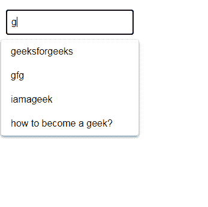
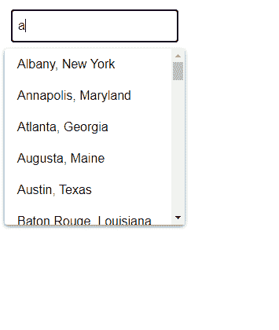

# 谷歌 AMP-AMP 自动完成

> 原文:[https://www.geeksforgeeks.org/google-amp-amp-autocomplete/](https://www.geeksforgeeks.org/google-amp-amp-autocomplete/)


**amp-autocomplete** 根据用户键入时给出的输入建议完整的结果。这是一个非常常见和有用的功能，因为它使用户能够更快地完成任务。当用户不知道输入的全部范围时，这非常有用。

**必需脚本:**导入放大器自动完成组件–

## 超文本标记语言

```html
<script async custom-element="amp-autocomplete" src=
"https://cdn.ampproject.org/v0/amp-autocomplete-0.1.js">
</script>
```

**导入放大器组件–**

## 超文本标记语言

```html
<script async custom-element="amp-form" src=
"https://cdn.ampproject.org/v0/amp-form-0.1.js">
</script>
```

用法:

*   amp-autocomplete 必须嵌套在表单中。
*   表单应该包含带有输入标签或 textarea 标签的输入字段。
*   数据源必须是包含数组属性项的 JSON 对象。
*   数据源可以用子脚本 type="application/json "标记指定，也可以通过 src 标记指定。

**使用子脚本类型=“应用程序/JSON”–**

## 超文本标记语言

```html
<form class="sample-form" method="post" 
    action-xhr=
"https://amp.dev/documentation/examples/api/echo"
    target="_top">

    <amp-autocomplete filter="substring">
        <input>
        <script type="application/json">
            {
                "items": ["geeksforgeeks", "gfg", 
                "iamageek" ,"how to become a geek?"]
            }
        </script>
    </amp-autocomplete>
</form>
```

**使用 src 标签–**

## 超文本标记语言

```html
<form class="sample-form" method="post" 
    action-xhr=
"https://amp.dev/documentation/examples/api/echo"
    target="_top">

    <!--the following src link contains 
        names of cities-->
    <amp-autocomplete filter="substring" 
src="/static/samples/json/amp-autocomplete-cities.json">
        <input>
    </amp-autocomplete>
</form>
```

**例 1:**

## 超文本标记语言

```html
<!doctype html>
<html amp>

<head>
    <meta charset="utf-8">
    <link rel="canonical" href=
"https://amp.dev/documentation/examples/components/amp-autocomplete/index.html">

    <meta name="viewport" content=
"width=device-width,minimum-scale=1,initial-scale=1">

    <script async custom-element=
        "amp-autocomplete" src=
"https://cdn.ampproject.org/v0/amp-autocomplete-0.1.js">
    </script>

    <script async custom-element=
        "amp-form" src=
"https://cdn.ampproject.org/v0/amp-form-0.1.js">
    </script>

    <title>Google AMP amp-autocomplete</title>

    <style amp-custom>
        :root {
            --space-1: .5rem;
            /* 8px */
            --space-2: 1rem;
            /* 16px */
            --space-3: 1.5rem;
            /* 24px */
            --space-4: 2rem;
            /* 32px */
        }

        .sample-form input[type=submit] {
            -webkit-appearance: none;
            border: none;
            background-color: var(--color-primary);
            color: var(--color-text-light);
            margin: var(--space-2);
            font-family: 'Poppins', sans-serif;
            font-weight: 700;
            line-height: 1.2em;
            font-size: 1em;
            padding: 0.75em 1.75em;
            text-decoration: none;
            text-align: center;
            border-radius: 3px;
            border: none;
            box-shadow: var(--box-shadow-1);
        }

        .sample-form {
            padding: var(--space-2);
        }
    </style>

    <style amp-boilerplate>
        body {
            -webkit-animation: -amp-start 8s 
                steps(1, end) 0s 1 normal both;

            -moz-animation: -amp-start 8s 
                steps(1, end) 0s 1 normal both;

            -ms-animation: -amp-start 8s 
                steps(1, end) 0s 1 normal both;

            animation: -amp-start 8s 
                steps(1, end) 0s 1 normal both
        }

        @-webkit-keyframes -amp-start {
            from {
                visibility: hidden
            }

            to {
                visibility: visible
            }
        }

        @-moz-keyframes -amp-start {
            from {
                visibility: hidden
            }

            to {
                visibility: visible
            }
        }

        @-ms-keyframes -amp-start {
            from {
                visibility: hidden
            }

            to {
                visibility: visible
            }
        }

        @-o-keyframes -amp-start {
            from {
                visibility: hidden
            }

            to {
                visibility: visible
            }
        }

        @keyframes -amp-start {
            from {
                visibility: hidden
            }

            to {
                visibility: visible
            }
        }
    </style>
    <noscript>
        <style amp-boilerplate>
            body {
                -webkit-animation: none;
                -moz-animation: none;
                -ms-animation: none;
                animation: none
            }
        </style>
    </noscript>
</head>

<body>
    <form class="sample-form" method="post"
        action-xhr=
"https://amp.dev/documentation/examples/api/echo"
        target="_top">

        <amp-autocomplete filter="substring">
            <input>

            <!-- Auto suggestion strings 
                stored in item-->
            <script type="application/json">
                {
                    "items": ["geeksforgeeks", 
                    "gfg", "iamageek", 
                    "how to become a geek?"]
                }
            </script>
        </amp-autocomplete>
    </form>
</body>

</html>
```

### 输出



**例 2:**

## 超文本标记语言

```html
<!doctype html>
<html amp>

<head>
    <meta charset="utf-8">
    <link rel="canonical" href=
"https://amp.dev/documentation/examples/components/amp-autocomplete/index.html">

    <meta name="viewport" content=
"width=device-width,minimum-scale=1,initial-scale=1">

    <script async custom-element=
        "amp-autocomplete" src=
"https://cdn.ampproject.org/v0/amp-autocomplete-0.1.js">
    </script>

    <script async custom-element=
        "amp-form" src=
"https://cdn.ampproject.org/v0/amp-form-0.1.js">
    </script>

    <title>Google AMP amp-autocomplete</title>

    <style amp-custom>
        :root {
            --space-1: .5rem;
            /* 8px */
            --space-2: 1rem;
            /* 16px */
            --space-3: 1.5rem;
            /* 24px */
            --space-4: 2rem;
            /* 32px */
        }

        .sample-form input[type=submit] {
            -webkit-appearance: none;
            border: none;
            background-color: var(--color-primary);
            color: var(--color-text-light);
            margin: var(--space-2);
            font-family: 'Poppins', sans-serif;
            font-weight: 700;
            line-height: 1.2em;
            font-size: 1em;
            padding: 0.75em 1.75em;
            text-decoration: none;
            text-align: center;
            border-radius: 3px;
            border: none;
            box-shadow: var(--box-shadow-1);
        }

        .sample-form {
            padding: var(--space-2);
        }
    </style>

    <style amp-boilerplate>
        body {
            -webkit-animation: -amp-start 8s 
                steps(1, end) 0s 1 normal both;

            -moz-animation: -amp-start 8s 
                steps(1, end) 0s 1 normal both;

            -ms-animation: -amp-start 8s 
                steps(1, end) 0s 1 normal both;

            animation: -amp-start 8s 
                steps(1, end) 0s 1 normal both
        }

        @-webkit-keyframes -amp-start {
            from {
                visibility: hidden
            }

            to {
                visibility: visible
            }
        }

        @-moz-keyframes -amp-start {
            from {
                visibility: hidden
            }

            to {
                visibility: visible
            }
        }

        @-ms-keyframes -amp-start {
            from {
                visibility: hidden
            }

            to {
                visibility: visible
            }
        }

        @-o-keyframes -amp-start {
            from {
                visibility: hidden
            }

            to {
                visibility: visible
            }
        }

        @keyframes -amp-start {
            from {
                visibility: hidden
            }

            to {
                visibility: visible
            }
        }
    </style>
    <noscript>
        <style amp-boilerplate>
            body {
                -webkit-animation: none;
                -moz-animation: none;
                -ms-animation: none;
                animation: none
            }
        </style>
    </noscript>
</head>

<body>
    <form class="sample-form" method="post" 
        action-xhr=
"https://amp.dev/documentation/examples/api/echo"
        target="_top">

        <!--the following src link contains 
            names of cities-->
        <amp-autocomplete filter="substring" 
src="/static/samples/json/amp-autocomplete-cities.json">
            <input>
        </amp-autocomplete>
    </form>
</body>

</html>
```

### 输出

