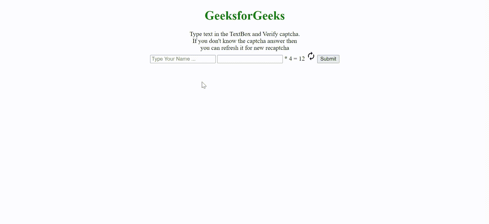

# 谷歌 AMP-AMP-bind-recaptcha

> 原文:[https://www . geesforgeks . org/Google-amp-amp-bind-recaptcha/](https://www.geeksforgeeks.org/google-amp-amp-bind-recaptcha/)


**amp-bind** 允许元素通过数据绑定和简单的**类 JSON 表达式**改变对用户输入的响应，recaptcha 元素仅使用 amp-bind 创建一个 **recaptcha** 输入。

**必需脚本:**导入 amp-bind，以便 recaptcha 可以有许多状态。

## 超文本标记语言

```html
<script async custom-element="amp-bind" src=
"https://cdn.ampproject.org/v0/amp-bind-0.1.js">
</script>
```

导入 amp-form，以便 recaptcha 输入可用于验证用户输入。

## 超文本标记语言

```html
<script async custom-element="amp-form" src=
"https://cdn.ampproject.org/v0/amp-form-0.1.js">
</script>
```

使用 amp-state 定义要在 recaptcha 方程中使用的不同状态。

## 超文本标记语言

```html
<amp-state id="captcha">
  <script type="application/json">
      {
         "state1": {
               "result": "9",
               "condition": "+",
               "captchaCorrect": "5"

         },
         "state2": {
               "result": "4",
               "condition": "-",
               "captchaCorrect": "8"
         },
         "state3": {
               "result": "8",
               "condition": "*",
               "captchaCorrect": "2"
         }
       }
    </script>
</amp-state>
```

**示例:** Recaptcha 要求用户使用【模式】要求提供正确的输入。[模式]会随着状态的变化而动态更新。

为了让 recaptcha 在第一次通过时工作，输入被禁用，直到 amp-bind 变量被设置。刷新时，更新“状态”以提供新的等式。

## 超文本标记语言

```html
<!doctype html>
<html amp>

<head>
    <title>Google AMP amp-bind-recaptcha</title>
    <meta charset="utf-8">
    <script async src=
        "https://cdn.ampproject.org/v0.js">
    </script>

    <link rel="canonical" href=
"https://amp.dev/documentation/examples/components/amp-bind-recaptcha/index.html">

    <meta name="viewport" content=
"width=device-width,minimum-scale=1,initial-scale=1">

    <!-- Import `amp-bind` so recaptcha can 
        have multiple states -->
    <script async custom-element=
        "amp-bind" src=
"https://cdn.ampproject.org/v0/amp-bind-0.1.js">
    </script>

    <!-- Recaptcha input used to verify user 
        for `amp-form` -->
    <script async custom-element=
        "amp-form" src=
"https://cdn.ampproject.org/v0/amp-form-0.1.js">
    </script>

    <style amp-boilerplate>
        body {
            -webkit-animation: -amp-start 8s 
                steps(1, end) 0s 1 normal both;

            -moz-animation: -amp-start 8s 
                steps(1, end) 0s 1 normal both;

            -ms-animation: -amp-start 8s 
                steps(1, end) 0s 1 normal both;

            animation: -amp-start 8s 
                steps(1, end) 0s 1 normal both
        }

        @-webkit-keyframes -amp-start {
            from {
                visibility: hidden
            }

            to {
                visibility: visible
            }
        }

        @-moz-keyframes -amp-start {
            from {
                visibility: hidden
            }

            to {
                visibility: visible
            }
        }

        @-ms-keyframes -amp-start {
            from {
                visibility: hidden
            }

            to {
                visibility: visible
            }
        }

        @-o-keyframes -amp-start {
            from {
                visibility: hidden
            }

            to {
                visibility: visible
            }
        }

        @keyframes -amp-start {
            from {
                visibility: hidden
            }

            to {
                visibility: visible
            }
        }
    </style>
    <noscript>
        <style amp-boilerplate>
            body {
                -webkit-animation: none;
                -moz-animation: none;
                -ms-animation: none;
                animation: none
            }
        </style>
    </noscript>
</head>

<body style="text-align: center;">

    <h1 style="color:green">
        GeeksforGeeks
    </h1>

    <header>
        Type text in the TextBox and Verify 
        captcha. <br>If you don't know the 
        captcha answer then <br>you can 
        refresh it for new recaptcha
    </header>

    <!-- The `amp-state` defines three 
        different states -->
    <amp-state id="captcha">
        <script type="application/json">
        {
           "state1": {
                 "result": "9",
                 "condition": "+",
                 "captchaCorrect": "5"

           },
           "state2": {
                 "result": "3",
                 "condition": "-",
                 "captchaCorrect": "7"
           },
           "state3": {
                 "result": "12",
                 "condition": "*",
                 "captchaCorrect": "3"
           }
         }
      </script>
    </amp-state>

    <form action="https://www.geeksforgeeks.org.com/" 
        method="get" target="_top">
        <input name="s" placeholder="Type Your Name ..." 
            type="text" on=
            "input-debounced:AMP.setState({state: 'state1'})"
            required>

        <input [disabled]="!state" disabled type="text" 
            name [pattern]="captcha[state].captchaCorrect"
            title="AMP recaptcha input" required>

        <span ="captcha[state].condition">+</span>
        <span>4</span>
        <span>=</span>
        <span ="captcha[state].result">10</span>
        <span on=
"tap:AMP.setState({state: (state == 'state1' ? 'state2' : state == 'state2' ? 'state3': 'state1')})"
            role="button" tabindex="0">

            <amp-img src=
"https://fonts.gstatic.com/s/i/materialicons/autorenew/v4/24px.svg"
                width="24" height="24">
            </amp-img>
            <input type="submit" value="Submit">
        </span>
    </form>
</body>

</html>
```

**输出:**

