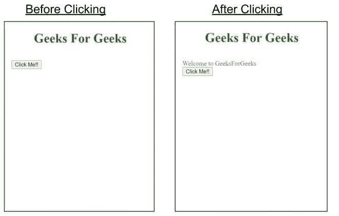

# 谷歌 amp-bind

> 原文:[https://www.geeksforgeeks.org/google-amp-amp-bind/](https://www.geeksforgeeks.org/google-amp-amp-bind/)


有时，您希望为您的放大器页面添加自定义交互性，以使您的页面看起来更加用户友好和用户调用。虽然 AMP 的预建组件有限，所以做 amp-bind 就是为了克服这个问题。它帮助开发人员在不使用 AMP 的预构建组件的情况下为页面添加自定义交互性。

**设置:**要在页面中使用 amp-bind，您必须在文档的标题中导入其脚本。

## 超文本标记语言

```
<script async custom-element="amp-bind"
    src="https://cdn.ampproject.org/v0/amp-bind-0.1.js">
</script>
```

谷歌放大器的放大器绑定包括三个主要概念:

1.  **状态:**状态变量负责基于用户动作的页面更新。定义一个状态变量是非常重要的。
2.  **表达式:**它们就像是用来指代状态的 JavaScript 表达式。
3.  **绑定:**它们是一种特殊的属性，用于通过表达式将元素的属性链接到状态。

**示例:**点击按钮时动态添加文本。

## 超文本标记语言

```
<!doctype html>
<html amp>

<head>
    <meta charset="utf-8">
    <title>Google AMP amp-bind</title>
    <link rel="canonical" href=
"https://amp.dev/documentation/examples/components/amp-bind/index.html">

    <meta name="viewport" content=
"width=device-width,minimum-scale=1,initial-scale=1">

    <script async src=
        "https://cdn.ampproject.org/v0.js">
    </script>

    <script async custom-element="amp-bind"
src="https://cdn.ampproject.org/v0/amp-bind-0.1.js">
    </script>

    <style amp-boilerplate>
        body {
            -webkit-animation: -amp-start 8s
                steps(1, end) 0s 1 normal both;

            -moz-animation: -amp-start 8s
                steps(1, end) 0s 1 normal both;

            -ms-animation: -amp-start 8s
                steps(1, end) 0s 1 normal both;

            animation: -amp-start 8s
                steps(1, end) 0s 1 normal both;
        }

        @-webkit-keyframes -amp-start {
            from {
                visibility: hidden
            }

            to {
                visibility: visible
            }
        }

        @-moz-keyframes -amp-start {
            from {
                visibility: hidden
            }

            to {
                visibility: visible
            }
        }

        @-ms-keyframes -amp-start {
            from {
                visibility: hidden
            }

            to {
                visibility: visible
            }
        }

        @-o-keyframes -amp-start {
            from {
                visibility: hidden
            }

            to {
                visibility: visible
            }
        }

        @keyframes -amp-start {
            from {
                visibility: hidden
            }

            to {
                visibility: visible
            }
        }
    </style>

    <noscript>
        <style amp-boilerplate>
            body {
                -webkit-animation: none;
                -moz-animation: none;
                -ms-animation: none;
                animation: none
            }
        </style>
    </noscript>

    <style amp-custom>
        h1 {
            color: forestgreen;
            text-align: center;
        }
    </style>
</head>

<body>
    <h1>
        Geeks For Geeks
    </h1>

    <div style="padding: 1em;">
        <div hidden [hidden]="hideGreeting"
            style="color: crimson;">
            Welcome to GeeksForGeeks
        </div>

        <button on=
"tap:AMP.setState({ hideGreeting: false })">
            Click Me!!
        </button>
    </div>
</body>

</html>
```

#### 输出:



**解释:**当按钮被点击时，被称为 HideHeaLTH 的隐藏属性被更新，因为它的状态通过 AMP.setState()动作被更新。

**用途:**amp-bind 可用于多种用途，其中包括:

*   它可以用来动态改变内容。
*   它可以用来动态更新图像。
*   它可以用来动态改变元素的类。
*   它可以用来改变元素的 CSS 属性的值。