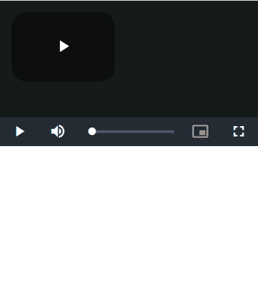

# 谷歌 amp-brightcove

> 原文:[https://www.geeksforgeeks.org/google-amp-amp-brightcove/](https://www.geeksforgeeks.org/google-amp-amp-brightcove/)


**Brightcove 视频云**是一个用来托管视频的在线平台。 **amp-brightcove** 是一个 amp 组件，用于嵌入 brightcove 视频表演播放器或 brightcove 视频云。

**必需脚本:**在标题中导入 **brightcove 组件**

## 超文本标记语言

```html
<script async custom-element="amp-brightcove" src=
"https://cdn.ampproject.org/v0/amp-brightcove-0.1.js">
</script>
```

**属性:**

1.  **数据-账号:**bright cove 视频云账号 ID。
2.  **数据-视频-id:**bright cove 视频云 ID。
3.  **数据-玩家 id:** 布莱特科夫玩家 id。这是一个全球唯一标识符。
4.  **数据-播放列表-id:**bright cove 视频云播放列表 id。如果同时指定了播放列表和视频，则播放列表优先于视频。
5.  **自动播放:**如果指定了该属性，视频将自动开始播放。
6.  **停靠:**如果指定了此属性，并且视频是手动播放的，则视频将被最小化。使用此属性需要 amp-video-docking 扩展。

brightcove 视频如下所示嵌入，**需要数据账户、数据视频 id、数据播放器 id** 。

## 超文本标记语言

```html
<amp-brightcove data-account="906043040001"
    data-video-id="1401169490001"
    data-player-id=
        "180a5658-8be8-4f33-8eba-d562ab41b40c"
        layout="responsive" width="480"
        height="270">
</amp-brightcove>
```

有关 brightcove 播放器配置说明，您可以查看以下 Brightcove 的支持文档。[https://amp.dev/documentation/components/amp-brightcove/?格式=网站](https://amp.dev/documentation/components/amp-brightcove/?format=websites)

**示例:**

## 超文本标记语言

```html
<!doctype html>
<html amp>

<head>
    <meta charset="utf-8">
    <title>Google AMP amp-brightcove</title>
    <script async src=
        "https://cdn.ampproject.org/v0.js">
    </script>

    <!-- Import the Brightcove component 
         in the header. -->
    <script async custom-element=
        "amp-brightcove" src=
"https://cdn.ampproject.org/v0/amp-brightcove-0.1.js">
    </script>

    <meta name="viewport" content=
"width=device-width,minimum-scale=1,initial-scale=1">

    <link rel="canonical" href=
"https://amp.dev/documentation/examples/components/amp-brightcove/index.html">

    <style amp-boilerplate>
        body {
            -webkit-animation: -amp-start 8s 
                steps(1, end) 0s 1 normal both;

            -moz-animation: -amp-start 8s 
                steps(1, end) 0s 1 normal both;

            -ms-animation: -amp-start 8s 
                steps(1, end) 0s 1 normal both;

            animation: -amp-start 8s 
                steps(1, end) 0s 1 normal both
        }

        @-webkit-keyframes -amp-start {
            from {
                visibility: hidden
            }

            to {
                visibility: visible
            }
        }

        @-moz-keyframes -amp-start {
            from {
                visibility: hidden
            }

            to {
                visibility: visible
            }
        }

        @-ms-keyframes -amp-start {
            from {
                visibility: hidden
            }

            to {
                visibility: visible
            }
        }

        @-o-keyframes -amp-start {
            from {
                visibility: hidden
            }

            to {
                visibility: visible
            }
        }

        @keyframes -amp-start {
            from {
                visibility: hidden
            }

            to {
                visibility: visible
            }
        }
    </style>
    <noscript>
        <style amp-boilerplate>
            body {
                -webkit-animation: none;
                -moz-animation: none;
                -ms-animation: none;
                animation: none
            }
        </style>
    </noscript>
</head>

<body>

    <amp-brightcove data-account="906043040001" 
        data-video-id="1401169490001"
        data-player-id=
            "180a5658-8be8-4f33-8eba-d562ab41b40c" 
        layout="responsive" width="480" 
        height="270">
    </amp-brightcove>
</body>

</html>
```

**输出:**

