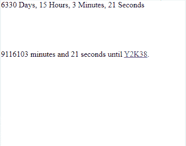

# 谷歌 AMP-AMP-date-倒计时

> 原文:[https://www . geesforgeks . org/Google-amp-amp-date-倒计时/](https://www.geeksforgeeks.org/google-amp-amp-date-countdown/)


安培数据倒计时是用来倒数到一个特定的日期，这是渲染到安培 HTML 页面。它专门用作计时器或倒计时。

**必需脚本:**添加**放大器-数据-倒计时**组件。

## 超文本标记语言

```
<script async custom-element="amp-date-countdown" src=
"https://cdn.ampproject.org/v0/amp-date-countdown-0.1.js">
</script>
```

添加**小胡子**组件

## 超文本标记语言

```
<script async custom-template="amp-mustache" src=
"https://cdn.ampproject.org/v0/amp-mustache-0.2.js">
</script>
```

**属性:**

1.  **结束日期:**是国际标准化组织规定的倒计时日期。
2.  **timeleft-ms:** 毫秒值倒计时。
3.  **偏移量-秒:**要添加到结束日期的数字。可能是积极的，也可能是消极的。
4.  **最大单位:**该属性可以设置为天、小时、分钟、秒(默认:天)。未显示大于用户定义单位的单位。如果还剩 2 天，最大单位是小时，它显示还剩 48 小时。
5.  **地区:**设置定时器显示的语言。

<figure class="table">

| 英语 | 在中 |
| 德国人 | (加在动词之前）表示“否定”，“相反”；(加在名词之前构成动词)表示“除去”，“除掉” |
| 西班牙语 | 是吗 |
| 法语 | fr |
| 意大利的 | 它 |
| 日本人 | 是 |
| 荷兰人 | 北纬 |
| 韩国的 | 击倒 |
| 俄语 | 钌 |
| 越南人 | 我们吗 |
| 土耳其的 | tr |
| 葡萄牙语 | 元素铂的符号 |
| 泰国的 | 泰国(Thailand) |
| 简体/繁体中文 | zh-cn/zh-tw(消歧义) |

</figure>

**示例:**

## 超文本标记语言

```
<!doctype html>
<html amp>

<head>
    <meta charset="utf-8">
    <title>Google AMP amp-date-countdown</title>

    <!-- Include the `amp-date-countdown` 
        component ... -->
    <script async custom-element=
        "amp-date-countdown" src=
"https://cdn.ampproject.org/v0/amp-date-countdown-0.1.js">
    </script>

    <!-- Include the `amp-mustache` 
        component ... -->
    <script async custom-template=
        "amp-mustache" src=
"https://cdn.ampproject.org/v0/amp-mustache-0.2.js">
    </script>

    <meta name="viewport" content=
"width=device-width,minimum-scale=1,initial-scale=1">

    <link rel="canonical" href=
"https://amp.dev/documentation/examples/components/amp-date-countdown/index.html">

    <style amp-boilerplate>
        body {
            -webkit-animation: -amp-start 8s 
                steps(1, end) 0s 1 normal both;

            -moz-animation: -amp-start 8s 
                steps(1, end) 0s 1 normal both;

            -ms-animation: -amp-start 8s 
                steps(1, end) 0s 1 normal both;

            animation: -amp-start 8s 
                steps(1, end) 0s 1 normal both
        }

        @-webkit-keyframes -amp-start {
            from {
                visibility: hidden
            }

            to {
                visibility: visible
            }
        }

        @-moz-keyframes -amp-start {
            from {
                visibility: hidden
            }

            to {
                visibility: visible
            }
        }

        @-ms-keyframes -amp-start {
            from {
                visibility: hidden
            }

            to {
                visibility: visible
            }
        }

        @-o-keyframes -amp-start {
            from {
                visibility: hidden
            }

            to {
                visibility: visible
            }
        }

        @keyframes -amp-start {
            from {
                visibility: hidden
            }

            to {
                visibility: visible
            }
        }
    </style>
    <noscript>
        <style amp-boilerplate>
            body {
                -webkit-animation: none;
                -moz-animation: none;
                -ms-animation: none;
                animation: none
            }
        </style>
    </noscript>
    <script async src=
        "https://cdn.ampproject.org/v0.js">
    </script>

    <style amp-custom>
        amp-date-countdown {
            display: block;
        }
    </style>
</head>

<body>
    <amp-date-countdown 
        timestamp-seconds="2147483648" 
        locale="en" layout="fixed-height" 
        height="100">
        <template type="amp-mustache">
            {{d}} {{days}}, {{h}} {{hours}}, 
            {{m}} {{minutes}}, {{s}} {{seconds}}
        </template>
    </amp-date-countdown>

    <amp-date-countdown 
        timestamp-seconds="2147483648" 
        biggest-unit="minutes" 
        layout="fixed-height" height="100">
        <template type="amp-mustache">
            {{m}} minutes and {{s}} seconds until
            <a href=
"https://en.wikipedia.org/wiki/Year_2038_problem">
                Y2K38
            </a>
        </template>
    </amp-date-countdown>
</body>

</html>
```

**输出:**

