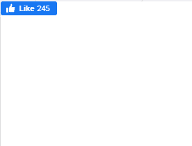

# 类似谷歌 AMP-AMP-Facebook 的

> 原文:[https://www.geeksforgeeks.org/google-amp-amp-facebook-like/](https://www.geeksforgeeks.org/google-amp-amp-facebook-like/)


**简介:**一个真正流行的特色网页就像社交媒体平台上的按钮。类似 T2 和脸书的 T3 被用来在 T4 的网页上嵌入类似脸书的按钮。在这里，当一个类似脸书的按钮被嵌入时，你可以不去脸书就喜欢这个帖子。

**必需脚本:**将以下包含源代码的脚本添加到中，导入 **amp-facebook 式的**组件。

## 超文本标记语言

```
<script async custom-element="amp-facebook-like" src=
"https://cdn.ampproject.org/v0/amp-facebook-like-0.1.js">
</script>
```

**属性:**

1.  **data-href:** 要喜欢的页面的 URL。
2.  **数据-动作:**要在按钮上显示的字符串。默认值为“喜欢”。
3.  **数据-配色方案:**应该在按钮外部使用的配色方案。默认情况下，它是亮的，也可以保持暗。
4.  **数据大小:**用于改变按钮的大小。默认情况下，它很小，也可以设置为大。
5.  **数据-布局:**用于改变按钮的布局。有四种布局可供选择，它们是:
    *   标准(默认)
    *   按钮
    *   按钮计数
    *   箱数

**示例:**

## 超文本标记语言

```
<!doctype html>
<html amp>

<head>
    <meta charset="utf-8">
    <title>amp-facebook-like</title>
    <script async src=
        "https://cdn.ampproject.org/v0.js">
    </script>

    <!-- Import the `amp-facebook-like` 
        component to add a like button-->
    <script async custom-element=
            "amp-facebook-like" src=
"https://cdn.ampproject.org/v0/amp-facebook-like-0.1.js">
    </script>

    <link rel="canonical" href=
"https://amp.dev/documentation/examples/components/amp-facebook-like/index.html">
    <meta name="viewport" content=
"width=device-width,minimum-scale=1,initial-scale=1">
    <style amp-boilerplate>
        body {
            -webkit-animation: -amp-start 8s 
                    steps(1, end) 0s 1 normal both;
            -moz-animation: -amp-start 8s 
                    steps(1, end) 0s 1 normal both;
            -ms-animation: -amp-start 8s 
                    steps(1, end) 0s 1 normal both;
            animation: -amp-start 8s 
                    steps(1, end) 0s 1 normal both
        }

        @-webkit-keyframes -amp-start {
            from {
                visibility: hidden
            }

            to {
                visibility: visible
            }
        }

        @-moz-keyframes -amp-start {
            from {
                visibility: hidden
            }

            to {
                visibility: visible
            }
        }

        @-ms-keyframes -amp-start {
            from {
                visibility: hidden
            }

            to {
                visibility: visible
            }
        }

        @-o-keyframes -amp-start {
            from {
                visibility: hidden
            }

            to {
                visibility: visible
            }
        }

        @keyframes -amp-start {
            from {
                visibility: hidden
            }

            to {
                visibility: visible
            }
        }
    </style>
    <noscript>
        <style amp-boilerplate>
            body {
                -webkit-animation: none;
                -moz-animation: none;
                -ms-animation: none;
                animation: none
            }
        </style>
    </noscript>
</head>

<body>
    <amp-facebook-like width="100" height="30"
        layout="fixed" data-layout="button_count"
        data-href=
"https://www.facebook.com/testesmegadivertidos/">
    </amp-facebook-like>
</body>

</html>
```

### 输出

