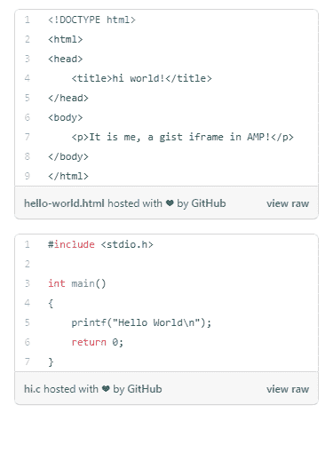

# 谷歌 amp-gist

> 原文:[https://www.geeksforgeeks.org/google-amp-amp-gist/](https://www.geeksforgeeks.org/google-amp-amp-gist/)


GitHub 非常受欢迎开发人员在网页中添加 gist 已经变得非常受欢迎，gist 是通过使用 **amp-gist 组件在 AMP HTML 中添加的。**

**必需脚本:**将 amp-gist 组件导入标题。

## 超文本标记语言

```html
<script async custom-element="amp-gist" src=
    "https://cdn.ampproject.org/v0/amp-gist-0.1.js">
</script>
```

**属性:**

*   **数据-gistid:** 要嵌入页面的要点的 id。
*   **高度:**要旨的高度。
*   **数据文件:**只显示一个要点文件。

**示例:**

## 超文本标记语言

```html
<!doctype html>
<html ⚡>

<head>
    <meta charset="utf-8">

    <title>Google AMP amp-gist</title>

    <link rel="canonical" href=
"https://amp.dev/documentation/examples/components/amp-gist/index.html">

    <meta name="viewport" content=
"width=device-width,minimum-scale=1,initial-scale=1">

    <script async src=
        "https://cdn.ampproject.org/v0.js">
    </script>

    <!-- Import the amp-gist component -->
    <script async custom-element="amp-gist" 
src="https://cdn.ampproject.org/v0/amp-gist-0.1.js">
    </script>

    <style amp-boilerplate>
        body {
            -webkit-animation: -amp-start 8s 
                steps(1, end) 0s 1 normal both;

            -moz-animation: -amp-start 8s 
                steps(1, end) 0s 1 normal both;

            -ms-animation: -amp-start 8s 
                steps(1, end) 0s 1 normal both;

            animation: -amp-start 8s 
                steps(1, end) 0s 1 normal both;
        }

        @-webkit-keyframes -amp-start {
            from {
                visibility: hidden
            }

            to {
                visibility: visible
            }
        }

        @-moz-keyframes -amp-start {
            from {
                visibility: hidden
            }

            to {
                visibility: visible
            }
        }

        @-ms-keyframes -amp-start {
            from {
                visibility: hidden
            }

            to {
                visibility: visible
            }
        }

        @-o-keyframes -amp-start {
            from {
                visibility: hidden
            }

            to {
                visibility: visible
            }
        }

        @keyframes -amp-start {
            from {
                visibility: hidden
            }

            to {
                visibility: visible
            }
        }
    </style>

    <noscript>
        <style amp-boilerplate>
            body {
                -webkit-animation: none;
                -moz-animation: none;
                -ms-animation: none;
                animation: none
            }
        </style>
    </noscript>

    <style amp-custom>
        amp-gist {
            margin: 1rem;
        }
    </style>

</head>

<body>

    <!-- Embed an entire gist. -->
    <amp-gist data-gistid=
        "b9bb35bc68df68259af94430f012425f" 
        layout="fixed-height" height="241">
    </amp-gist>

    <!-- Embed one file out of a gist 
        using the `data-file` attribute. 
    The `data-file` attribute is optional. -->
    <amp-gist data-gistid=
        "a19e811dcd7df10c4da0931641538497" 
        data-file="hi.c" layout="fixed-height" 
        height="197">
    </amp-gist>
</body>

</html>
```

**输出:**

