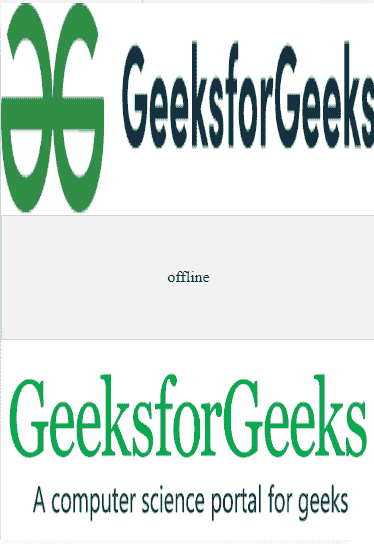

# 谷歌 AMP-AMP-img

> 原文:[https://www.geeksforgeeks.org/google-amp-amp-img/](https://www.geeksforgeeks.org/google-amp-amp-img/)


AMP HTML 页面不支持标准的 **img 标签**、**T3【我们使用 **amp-img** 组件在 AMP HTML 页面中插入图片。amp-img 组件不需要在头中嵌入脚本，因为它来自 amp 运行时。**

**脚本必需:**amp-img 是一个内置元素，因此通过 AMP 运行时自动导入。

## 超文本标记语言

```
<script async src=
    "https://cdn.ampproject.org/v0.js">
</script>
```

**属性:**

*   **src:** 指定要嵌入的图像的网址或路径。
*   **大小:**定义媒体查询的大小这只能在属性 rel =“icon”时使用。
*   **属性:**这是描述图像属性的字符串。
*   **高度:**定义图像的高度。
*   **宽度:**定义图像的宽度。

**示例:**

## 超文本标记语言

```
<!doctype html>
<html ⚡>

<head>
    <meta charset="utf-8">
    <title>Google AMP amp-img</title>
>
    <script async src=
        "https://cdn.ampproject.org/v0.js">
    </script>

    <link rel="canonical" href=
"https://amp.dev/documentation/examples/components/amp-img/index.html">

    <meta name="viewport" content=
"width=device-width,minimum-scale=1,initial-scale=1">

    <style amp-boilerplate>
        body {
            -webkit-animation: -amp-start 8s 
                steps(1, end) 0s 1 normal both;

            -moz-animation: -amp-start 8s 
                steps(1, end) 0s 1 normal both;

            -ms-animation: -amp-start 8s 
                steps(1, end) 0s 1 normal both;

            animation: -amp-start 8s 
                steps(1, end) 0s 1 normal both
        }

        @-webkit-keyframes -amp-start {
            from {
                visibility: hidden
            }

            to {
                visibility: visible
            }
        }

        @-moz-keyframes -amp-start {
            from {
                visibility: hidden
            }

            to {
                visibility: visible
            }
        }

        @-ms-keyframes -amp-start {
            from {
                visibility: hidden
            }

            to {
                visibility: visible
            }
        }

        @-o-keyframes -amp-start {
            from {
                visibility: hidden
            }

            to {
                visibility: visible
            }
        }

        @keyframes -amp-start {
            from {
                visibility: hidden
            }

            to {
                visibility: visible
            }
        }
    </style>
    <noscript>
        <style amp-boilerplate>
            body {
                -webkit-animation: none;
                -moz-animation: none;
                -ms-animation: none;
                animation: none
            }
        </style>
    </noscript>
    <style amp-custom>
        amp-img>div[fallback] {
            display: flex;
            align-items: center;
            justify-content: center;
            background: #f2f2f2;
            border: solid 1px #ccc;
        }
    </style>
</head>

<body>

    <!-- A simpler esponsive image-->
    <amp-img src=
"https://media.geeksforgeeks.org/wp-content/cdn-uploads/20200817185016/gfg_complete_logo_2x-min.png"
        width="1080" height="610" 
        layout="responsive" alt="AMP">
    </amp-img>

    <!--shows a `fallback` in case the 
        image couldn't be loaded. -->
    <amp-img src="does-not-exist.jpg" 
        width="300" height="100" 
        layout="responsive" 
        alt="a non-existent image">
        <div fallback>offline</div>
    </amp-img>

    <amp-img src=
"https://media.geeksforgeeks.org/wp-content/uploads/resize1-1.png"
        width="475" height="268"
        layout="responsive" alt="AMP">
        <noscript>
            
        </noscript>
    </amp-img>
</body>

</html>
```

**输出:**

