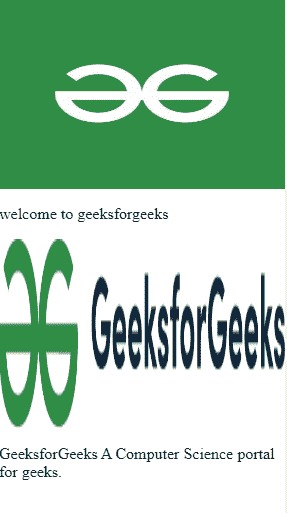

# 谷歌放大器-灯箱-图库

> 原文:[https://www . geesforgeks . org/Google-amp-amp-light box-gallery/](https://www.geeksforgeeks.org/google-amp-amp-lightbox-gallery/)


**amp-lightbox-gallery** 组件用于为其他 amp 组件(如 amp-carousel、amp-img)提供灯箱体验。目前只有图像被 amp-lightbox-gallery 支持。

**必需脚本:**将 amp-lightbox-gallery 组件导入标题。

## 超文本标记语言

```html
<script async custom-element="amp-lightbox-gallery" src=
"https://cdn.ampproject.org/v0/amp-lightbox-gallery-0.1.js">
</script>
```

**属性:**

*   **灯箱:**我们用这个属性给图像增加一个灯箱效果。
*   **src:** 指定要嵌入的图像的网址或路径。
*   **布局:**指定图像的布局，例如响应。

**示例:**

## 超文本标记语言

```html
<!doctype html>
<html ⚡>

<head>
    <meta charset="utf-8">
    <link rel="canonical" href=
"https://amp.dev/documentation/examples/components/amp-lightbox-gallery/index.html">

    <meta name="viewport" content=
        "width=device-width,minimum-scale=1,
        initial-scale=1">

    <script async src=
        "https://cdn.ampproject.org/v0.js">
    </script>

    <script async custom-element="amp-carousel"
src="https://cdn.ampproject.org/v0/amp-carousel-0.1.js">
    </script>

    <title>Google AMP amp-lightbox-gallery</title>

    <!-- Import the amp-lightbox-gallery 
        component in the header.  -->
    <script async custom-element="amp-lightbox-gallery"
src="https://cdn.ampproject.org/v0/amp-lightbox-gallery-0.1.js">
    </script>

    <style amp-boilerplate>
        body {
            -webkit-animation: -amp-start 8s 
                steps(1, end) 0s 1 normal both;

            -moz-animation: -amp-start 8s 
                steps(1, end) 0s 1 normal both;

            -ms-animation: -amp-start 8s 
                steps(1, end) 0s 1 normal both;

            animation: -amp-start 8s 
                steps(1, end) 0s 1 normal both;
        }

        @-webkit-keyframes -amp-start {
            from {
                visibility: hidden
            }

            to {
                visibility: visible
            }
        }

        @-moz-keyframes -amp-start {
            from {
                visibility: hidden
            }

            to {
                visibility: visible
            }
        }

        @-ms-keyframes -amp-start {
            from {
                visibility: hidden
            }

            to {
                visibility: visible
            }
        }

        @-o-keyframes -amp-start {
            from {
                visibility: hidden
            }

            to {
                visibility: visible
            }
        }

        @keyframes -amp-start {
            from {
                visibility: hidden
            }

            to {
                visibility: visible
            }
        }
    </style>
    <noscript>
        <style amp-boilerplate>
            body {
                -webkit-animation: none;
                -moz-animation: none;
                -ms-animation: none;
                animation: none
            }
        </style>
    </noscript>
    <style amp-custom>
        :root {
            --color-primary: #005AF0;
            --color-text-light: #fff;
            --space-1: .5rem;
            --space-2: 1rem;
        }
    </style>
</head>

<body>
    <div>
        <amp-img lightbox src=
"https://pbs.twimg.com/profile_images/1304985167476523008/QNHrwL2q_400x400.jpg"
            width="300" height="200"
            layout="responsive">
        </amp-img>

        <p class="paragraph">
            welcome to geeksforgeeks
        </p>

        <amp-img lightbox
            src=
"https://media.geeksforgeeks.org/wp-content/cdn-uploads/20200817185016/gfg_complete_logo_2x-min.png"
            width="300" height="200"
            layout="responsive">
        </amp-img>

        <p class="paragraph">
            GeeksforGeeks A Computer Science 
            portal for geeks.
        </p>

    </div>
</body>

</html>
```

**输出:**



代码输出

**点击图像**给出如下视图


点击图像

点击左上方的**图库选项**给出如下视图


画廊视图