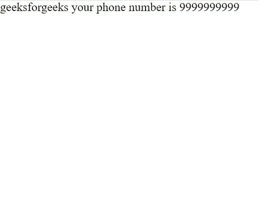

# 谷歌 AMP-AMP-小胡子

> 原文:[https://www.geeksforgeeks.org/google-amp-amp-mustache/](https://www.geeksforgeeks.org/google-amp-amp-mustache/)


我们使用**和小胡子**来渲染小胡子模板。amp-小胡子不提供由 **amp-list、amp-access** 或 **amp-form** 组件收集的 JSON 数据。

使用 **amp-list** 通过字典传递的 JSON 文件示例。

## java 描述语言

```
{
  "geeksforgeeks": [
    {
      "fullname": "geeksforgeeks",
      "phonenumber": "9999999999",
    }
  ]
}
```

**必需脚本:**将 amp-小胡子组件导入标题。

## 超文本标记语言

```
<script async custom-template="amp-mustache" src=
"https://cdn.ampproject.org/v0/amp-mustache-0.2.js">
</script>
```

**amp-小胡子**与 amp-list 或 amp-form 等组件一起用于传递 JSON 文件(介绍后给出的示例)。

**将放大器列表组件导入标题。**

## 超文本标记语言

```
<script async custom-element="amp-list" src=
"https://cdn.ampproject.org/v0/amp-list-0.1.js">
</script>
```

**将放大器列表组件导入标题。**

## 超文本标记语言

```
<script async custom-element="amp-form" src=
"https://cdn.ampproject.org/v0/amp-form-0.1.js">
</script>
```

**验证:****小胡子需要在框架良好的 DOM 片段中。所以我们不能用小胡子来:**

*   **计算标签名称，例如**
*   **计算属性名**

**这些是不允许的**

****示例:****

## **超文本标记语言**

```
<!doctype html>
<html ⚡>

<head>
    <meta charset="utf-8">
    <title>Google AMP amp-mustache</title>

    <link rel="canonical" href=
"https://amp.dev/documentation/examples/components/amp-mustache/index.html">

    <meta name="viewport" content=
"width=device-width,minimum-scale=1,initial-scale=1">

    <script async src=
        "https://cdn.ampproject.org/v0.js">
    </script>

    <!--Import the `amp-mustache` tag.-->
    <script async custom-template="amp-mustache" 
src="https://cdn.ampproject.org/v0/amp-mustache-0.2.js">
    </script>

    <script async custom-element="amp-list" 
src="https://cdn.ampproject.org/v0/amp-list-0.1.js">
    </script>

    <style amp-boilerplate>
        body {
            -webkit-animation: -amp-start 8s 
                steps(1, end) 0s 1 normal both;

            -moz-animation: -amp-start 8s 
                steps(1, end) 0s 1 normal both;

            -ms-animation: -amp-start 8s 
                steps(1, end) 0s 1 normal both;

            animation: -amp-start 8s 
                steps(1, end) 0s 1 normal both
        }

        @-webkit-keyframes -amp-start {
            from {
                visibility: hidden
            }

            to {
                visibility: visible
            }
        }

        @-moz-keyframes -amp-start {
            from {
                visibility: hidden
            }

            to {
                visibility: visible
            }
        }

        @-ms-keyframes -amp-start {
            from {
                visibility: hidden
            }

            to {
                visibility: visible
            }
        }

        @-o-keyframes -amp-start {
            from {
                visibility: hidden
            }

            to {
                visibility: visible
            }
        }

        @keyframes -amp-start {
            from {
                visibility: hidden
            }

            to {
                visibility: visible
            }
        }
    </style>
    <noscript>
        <style amp-boilerplate>
            body {
                -webkit-animation: none;
                -moz-animation: none;
                -ms-animation: none;
                animation: none
            }
        </style>
    </noscript>
    <style amp-custom>
    </style>
</head>

<body>
    <amp-list src="geeks.json" 
        layout="fixed-height"
        height="50" binding="no">

        <template type="amp-mustache">
            {{fullname}}!
            {{#phonenumber}}
            your phone number is {{phonenumber}}
            {{/phonenumber}}
        </template>
    </amp-list>
</body>

</html>
```

****输出:****

****