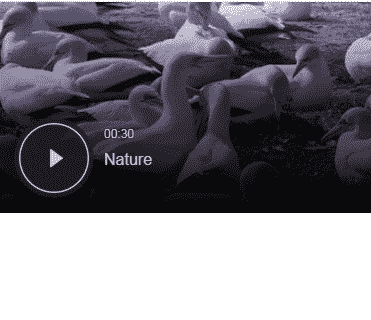

# 谷歌 AMP-AMP-O2-player

> 原文:[https://www.geeksforgeeks.org/google-amp-amp-o2-player/](https://www.geeksforgeeks.org/google-amp-amp-o2-player/)


amp-o2-player 用于在 AMP HTML 网页中嵌入一个 AOL O2 播放器。

**所需脚本:**将 amp-o2-player 组件导入标题。

## 超文本标记语言

```
<script async custom-element="amp-o2-player"
    src="https://cdn.ampproject.org/v0/amp-o2-player-0.1.js">
</script>
```

**属性:**

*   **数据-Pid:**O2 玩家的玩家 ID。
*   **数据-vid:**O2 播放器的视频 id。
*   **数据-出价:**O2 播放器的播放列表 id。
*   **数据-宏:**O2 播放器的宏。

**示例:**

## 超文本标记语言

```
<!doctype html>
<html ⚡>

<head>
    <meta charset="utf-8">
    <title>Google AMP amp-o2-player</title>

    <script async src=
        "https://cdn.ampproject.org/v0.js">
    </script>

    <!-- Import the `amp-o2-player` component -->
    <script async custom-element="amp-o2-player" 
src="https://cdn.ampproject.org/v0/amp-o2-player-0.1.js">
    </script>

    <meta name="viewport" content=
"width=device-width,minimum-scale=1,initial-scale=1">

    <link rel="canonical" href=
"https://amp.dev/documentation/examples/components/amp-o2-player/index.html">

    <style amp-boilerplate>
        body {
            -webkit-animation: -amp-start 8s 
                steps(1, end) 0s 1 normal both;

            -moz-animation: -amp-start 8s 
                steps(1, end) 0s 1 normal both;

            -ms-animation: -amp-start 8s 
                steps(1, end) 0s 1 normal both;

            animation: -amp-start 8s 
                steps(1, end) 0s 1 normal both;
        }

        @-webkit-keyframes -amp-start {
            from {
                visibility: hidden
            }

            to {
                visibility: visible
            }
        }

        @-moz-keyframes -amp-start {
            from {
                visibility: hidden
            }

            to {
                visibility: visible
            }
        }

        @-ms-keyframes -amp-start {
            from {
                visibility: hidden
            }

            to {
                visibility: visible
            }
        }

        @-o-keyframes -amp-start {
            from {
                visibility: hidden
            }

            to {
                visibility: visible
            }
        }

        @keyframes -amp-start {
            from {
                visibility: hidden
            }

            to {
                visibility: visible
            }
        }
    </style>

    <noscript>
        <style amp-boilerplate>
            body {
                -webkit-animation: none;
                -moz-animation: none;
                -ms-animation: none;
                animation: none
            }
        </style>
    </noscript>
</head>

<body>
    <amp-o2-player data-pid="579a115aa01b4d2db062aa85"
        data-bcid="545db032e4b0af1a81424b48"
        data-macros="m.playback=click" 
        layout="responsive" width="480" height="270">
    </amp-o2-player>
</body>

</html>
```

**输出:**

