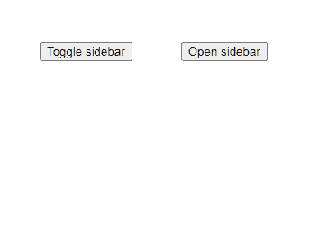
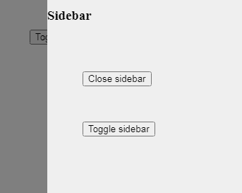

# 谷歌放大器-侧栏

> 原文:[https://www.geeksforgeeks.org/google-amp-amp-sidebar/](https://www.geeksforgeeks.org/google-amp-amp-sidebar/)


侧边栏是网页中非常常见的功能，非常简单，但是用 HTML CSS 编码有点长。在 AMP HTML 中，我们使用**AMP-侧边栏**组件向页面添加侧边栏。侧边栏提供了对元内容的访问。它可以通过点击按钮来显示。

**必需脚本:**将放大器侧边栏组件导入标题。

## 超文本标记语言

```
<script async custom-element="amp-sidebar"
    src="https://cdn.ampproject.org/v0/amp-sidebar-0.1.js">
</script>
```

**属性:**

*   **边:**指定侧边栏应该从页面的哪一侧向左或向右弹出。它的默认值保留不变。
*   **布局:**指定侧边栏的布局，始终设置为**无显示。**
*   **工具栏:**该属性用于子级<导航工具栏=“>并接受媒体查询显示在侧边栏中。
*   **数据-关闭-按钮-咏叹调-标签:**按钮的咏叹调标签的种类。

**示例:**

## 超文本标记语言

```
<!doctype html>
<html ⚡>

<head>
    <meta charset="utf-8">
    <title>Google AMP amp-sidebar</title>

    <script async src=
        "https://cdn.ampproject.org/v0.js">
    </script>

    <!--Import the `amp-sidebar` component.-->
    <script async custom-element="amp-sidebar"
src="https://cdn.ampproject.org/v0/amp-sidebar-0.1.js">
    </script>

    <script async custom-element="amp-fit-text"
src="https://cdn.ampproject.org/v0/amp-fit-text-0.1.js">
    </script>

    <link rel="canonical" href=
"https://amp.dev/documentation/examples/components/amp-sidebar/index.html">

    <meta name="viewport" content=
"width=device-width,minimum-scale=1,initial-scale=1">

    <style amp-boilerplate>
        body {
            -webkit-animation: -amp-start 8s
                steps(1, end) 0s 1 normal both;

            -moz-animation: -amp-start 8s
                steps(1, end) 0s 1 normal both;

            -ms-animation: -amp-start 8s
                steps(1, end) 0s 1 normal both;

            animation: -amp-start 8s
                steps(1, end) 0s 1 normal both;
        }

        @-webkit-keyframes -amp-start {
            from {
                visibility: hidden
            }

            to {
                visibility: visible
            }
        }

        @-moz-keyframes -amp-start {
            from {
                visibility: hidden
            }

            to {
                visibility: visible
            }
        }

        @-ms-keyframes -amp-start {
            from {
                visibility: hidden
            }

            to {
                visibility: visible
            }
        }

        @-o-keyframes -amp-start {
            from {
                visibility: hidden
            }

            to {
                visibility: visible
            }
        }

        @keyframes -amp-start {
            from {
                visibility: hidden
            }

            to {
                visibility: visible
            }
        }
    </style>

    <noscript>
        <style amp-boilerplate>
            body {
                -webkit-animation: none;
                -moz-animation: none;
                -ms-animation: none;
                animation: none
            }
        </style>
    </noscript>

    <style amp-custom>
        .btn {
            margin-top: 50px;
            margin-left: 50px
        }
    </style>
</head>

<body>
    <amp-sidebar id="sidebar"
        class="sample-sidebar"
        layout="nodisplay" side="right">

        <h3>Sidebar</h3>
        <button on="tap:sidebar.close"
            class="btn">Close sidebar
        </button>

        <button on="tap:sidebar.toggle"
            class="btn">Toggle sidebar
        </button>
    </amp-sidebar>

    <button on="tap:sidebar.toggle"
        class="btn">Toggle sidebar
    </button>

    <button on="tap:sidebar.open"
        class="btn">Open sidebar
    </button>
</body>

</html>
```

**输出:**



主页



补充报道