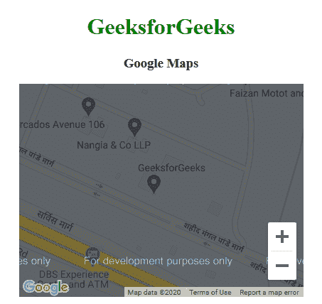

# 谷歌地图|简介

> 原文:[https://www.geeksforgeeks.org/google-maps-introduction/](https://www.geeksforgeeks.org/google-maps-introduction/)

谷歌地图是一项由谷歌免费提供的网络地图服务。这项服务提供各种类型的地理信息。借助谷歌地图，可以搜索地点和方向。此外，我们可以获得特定区域的交通信息或查看城市的街道级图像。

谷歌地图有一个 JavaScript 应用编程接口。该应用编程接口用于定制显示信息的地图。

**示例:**

```html
<!DOCTYPE html>
<html>

<head>
    <title>
        Google Maps | Introduction
    </title>

    <!-- Add Google map API source -->
    <script src=
        "https://maps.googleapis.com/maps/api/js">
    </script>

    <script>
        function GFG() {

            var CustomOp = {
                center: new google.maps.LatLng(
                        28.502212, 77.405603),
                zoom: 17,
                mapTypeId: google.maps.MapTypeId.ROADMAP
            };

            // Map object
            var map = new google.maps.Map(
                document.getElementById("DivID"),
                CustomOp
            );
        }
    </script>
</head>

<!-- Function that execute when page load -->
<body onload="GFG()">
    <center>
        <h1 style="color:green">
            GeeksforGeeks
        </h1>

        <h3>Google Maps</h3>

        <!-- Basic Container -->
        <div id="DivID" 
            style="width:400px; height:300px;">
        </div>
    </center>
</body>

</html>
```

**输出:**


**解释:**

*   In the above example, we will use Google API to load google map.

    ```html
    <script src = "https://maps.googleapis.com/maps/api/js"></script>
    ```

    **获取 API 密钥所需的步骤如下:**

    *   **前往下述链接**
        [https://console.developers.google.com/flows/enableapi?apiid =地图 _ 后端、地理编码 _ 后端、方向 _ 后端、距离 _ 矩阵 _ 后端、高程 _ 后端、地点 _ 后端& reusekey=true](https://console.developers.google.com/flows/enableapi?apiid=maps_backend,geocoding_backend,directions_backend,distance_matrix_backend,elevation_backend,places_backend&reusekey=true)
    *   创建新项目或从现有项目中进行选择。
    *   单击继续启用应用编程接口。
    *   在“凭据”页面上，获取一个应用编程接口密钥(并设置应用编程接口密钥限制)。
    *   用您自己的 API 密钥替换 URL 中的密钥参数值
*   To custmize the maps:

    ```html
    var CustomOp = {
        center:new google.maps.LatLng(28.502212, 77.405603), 
        zoom:17, 
        mapTypeId:google.maps.MapTypeId.ROADMAP
    };
    ```

    在这种情况下， **CustomOp** 是一个包含 3 个选项的对象，**中心**、**缩放**和 **maptypeid** 。

    *   **中心:**该属性用于设置地图中的特定点。
    *   **缩放:**此属性用于指定特定点上的缩放级别。
    *   **maptypeid:** 该属性用于指定地图的类型。(路线图、卫星、混合、地形)
**To create a map object we will use the following code:**

```html
var map = new google.maps.Map(document.getElementById("DivID"), CustomOp);
```