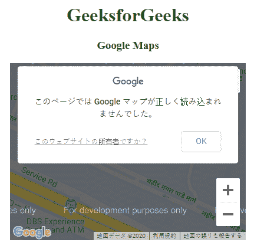

# 谷歌地图|本地化

> 原文:[https://www.geeksforgeeks.org/google-maps-localization/](https://www.geeksforgeeks.org/google-maps-localization/)

本地化是一个用不同语言提供信息的过程。谷歌地图的默认语言是英语。所有信息都用英语提供喜欢；城市、选项名称、道路等。

要定制或本地化地图，请在加载谷歌地图应用编程接口时提及语言。

**语法:**

```htmlhtml
<script src=
    "https://maps.googleapis.com/maps/api/js?language=ja">
</script>
```

**示例:**

```htmlhtml
<!DOCTYPE html>
<html>

<head>
    <title>
        Google Maps | Localization
    </title>

    <!-- Loading map API -->
    <script src=
        "https://maps.googleapis.com/maps/api/js?language=ja">
    </script>

    <script>
        function GFG() {

            var CustomOp = {
                center:new google.maps.LatLng(
                        28.502212, 77.405603), 
                zoom:17, 
                mapTypeId:google.maps.MapTypeId.ROADMAP
            };

            // Map object
            var map = new google.maps.Map(
                document.getElementById("DivID"),
                CustomOp
            );
        }
    </script>
</head>

<!-- Load map -->
<body onload = "GFG()">
    <center>
        <h1 style="color:green">
            GeeksforGeeks
        </h1>

        <h3>Google Maps</h3>

        <!-- Basic Container -->
        <div id = "DivID" style=
            "width:400px; height:300px;">
        </div>
    </center>
</body>

</html>
```

**输出:**
