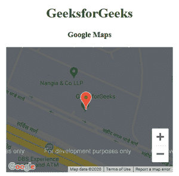
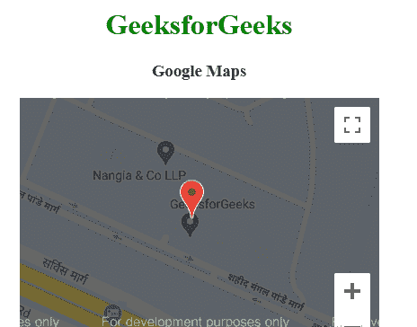

# 谷歌地图标记

> 原文:[https://www.geeksforgeeks.org/google-maps-markers/](https://www.geeksforgeeks.org/google-maps-markers/)

在地图上绘制对象并将它们绑定到所需纬度和经度的过程称为叠加。
谷歌地图提供的各种叠加。

*   标记
*   聚合线
*   多边形
*   圆形和矩形
*   信息窗口
*   标志

谷歌地图标记用于标记地图上的单个位置。这些标记使用可自定义的标准符号。

**语法:**

```html
var marker = new google.maps.Marker({
   position: new google.maps.LatLng(19.373341, 78.662109),
   map: map,
});  

```

**例 1:**

```html
<!DOCTYPE html>
<html>
    <head>
        <!-- Loading map API -->
        <script src=
           "https://maps.googleapis.com/maps/api/js">
      </script>

        <script>
            function GFG() {
                var CustomOp = {
                    center: 
               new google.maps.LatLng(28.502212, 77.405603),
                    zoom: 17,
                };

                // Map object
                var map = 
new google.maps.Map(document.getElementById("DivID"), CustomOp);
                var marker = new google.maps.Marker({
                    position: 
                  new google.maps.LatLng(28.502211, 77.405512),
                    map: map,
                });
            }
        </script>
    </head>
    <!-- load map -->
    <body onload="GFG()">
        <center>
            <h1 style="color: green;">
              GeeksforGeeks</h1>
            <h3>Google Maps</h3>
            <!-- Basic Container -->
            <div id="DivID" 
                 style="width: 400px;
                        height: 300px;">
          </div>
        </center>
    </body>
</html>
```

**输出:**


**示例 2:** 自定义标记。

```html
<!DOCTYPE html>
<html>
    <head>
        <!-- Loading map API -->
        <script src=
           "https://maps.googleapis.com/maps/api/js">
      </script>

        <script>
            function GFG() {
                var CustomOp = {
                    center: 
               new google.maps.LatLng(28.502212, 77.405603),
                    zoom: 17,
                };

                // Map object
                var map = 
new google.maps.Map(document.getElementById("DivID"), CustomOp);
                var marker = new google.maps.Marker({
                    position: 
                  new google.maps.LatLng(28.502211, 77.405512),
                    map: map,
                  animation:google.maps.Animation.BOUNCE 
                });
            }
        </script>
    </head>
    <!-- load map -->
    <body onload="GFG()">
        <center>
            <h1 style="color: green;">
              GeeksforGeeks</h1>
            <h3>Google Maps</h3>
            <!-- Basic Container -->
            <div id="DivID" 
                 style="width: 400px;
                        height: 300px;">
          </div>
        </center>
    </body>
</html>
```

**输出:**
