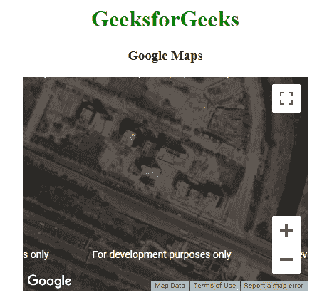
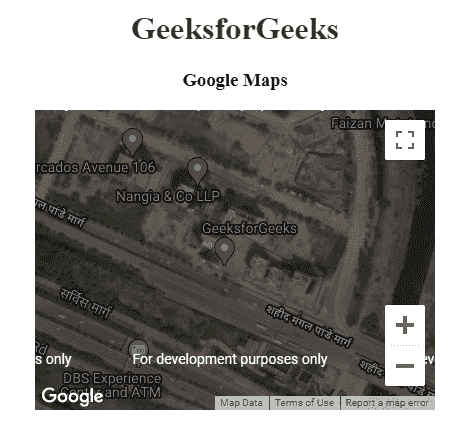
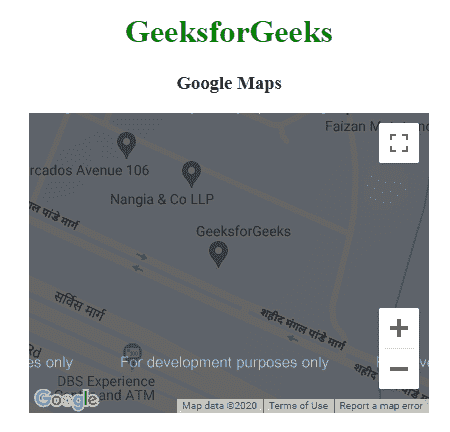

# 谷歌地图|类型

> 原文:[https://www.geeksforgeeks.org/google-maps-types/](https://www.geeksforgeeks.org/google-maps-types/)

为了定制谷歌地图，提供了四种类型的地图。

*   **路线图:**这种类型的地图显示特定区域的街景。这是默认的类型映射。
*   **卫星:**这种类型的地图显示了特定区域的卫星图像。
*   **HYBRID:** 这种类型的地图显示了特定区域的主要街道。
*   **TERRAIN:** 这种类型的地图显示地形和植被。

**语法:**

```html
var CustomOp= {
   mapTypeId:google.maps.MapTypeId.ROADMAP | SATELLITE | HYBRID | TERRAIN
};
```

**示例 1:路线图**

```html
<!DOCTYPE html>
<html>

<head>
    <title>
        Google Maps | Types
    </title>

    <!-- Add Google map API source -->
    <script src = 
        "https://maps.googleapis.com/maps/api/js">
    </script>

    <script>
        function GFG() {
            var CustomOp = {
                center:new google.maps.LatLng(
                        28.502212, 77.405603), 
                zoom:17, 
                mapTypeId:google.maps.MapTypeId.ROADMAP
            };

            // Map object
            var map = new google.maps.Map(
                document.getElementById("DivID"),
                CustomOp
            );
        }
    </script>
</head>

<!-- Function that execute when page load -->
<body onload = "GFG()">
    <center>
        <h1 style="color:green">
            GeeksforGeeks
        </h1>

        <h3>Google Maps</h3>

        <!-- Basic Container -->
        <div id = "DivID" style = 
            "width:400px; height:300px;">
        </div>
    </center>
</body>

</html>
```

**输出:**


**例 2:卫星**

```html
<!DOCTYPE html>
<html>

<head>
    <title>
        Google Maps | Types
    </title>

    <!-- Add Google map API source -->
    <script src = 
        "https://maps.googleapis.com/maps/api/js">
    </script>

    <script>
        function GFG() {
            var CustomOp = {
                center:new google.maps.LatLng(
                        28.502212, 77.405603), 
                zoom:17, 
                mapTypeId:google.maps.MapTypeId.SATELLITE
            };

            // Map object
            var map = new google.maps.Map(
                document.getElementById("DivID"),
                CustomOp
            );
        }
    </script>
</head>

<!-- Function that execute when page load -->
<body onload = "GFG()">
    <center>
        <h1 style="color:green">
            GeeksforGeeks
        </h1>

        <h3>Google Maps</h3>

        <!-- Basic Container -->
        <div id = "DivID" style = 
            "width:400px; height:300px;">
        </div>
    </center>
</body>

</html>
```

**输出:**


**例 3:混合动力**

```html
<!DOCTYPE html>
<html>

<head>
    <title>
        Google Maps | Types
    </title>

    <!-- Add Google map API source -->
    <script src = 
        "https://maps.googleapis.com/maps/api/js">
    </script>

    <script>
        function GFG() {
            var CustomOp = {
                center:new google.maps.LatLng(
                        28.502212, 77.405603), 
                zoom:17, 
                mapTypeId:google.maps.MapTypeId.HYBRID
            };

            // Map object
            var map = new google.maps.Map(
                document.getElementById("DivID"),
                CustomOp
            );
        }
    </script>
</head>

<!-- Function that execute when page load -->
<body onload = "GFG()">
    <center>
        <h1 style="color:green">
            GeeksforGeeks
        </h1>

        <h3>Google Maps</h3>

        <!-- Basic Container -->
        <div id = "DivID" style = 
            "width:400px; height:300px;">
        </div>
    </center>
</body>

</html>
```

**输出:**


**示例 4:地形**

```html
<!DOCTYPE html>
<html>

<head>
    <title>
        Google Maps | Types
    </title>

    <!-- Add Google map API source -->
    <script src = 
        "https://maps.googleapis.com/maps/api/js">
    </script>

    <script>
        function GFG() {
            var CustomOp = {
                center:new google.maps.LatLng(
                        28.502212, 77.405603), 
                zoom:17, 
                mapTypeId:google.maps.MapTypeId.TERRAIN
            };

            // Map object
            var map = new google.maps.Map(
                document.getElementById("DivID"),
                CustomOp
            );
        }
    </script>
</head>

<!-- Function that execute when page load -->
<body onload = "GFG()">
    <center>
        <h1 style="color:green">
            GeeksforGeeks
        </h1>

        <h3>Google Maps</h3>

        <!-- Basic Container -->
        <div id = "DivID" style = 
            "width:400px; height:300px;">
        </div>
    </center>
</body>

</html>
```

**输出:**
