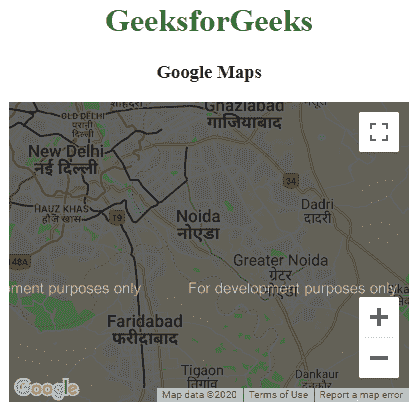
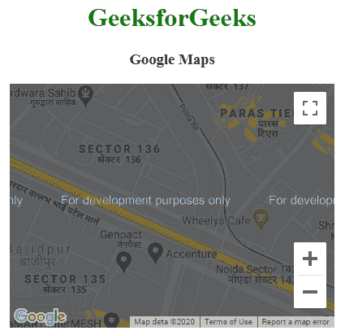

# 谷歌地图|缩放

> 原文:[https://www.geeksforgeeks.org/google-maps-zoom/](https://www.geeksforgeeks.org/google-maps-zoom/)

缩放属性用于增加或减少地图中特定点的缩放级别。要自定义缩放级别，请更改缩放值。缩放的默认值是 10。

**语法:**

```htmlhtml
var CustomOp = {
    zoom:zoom value
};
```

**示例 1:** 本示例将缩放级别设置为 10。

```htmlhtml
<!DOCTYPE html>
<html>

<head>
    <title>
        Google Maps | Zoom
    </title>

    <!-- Loading map API -->
    <script src=
        "https://maps.googleapis.com/maps/api/js">
    </script>

    <script>
        function GFG() {

            var CustomOp = {
                center:new google.maps.LatLng(
                            28.502212, 77.405603), 
                zoom:10, 
                mapTypeId:google.maps.MapTypeId.ROADMAP
            };

            // Map object
            var map = new google.maps.Map(
                document.getElementById("DivID"),
                CustomOp
            );
        }
    </script>
</head>

<!-- load map -->
<body onload = "GFG()">
    <center>
        <h1 style="color:green">GeeksforGeeks</h1>
        <h3>Google Maps</h3>

        <!-- Basic Container -->
        <div id = "DivID" style=
            "width:400px; height:300px;">
        </div>
    </center>
</body>

</html>
```

**输出:**


**示例 2:** 本示例将缩放级别设置为 15。

```htmlhtml
<!DOCTYPE html>
<html>

<head>
    <title>
        Google Maps | Zoom
    </title>

    <!-- Loading map API -->
    <script src=
        "https://maps.googleapis.com/maps/api/js">
    </script>

    <script>
        function GFG() {

            var CustomOp = {
                center:new google.maps.LatLng(
                            28.502212, 77.405603), 
                zoom:15, 
                mapTypeId:google.maps.MapTypeId.ROADMAP
            };

            // Map object
            var map = new google.maps.Map(
                document.getElementById("DivID"),
                CustomOp
            );
        }
    </script>
</head>

<!-- load map -->
<body onload = "GFG()">
    <center>
        <h1 style="color:green">GeeksforGeeks</h1>
        <h3>Google Maps</h3>

        <!-- Basic Container -->
        <div id = "DivID" style=
            "width:400px; height:300px;">
        </div>
    </center>
</body>

</html>
```

**输出:**
