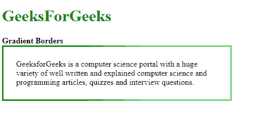
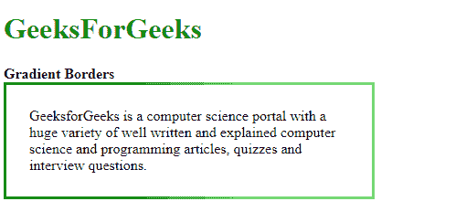

# 渐变边框

> 原文:[https://www.geeksforgeeks.org/gradient-borders/](https://www.geeksforgeeks.org/gradient-borders/)

使用 CSS 不直接支持渐变边框。下面列出了两种创建渐变边框的方法:

**方法 1:使用带渐变的边框图像:**使用边框属性中的透明大小和颜色创建边框。渐变用于定义边框图像属性。为了正确显示边框，边框图像切片被设置为 1。这些属性的组合会创建渐变边框。

**语法:**

```html
.border {
    width: 400px;
    border: 3px solid transparent;
    border-image: linear-gradient(to right, green, lightgreen);
    border-image-slice: 1;
    padding: 25px;
}
```

**示例:**

```html
<!DOCTYPE html>
<html>

<head>
    <title>Gradient Borders</title>

    <style>
        .border {
            width: 400px;
            border: 3px solid transparent;
            border-image: linear-gradient(to right, green, lightgreen);
            border-image-slice: 1;
            padding: 25px;
        }
    </style>
</head>

<body>
    <h1 style="color: green">
        GeeksForGeeks
    </h1>

    <b>Gradient Borders</b>

    <div class="border">
        GeeksforGeeks is a computer science portal with a huge
        variety of well written and explained computer science
        and programming articles, quizzes and interview questions.
    </div>
</body>

</html>                    
```

**输出:**


**方法 2:将背景设置为渐变并用填充覆盖内容:**该方法包括用具有正常渐变背景的元素包裹要在其上显示边框的元素。封闭 div 中的内容与页面所需背景颜色的边框宽度一样宽。这将模拟渐变边框。

**语法:**

```html
.border {
    width: 400px;
    position: relative;
    background: linear-gradient(to right, green, lightgreen);
    padding: 3px;
}
.inner {
    background: white;
    padding: 25px;
}

```

**示例:**

```html
<!DOCTYPE html>
<html>

<head>
    <title>Gradient Borders</title>

    <style>
        .border {
            width: 400px;
            position: relative;
            background: linear-gradient(to right, green, lightgreen);
            padding: 3px;
        }
        .inner {
            background: white;
            padding: 25px;
        }
    </style>
</head>

<body>
    <h1 style="color: green">
        GeeksForGeeks
    </h1>

    <b>Gradient Borders</b>

    <div class="border">
        <div class="inner">
            GeeksforGeeks is a computer science portal with
            a huge variety of well written and explained
            computer science and programming articles,
            quizzes and interview questions.
        </div>
    </div>
</body>

</html>                    
```

**输出:**
