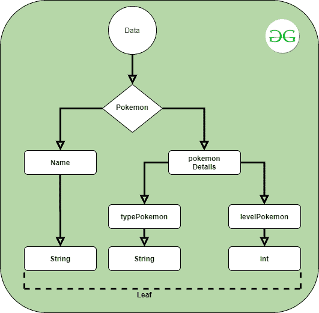
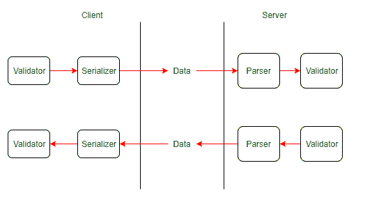
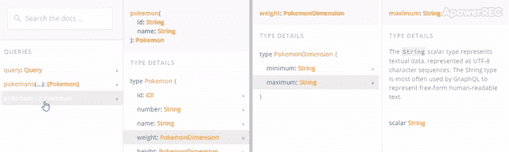

# 【图 QL |标量】

> 哎哎哎:# t0]https://www . geeksforgeeks . org/graph QL-scalars/

标量是 GraphQL 类型系统的内容。GraphQL 标量是 GraphQL 文档中的每个字段最终解析为的值类型。存储单个值的是原始数据类型。GraphQL 中有五个内置的标量，但是您也可以定义定制的标量。

**内置标量:**标量类型表示 GraphQL 类型系统中的原始叶值。GraphQL 响应采用层次树的形式；这些树上的叶子是 GraphQL 标量。

*   **int:** 表示 32 位有符号整数数值。作为 Int 响应的服务器应该使用这个 Int 规范。
*   **float:** 表示双精度带符号的小数值。定义这个规格时，使用的是 IEEE 754 标准。
*   **字符串:**表示 UTF-8 编码的文本。
*   **布尔:**这个标量不是真就是假。
*   **id:** 用于数据识别(充当密钥)的唯一标识符。该标识在序列化时被视为字符串。这里，序列化是将对象转换为布尔值、数字或字符串。

**例:**graph QL 标量的结构。

*   **查询:**

    ```
    {
      pokemon {
        name
        pokemonDetails
      }
    }
    ```

*   **输出:**

    ```
    {
     "data": {
       "pokemon": {
          "name":"Bulbasaur",
          "pokemonDetails": {
             "typePokemon":"land",
             "levelPokemon":3
           }
        }
      }
    }
    ```



GraphQL 标量有 3 种方法。这些方法的目的是在客户端和服务器之间传输数据之前识别和验证数据。

*   **验证:**客户端和服务器之间传递的数据被验证为特定的类型，以便接收方能够正确处理。这种验证应该放在所有需要验证的适当位置。(**<-验证器媒体<-验证器<-客户端**)
*   **序列化:**在传输数据之前，先进行序列化，转换成适合传输的类型。例如，包含学生详细信息的复杂 JSON 对象被序列化为字符串，然后被发送。
*   **解析:**当数据被接收(由发送方序列化)时，对其进行解析，将其转换为合适的形式。例如，日期对象由发送方序列化并发送给接收方。然后接收器**解析**将其转换回日期对象。



**自定义标量:** GraphQL 赋予开发人员定义自定义标量的权力，适合他们自己的需求。我们可以如下所示声明一个自定义标量，并将其添加到模式中。要定义自己的标量，必须从头开始编写验证、序列化和解析器。还有一个叫做 [graphql 标量](https://github.com/Urigo/graphql-scalars)的很棒的包，包含可能需要的通用标量。

*   **语法:**

    ```
    scalar customScalar
    ```

**示例:**现在，让我们看看这些标量如何发挥作用的一些示例。为了演示，我们将使用下面的 schema.js 文件来执行这个任务。

*   **schema . js:**T0】
*   **输出:**
    

**标量特性:**

*   在很大程度上，GraphQL Scalars 有助于 GraphQL 引擎的基本功能。他们通过为可以在服务器和客户端之间传输的“字段”提供五种基本的“值类型”来做到这一点。这些基本类型是:整型、浮点型、字符串型、布尔型和标识型。
*   对于稍微复杂一点的软件，GraphQL 为程序员提供了定义“自定义标量类型”的能力，以更好地处理“GraphQL 操作”(在效率、有效性和安全性方面)
*   GraphQL 内置的标量也有一个“id”值类型，可以用来唯一地标记每个数据记录。
*   GraphQL 标量用于构建模式，作为从数据库中检索数据的模型。

**参考:**T2】https://graphql-ruby.org/type_definitions/scalars.html