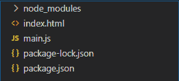
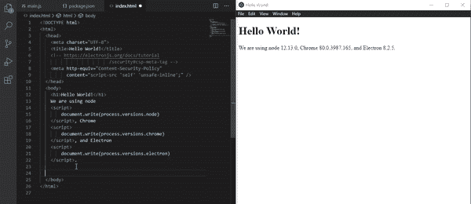
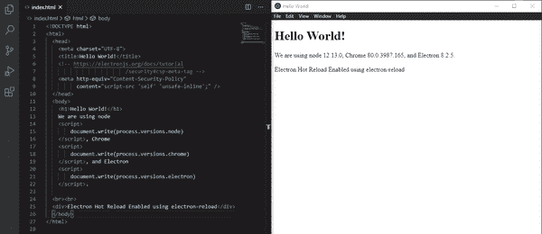
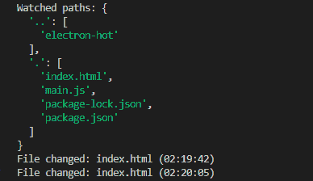

# 电子中的热重装

> 原文:[https://www.geeksforgeeks.org/hot-reload-in-electronjs/](https://www.geeksforgeeks.org/hot-reload-in-electronjs/)

**[electronijs](https://www.geeksforgeeks.org/introduction-to-electronjs/)**是一个开源框架，用于使用能够在 Windows、macOS 和 Linux 操作系统上运行的**[HTML](https://www.geeksforgeeks.org/html-tutorials/)****[CSS](https://www.geeksforgeeks.org/css-tutorials/)**和 **[JavaScript](https://www.geeksforgeeks.org/javascript-tutorial/)** 等 web 技术构建跨平台原生桌面应用。它将 Chromium 引擎和 **[NodeJS](https://www.geeksforgeeks.org/introduction-to-nodejs/)** 结合成一个单一的运行时。

**Angular** 、 **AngularJS 1.x** 、 **React** 、 **React-Native** 等几个强大的框架实现了 **Webpack** 这样的工具。Webpack 是现代 JavaScript 应用程序的静态模块捆绑器。它是一个强大的工具，提供实用程序来使开发过程更快更好。网络包提供的最有用的特性之一是热重装能力。热重新加载功能允许开发人员修改项目源代码，以立即反映输出/浏览器中的更改，而无需更新应用程序的整个状态。电子没有提供任何内置的热重载模块，但是，我们仍然可以使用开源包实现热重载能力。本教程将演示如何使用**电子重装** npm 包和**电子重装** npm 包在电子中实现热重装。

我们假设您熟悉上述链接中介绍的先决条件。电子要工作， **[节点](https://www.geeksforgeeks.org/introduction-to-nodejs/)** 和 **[npm](https://www.geeksforgeeks.org/node-js-npm-node-package-manager/)** 需要预装在系统中。

*   **项目结构:**
    

**示例:**我们将按照给定的步骤开始构建基本的电子应用程序。

*   **Step 1:** Navigate to an Empty Directory to setup the project, and run the following command,

    ```html
    npm init
    ```

    生成**包. json** 文件。安装 **[电子](https://www.geeksforgeeks.org/introduction-to-electronjs/)** 如果没有安装，使用 npm。

    ```html
    npm install electron --save
    ```

    该命令还将创建**包-lock.json** 文件，并安装所需的**节点 _ 模块**依赖项。一旦电子安装成功，打开**包. json** 文件，并在**脚本**键下执行必要的更改。使用 npm 安装**电子重装**，并将其保存为开发依赖项。

    ```html
    npm install electron-reload --save-dev
    ```

    使用 npm 安装**电子加载器**，并将其保存为开发依赖项。

    ```html
    npm install electron-reloader --save-dev
    ```

    这两个软件包都可以用来实现电子热重装。

    **package.json:**

    ```html
    {
      "name": "electron-hot",
      "version": "1.0.0",
      "description": "Hot Reload for Electron",
      "main": "main.js",
      "scripts": {
        "start": "electron ."
      },
      "keywords": [
        "electron"
      ],
      "author": "Radhesh Khanna",
      "license": "ISC",
      "dependencies": {
        "electron": "^8.2.5"
      },
      "devDependencies": {
        "electron-reload": "^1.5.0",
        "electron-reloader": "^1.0.1"
      }
    }

    ```

*   **Step 2:** Create a **main.js** file according to the project structure. This file is the **Main Process** and acts as an entry point into the application. Copy the Boilerplate code for the **main.js** file as given in the following [**link**](https://www.electronjs.org/docs/tutorial/first-app#electron-development-in-a-nutshell).

    **main.js:**

    ```html
    const { app, BrowserWindow } = require('electron')

    function createWindow() {
        // Create the browser window.
        const win = new BrowserWindow({
            width: 800,
            height: 600,
            webPreferences: {
                nodeIntegration: true
            }
        })

        // Load the index.html of the app.
        win.loadFile('index.html')

        // Open the DevTools.
        win.webContents.openDevTools()
    }

    // This method will be called when Electron has finished
    // initialization and is ready to create browser windows.
    // Some APIs can only be used after this event occurs.
    // This method is equivalent to 'app.on('ready', function())'
    app.whenReady().then(createWindow)

    // Quit when all windows are closed.
    app.on('window-all-closed', () => {
        // On macOS it is common for applications and their 
        // menu bar to stay active until the user quits 
        // explicitly with Cmd + Q
        if (process.platform !== 'darwin') {
            app.quit()
        }
    })

    app.on('activate', () => {
        // On macOS it's common to re-create a window in the 
        // app when the dock icon is clicked and there are no 
        // other windows open.
        if (BrowserWindow.getAllWindows().length === 0) {
            createWindow()
        }
    })

    // In this file, you can include the rest of your 
    // app's specific main process code. You can also 
    // put them in separate files and require them here.
    ```

*   **步骤 3:** 在 **src** 目录下创建**index.html**文件。我们还将从上述链接中复制**index.html**文件的样板代码。
    **index . html:**

    ```html
    <!DOCTYPE html>
    <html>
      <head>
        <meta charset="UTF-8">
        <title>Hello World!</title>
        <!-- https://electronjs.org/docs/tutorial
                               /security#csp-meta-tag -->
        <meta http-equiv="Content-Security-Policy" 
              content="script-src 'self' 'unsafe-inline';" />
      </head>
      <body>
        <h1>Hello World!</h1>
        We are using node 
        <script>
            document.write(process.versions.node)
        </script>, Chrome 
        <script>
            document.write(process.versions.chrome)
        </script>, and Electron 
        <script>
            document.write(process.versions.electron)
        </script>.
      </body>
    </html>
    ```

*   **Output:** To launch the Electron Application, run the Command:

    ```html
    npm start
    ```

    

**电子中的热重装:**热重装应该只在**开发**环境中实现。因此，在实现这个特性之前，我们需要控制应用程序环境。NodeJS 为我们提供了一种使用环境变量通过代码控制应用程序环境的方法。

**main.js** :在该文件中添加以下代码片段。

```html
const env = process.env.NODE_ENV || 'development';
```

**NODE_ENV** 是一个环境变量，在 NodeJS 中代表**节点环境**。启动节点应用程序时，它可以检查该环境变量，并根据该值执行其他任务和代码逻辑。按照惯例， **NODE_ENV** 变量应该只定义两个值，即**生产**或**开发**但是我们可以根据需要定义任意多个值。我们可以定义额外的值，如**测试**来执行应用程序中的自动化测试用例。如果我们没有设置环境变量，也没有在代码中明确定义值，那么它将默认为**未定义**。

*   要从 Windows Powershell 在**窗口**中设置**节点 _ENV** ，请使用:

    ```html
    $env:NODE_ENV="production"
    ```

*   要从 CMD 在**窗口**中设置**节点 _ 环境**，请使用:

    ```html
    set NODE_ENV=production
    ```

*   要在 **Linux** 和 **macOS** 中设置 **NODE_ENV** ，请使用:

    ```html
    export NODE_ENV=production
    ```

**注意:**如果使用上述方法设置，**节点 _ 环境**变量将在系统重新启动时重置。要在系统中保留该值，请通过**窗口**中的控制面板在系统环境变量中设置该值。我们也可以通过更新 **start** 脚本，从 **package.json** 在应用启动时设置 **NODE_ENV** 。

*   **T2

    ```html
    /..
    "start": "set NODE_ENV=development&&electron ."
    ../
    ```** 

在代码中，我们已经将 **NODE_ENV** 设置为**开发**。我们可以通过以下两种方法中的任何一种来实现电子中的热重载:

*   **Approach 1:** Using **electron-reload** npm package.
    This package is used to load the contents of all active **BrowserWindow** Instances within Electron when the source files are changed. The **require(‘electron-reload’)(path, options)** takes in the following parameters. For more detailed Information, Refer this [link](https://www.npmjs.com/package/electron-reload).
    *   **路径:字符串**需要观察的文件路径，让它刷新**浏览器窗口**实例上的源代码改变。
    *   **选项:对象(可选)**它接受以下参数
        *   **电子:字符串**要在重载时实现硬重置(启动新的电子进程)，我们可以指定指向电子可执行文件的路径。
        *   **hardrestmethod:String**如果电子应用程序覆盖默认的**退出**或**关闭**行为，如不关闭所有**浏览器窗口**实例，那么**电子重新加载**可以让应用程序的多个实例保持运行。在这种情况下，我们可以指定该属性将电子重装的默认行为更改为**退出**而不是**退出**。

    **main.js:** 在该文件中添加以下代码片段。

    ```html
    const path = require('path')
    const env = process.env.NODE_ENV || 'development';

    // If development environment
    if (env === 'development') {
        require('electron-reload')(__dirname, {
            electron: path.join(__dirname, 'node_modules', '.bin', 'electron'),
            hardResetMethod: 'exit'
        });
    }
    ```

    **输出:**
    

*   **Approach 2:** Using **electron-reloader** npm package. This package requires **Electron 5+**.

    根据**电子加载器**包的默认行为，当**主进程**中使用的文件源代码发生变化时，应用程序将重新启动，当**浏览器窗口**实例或**渲染器进程**中使用的文件源代码发生变化时，页面将重新加载。**要求(‘电子再装器’)(模块，选项)**采用以下参数。这个包还会监视我们构建应用程序时创建的 **dist** 文件夹。更多详细信息，请参考[链接](https://github.com/sindresorhus/electron-reloader)。

    *   **模块:对象**全局**模块**对象。传递该对象，以便包可以读取模块图，并找出哪些文件属于**主进程**。
    *   **选项:对象(可选)**它接受以下参数
        *   **调试:Boolean** 打印关注的路径和文件信息，如源代码更改时关注的文件的文件名。默认值为**假**。
        *   **忽略:String[]** 是正则表达式的字符串数组。正则表达式表示包要忽略的文件/目录的模式。默认情况下，文件/目录以**开头。**、**。映射**文件，忽略 **node_modules** 依赖关系。指定的其他模式将被添加到这些默认模式中。
        *   **观察渲染器:布尔**观察在**渲染器进程**中使用的文件，并在源代码更改时重新加载相应的窗口。默认值为**真**。

    **注意:**需要尝试/捕获，这样它就不会在**生产**环境中抛出以下错误。

    ```html
    Cannot find module 'electron-reloader'
    ```

    **main.js:** 在该文件中添加以下代码片段。

    ```html
    const env = process.env.NODE_ENV || 'development';

    // If development environment
    if (env === 'development') {
        try {
            require('electron-reloader')(module, {
                debug: true,
                watchRenderer: true
            });
        } catch (_) { console.log('Error'); }    
    }
    ```

    **输出:**
    

    **控制台输出:**
    