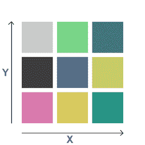
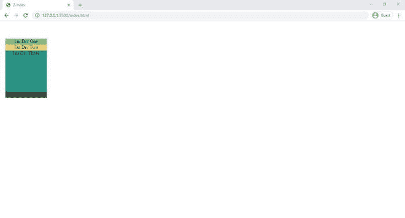

# 【z-index 图层是如何工作的？

> 原文:[https://www.geeksforgeeks.org/how-does-z-index-layer-work/](https://www.geeksforgeeks.org/how-does-z-index-layer-work/)

在本文中，我们将看到 z-index 如何在 CSS 中工作。众所周知，我们借助维度来看待每一个物品，完全决定了一个物体的大小。所以 z-index 被用来沿着 z 轴渲染元素。z 索引的默认值为零。

### 示例:

让我们从一个例子来理解它。

我们有一些尺寸相同的纸板，但是它们都是不同的颜色。所以如果我们想看到他们在一起，但是在我们看来会是这样的。



2D

在这里，我们只使用了两个维度，即在 X 维度和 Y 维度上，我们也可以在其中看到 Z 维度。


三维（three dimension 的缩写）

z-index 的整个概念与 3D 有关，我们可以用称为 z-index 的属性来调整 z 轴。

z 的值也可以是正的、负的或零。

#### 代码实现:

## 超文本标记语言

```html
<!DOCTYPE html>
<html lang="en">

<head>
    <link rel="stylesheet" href="style.css">
</head>

<body>
    <div class="d1">I'm Div One</div>
    <div class="d2">I'm Div Two</div>
    <div class="d3">I'm Div Three</div>
    <div class="d4">I'm Div Four</div>
</body>

</html>
```

#### CSS(style . CSS):

## 半铸钢ˌ钢性铸铁(Cast Semi-Steel)

```html
div {
    width: 140px;
    height: 140px;
    margin: 10px;
    text-align: center;

    /* Only display the last div */
    position: absolute;
}

/* If we want to adjust the z-axis */
/* use z-index */
.d1 {
    background-color: #79D588;
    top: 50px;
    /* z-index: 10; */
    /* Use comment/uncomment upper
    line to see the difference */
}

.d2 {
    background-color: #F6CD6C;
    top: 70px;
    /* z-index: 10; */
    /* Use comment/uncomment upper
    line to see the difference */
}

.d3 {
    background-color: #289485;
    top: 90px;
    z-index: 10;
    /* Use comment/uncomment upper
    line to see the difference */
}

.d4 {
    background-color: #403E3E;
    top: 110px;
    /* z-index: 10; */
    /* Use comment/uncomment upper
    line to see the difference */
}
```

**注意:**可以注释/取消注释每个 div 的 z-index 属性，然后逐个检查输出。

#### 输出:



输出