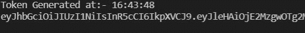
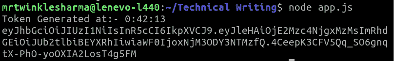
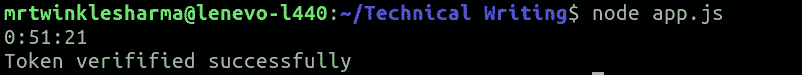
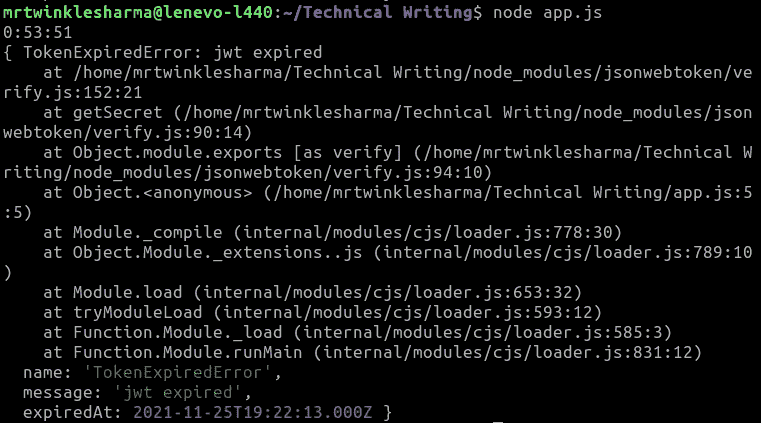

# JWT 令牌有效期多久？

> 原文:[https://www.geeksforgeeks.org/how-long-jwt-token-valid/](https://www.geeksforgeeks.org/how-long-jwt-token-valid/)

JSON web token 是一种高效、安全且最常用的在互联网上传输或交换数据的方法。一般用于应用中的[认证和授权](https://www.geeksforgeeks.org/how-to-implement-jwt-authentication-in-express-js-app/)。身份验证的工作流程是我们在服务器上生成令牌，并将其发送回客户端，客户端用于服务器上的进一步请求，现在讨论的重点是**这个 jwt 令牌将有效多长时间？**表示表示在此期间之后，服务器将不考虑客户端发送的令牌。让我们首先了解 JWT 令牌是如何创建的。

**jsonwebtoken** 库的**符号()**方法用于创建一个接受某些信息作为参数对象的令牌，并返回生成的令牌。

**语法:**

```
jwt.sign(payload, secretOrPrivateKey, [options, callback])
```

**参数:**

*   **有效载荷:**它是令牌中要加密的信息
*   **secretKey:** 它是签名或者可以说是一个用来识别令牌真伪的代码。
*   **选项:**在选项中，我们传递关于令牌的某些信息，这是我们提供令牌有效期的地方。

**返回类型**:此方法返回 JWT 令牌

**示例:**创建 10 分钟到期的令牌。

**步骤 1:** 创建节点项目

当我们在一个节点库中工作时，创建一个节点项目是一个强制性的步骤，在终端中编写 npm init。它会询问一些关于你的项目的配置，这些配置非常容易提供。

```
npm init
```

**步骤 2:** 安装“ **jsonwebtoken** 包

在编写 JWT 代码之前，我们必须安装软件包，

```
npm install jsonwebtoken
```

这将是我们安装后的项目结构，其中 node_modules 包含模块和包。此外，我们还创建了一个 **app.js** 文件来编写整个代码。

**项目结构:**


**第三步**:创建 **JWT 令牌**，有确定的到期时间。

注册令牌到期有两种方法，下面给出了说明。

*   创建到期时间的表达式。
*   在方法的 options 参数中提供 JWT 令牌的到期时间。

**方法 1:** 存在一个密钥 **exp** ，在该密钥中我们可以提供自纪元以来的秒数，并且令牌将在这些秒数之前有效。

## java 描述语言

```
// Importing module
const jwt = require('jsonwebtoken');
const token = jwt.sign({

    // Expression for initialising expiry time
    exp: Math.floor(Date.now() / 1000) + (10 * 60),
    data: 'Token Data'
}, 'secretKey');
const date = new Date();
console.log(`Token Generated at:- ${date.getHours()}
                               :${date.getMinutes()}
                               :${date.getSeconds()}`);

// Printing the JWT token
console.log(token);
```

**输出:**



**方法二:**在此方法中，我们可以将时间传递给选项中的**expire resin**键，它要求令牌保持有效的秒数或者时长字符串为**【1h】****【2h】****【10m】**等。

## java 描述语言

```
// Importing module
const jwt = require('jsonwebtoken');
const token = jwt.sign({

    // Assigning data value
    data: 'Token Data'
}, 'secretKey', {
    expiresIn: '10m'
});
const date = new Date();
console.log(`Token Generated at:- ${date.getHours()}
                               :${date.getMinutes()}
                               :${date.getSeconds()}`);
// Printing JWT token
console.log(token);
```

**输出:**



**第四步:验证令牌的有效期**

我们已经成功地生成了令牌，现在是时候验证代码是否按照预期的方式工作了。

## java 描述语言

```
//Importing module
const jwt = require('jsonwebtoken');
// JWT token
const token =
"eyJhbGciOiJIUzI1NiIsInR5cCI6IkpXVCJ9.eyJleHAiOjE2Mzc4NjgxMzMsImRhdGWf"

const date = new Date();
// Verifing the JWT token
jwt.verify(token, 'secretKey', function(err, decoded) {
    if (err) {
        console.log(`${date.getHours()}:${date.getMinutes()}
                                       :${date.getSeconds()}`);
        console.log(err);
    }
    else {
        console.log(`${date.getHours()}:${date.getMinutes()}
                                       :${date.getSeconds()}`);
        console.log("Token verifified successfully");
    }
});
```

**10 分钟前:**

**输出 1:** 这里我们在生成令牌前 10 分钟进行检查，正如预期的那样，else 代码块将会工作。



**10 分钟后:**

**输出 2** :这里我们检查一旦令牌过期，在这种情况下会抛出**令牌过期错误**。



**结论:**在看到这两个输出和创建令牌的方法后，我们可以分析出令牌的持续时间是如何声明的，以及它保持多长时间有效。