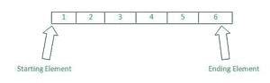

# 使用百分位数公式，给定数组中有多少个数小于/等于给定值？

> 原文:[https://www . geesforgeks . org/给定数组中有多少个数字小于等于给定值，使用百分制公式/](https://www.geeksforgeeks.org/how-many-numbers-in-the-given-array-are-less-equal-to-the-given-value-using-the-percentile-formula/)

下面的方法介绍了如何使用 JavaScript 中的百分比公式计算给定数组中有多少数字小于或等于给定值。

**问题陈述:**给你一个包含不同整数值的数组，还有一个整数值。您需要查看给定数组中有多少数字小于或等于给定的整数值，并使用 JavaScript 中的百分位数公式返回结果的百分位数。



以上面说明的数组[1，2，3，4，5，6]为例，给定的整数值为 6。所以如果我们计算有多少元素小于等于 6，那么我们会看到有 6 个元素(1，2，3，4，5，6)小于等于 6。

因此，根据百分比公式，我们将 100%打印结果，因为所有元素都小于等于给定的整数值。

**方法:**有几种方法可以解决这个特定的问题。我们已经介绍了以下两种方法:

**方法 1:**

*   在这种方法中，我们将使用**来进入**循环来特别检查数组的每个元素。
*   在 for 循环中，我们将保留我们的逻辑部分，在完成逻辑部分后，我们将通过调用一个函数(或一个方法)在控制台中打印我们的结果，在该函数中我们将写下我们的代码。
*   我们在 for-in 循环中使用了三进制运算符，而不是使用 if-else 语句，这将使我们的代码不那么冗长，也更容易理解。

**示例:**

## java 描述语言

```
<script>
  const percentileCalculation = (arr, val) => {
    let result = 0;

    for (let i in arr) {
      result = result + (arr[i] < val ? 1 : 0) + (arr[i] === val ? 0.5 : 0);
    }

    let resultDisplay = (result / arr.length) * 100;
    console.log(resultDisplay);
  };

  // Function call
  percentileCalculation([1, 2, 3, 4, 5, 6], 5);
</script>
```

**输出:**

```
75
```

**方法 2:**

*   在这种方法中，我们将使用 **reduce()** 方法，该方法将遍历我们的数组，并将其转换为单个实体或单个值。
*   在调用 reduce()方法时，我们将在 reduce()方法中编写我们的逻辑部分，并将调用我们的主方法或函数来打印结果值。
*   在 reduce()方法中，我们将采用两个参数:第一个是“acc”变量，它被称为累加器，它将充当我们的结果值，我们可以在计算后将结果存储在其中；第二个是“v”，它被称为值变量，数组的每个值都存储在其中，通过使用这个“v”变量，我们将每个值与给我们的值进行比较。

## java 描述语言

```
<script>
  const percentileCalculation = (arr, val) =>
    (100 *
      arr.reduce(
        (acc, v) => acc + (v < val ? 1 : 0) + (v === val ? 0.5 : 0),
        0
      )) /
    arr.length;

  // Function call
  console.log(percentileCalculation([1, 2, 3, 4, 5, 6], 5));
</script>
```

**输出:**

```
75
```