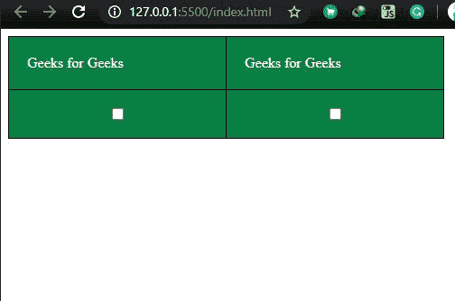
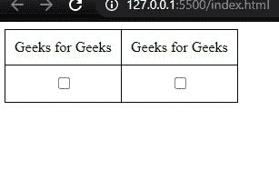

# 如何将复选框放置在表格单元格的中心？

> 原文:[https://www . geesforgeks . org/how-place-a-checkbox-to-center-a-table-cell/](https://www.geeksforgeeks.org/how-place-a-checkbox-into-the-center-of-a-table-cell/)

通过使用普通 CSS 样式表或借助引导，可以在表格单元格的中央放置一个复选框。在这里，我们将看到使用纯 CSS 在表格单元格中居中复选框的不同方法。

**方法 1:**

在此方法中，我们使用“显示弹性框”属性将复选框置于表格单元格的中心。

**注意:**该方法不会使复选框后的文本被视为块元素，勾选后输入的文本将可见

**示例:**

```html
<!DOCTYPE html>
<html lang="en">
<head>
  <meta charset="UTF-8">
  <meta name="viewport" 
        content="width=device-width, initial-scale=1.0">
  <title>Document</title>
</head>
<style>
/* Stylesheet*/
  table{
    border-collapse: collapse;
    padding: 20px;
  }
  td{
    border: 1px solid #000;
    padding: 20px;
  }
  .checkbox{
    width: 200px;
    background-color:#098043;
    color:#fff;
    margin: auto;
  }
  input{
    margin: auto; 
    /*setting margin to auto of the cheeckbox*/
    display: flex;/*Flex box property*/
  }
</style>
<body>
  <!-- Table start-->
  <table>
  <!-- row start-->
    <tr>
  <!-- column start-->
      <td class="checkbox">Geeks for Geeks</td>
      <td class="checkbox">Geeks for Geeks</td>
  <!-- Column closed-->
    </tr>
  <!-- row closed-->
    <tr>
      <td class="checkbox">
        <input type="checkbox">
      </td>
      <td class="checkbox">
        <input type="checkbox">
      </td>
    </tr>
  </table>

</body>
</html>
```

**输出:**



**方法二:**

在这个方法中，我们将使用 CSS 的文本对齐居中属性来居中单元格中的复选框。

**注意:**这个方法会将表格 td 中的所有内容居中。

**示例:**

```html
<!DOCTYPE html>
<html lang="en">
<head>
  <meta charset="UTF-8">
  <meta name="viewport" 
        content="width=device-width, initial-scale=1.0">
  <title>Document</title>
</head>
<style>
  table, td{
    border-collapse: collapse;
    border: 1px solid #000;
    padding: 10px;
  }
  .checkbox{
    text-align: center;
 /*Centering the text in a td of the table*/
  }
</style>
<body>
  <table>
    <tr>
      <td>
        Geeks for Geeks
      </td>
      <td>
        Geeks for Geeks
      </td>
    </tr>
    <tr>
      <td class="checkbox">
        <input type="checkbox">
      </td>
      <td class="checkbox">
        <input type="checkbox">
      </td>
    </tr>
  </table>

</body>
</html>
```

**输出:**

