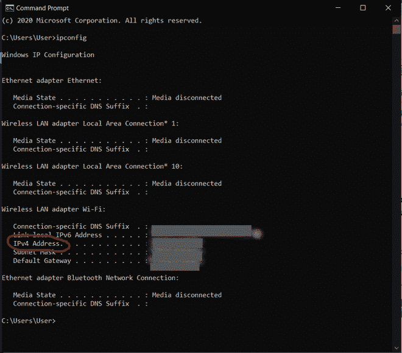

# 如何在移动浏览器上访问 Localhost？

> 原文:[https://www . geesforgeks . org/如何访问移动浏览器上的 localhost/](https://www.geeksforgeeks.org/how-to-access-localhost-on-mobile-browsers/)

如果你正在做一些项目或网站或网络应用程序，并想在手机上看看，如果是的话，请完整阅读这些文章，这将对你的发展有很大帮助。如果你想在移动浏览器中运行你的应用程序而没有太多麻烦，那么请阅读这些文章直到最后。是的，当然，你可以使用你的 chrome inspect 工具，你可以在 chrome 浏览器上点击右键，然后选择设备切换工具栏。为了更好地了解 chrome，开发工具从这里学习 [Chrome 检查元素工具&快捷方式](https://www.geeksforgeeks.org/chrome-inspect-element-tool-shortcut/)。

在这篇文章中，我们将学习如何在移动设备上查看您的应用程序，这非常简单且有帮助。

**第 1 步**:在本地机器上启动应用程序。在开始之前，您必须通过机器中的 localhost 在浏览器中启动应用程序。完成这些操作后，查看网址，记下端口号(显示在本地主机名后面的数字)。

**第二步**:找到你本地的 **IP 地址 IPV4** 。

打开你的终端或命令提示符，输入***【ipconfig】***，按回车键即可。你会看到这样的:

只要看看你的 IPv4 地址，把它写在任何地方。

**第三步**:在其他设备上查看你的应用。

一旦你有了你的端口号和 IPv4 地址，只需输入你的手机或设备浏览器，如 **IPv4 地址:PORT。**例如 **555.55.55.555:1234**

格式完全相同。一旦你在浏览器中运行，你会看到你的应用程序。