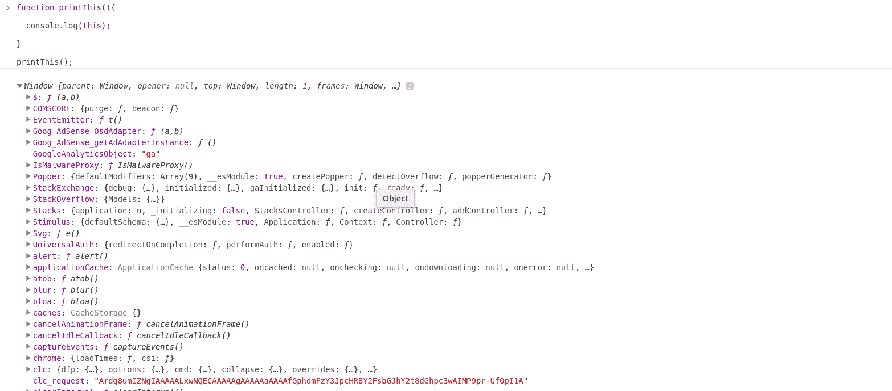
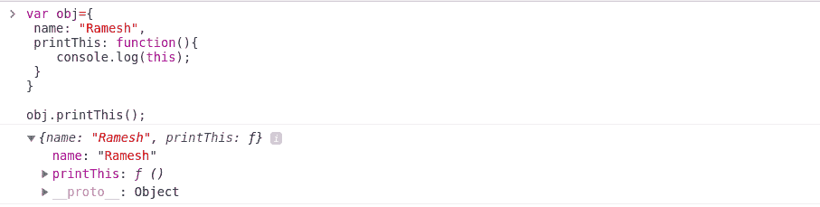
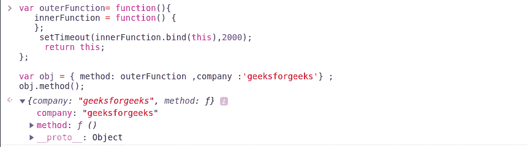

# 如何在回调中访问正确的‘this’？

> 原文:[https://www . geeksforgeeks . org/如何访问回调中的正确内容/](https://www.geeksforgeeks.org/how-to-access-the-correct-this-inside-a-callback/)

在 JavaScript 中，“this”的行为与其他编程语言不同。如果我们正在执行一个正常的函数调用，那么‘这’指向窗口对象。但是我们调用函数的方式不同于“这”将指向一个邻近的对象。为了更好地理解它，下面我们用两个不同调用方法的两个代码片段进行了阐述。

**示例 1:** 当我们在下面的示例中以正常方式调用函数时

## java 描述语言

```html
function printThis(){

  console.log(this);

}

printThis();
```

**输出:**



**例 2:** 当我们使用对象表示法调用函数时。

## java 描述语言

```html
var obj={
 name: "Ramesh",
 printThis: function(){
    console.log(this);
 }
}

obj.printThis();
```

**输出:**



所以，从上面两个例子中，我们可以清楚地理解当我们进行不同类型的函数调用时‘this’的行为。

**方法:**首先创建一个对象并输入样本属性。确保为一个键添加一个函数，在该函数中使用 setTimeout 添加一个回调函数。在这个 setTimeout 函数中，使用“bind”来绑定这个的上下文，然后返回这个。

*   **示例:**使用绑定

    ## java 描述语言

    ```html
    var outerFunction= function(){
       innerFunction = function() {
       };
        setTimeout(innerFunction.bind(this),2000);
         return this;
    };

    var obj = { method: outerFunction ,company :'geeksforgeeks'} ;
    obj.method();
    ```

*   **输出:**

    