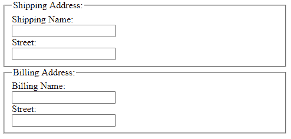
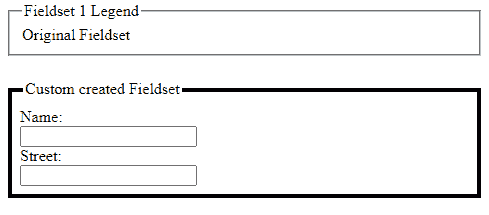

# 如何实现

<fieldset>like effect without using

<fieldset>tag ?

> 原文:[https://www . geeksforgeeks . org/如何在不使用 fieldset-tag 的情况下实现类似 fieldset 的效果/](https://www.geeksforgeeks.org/how-to-achieve-fieldset-like-effect-without-using-fieldset-tag/)

表单用于使所有用户和客户端更容易理解一个组，因为相关的数据字段更容易识别。它还使用户更容易将注意力集中在更小和更明确定义的组上，将它们作为一个个体逐一理解，而不是试图一次掌握整个形式。

为了便于数据处理，必须在代码中为用户可视化地创建分组。默认情况下，

<fieldset>和<legend>元素用于对相关表单数据字段进行分组。</legend></fieldset>

**示例 1:** 以下示例显示了 HTML 中默认的<字段集>标签的用法。

## 超文本标记语言

```html
<!DOCTYPE html>
<html>

<body>
    <h2>Welcome To GFG</h2>

    <fieldset>
        <legend>
            Shipping Address:
        </legend>
        <div>
            <label for="shipping_name">
                Name:
            </label>
            <br>
            <input type="text" name="shipping_name"
                    id="shipping_name">
        </div>

        <div>
            <label for="shipping_street">
                Street:
            </label>
            <br>
            <input type="text" name="shipping_street"
                    id="shipping_street">
        </div>
    </fieldset>

    <fieldset>
        <legend>
            Billing Address:
        </legend>
        <div>
            <label for="billing_name">
                Name:
            </label>
            <br>
            <input type="text" name="billing_name"
                    id="billing_name">
        </div>
        <div>
            <label for="billing_street">
                Street:
            </label>
            <br>
            <input type="text" name="billing_street"
                    id="billing_street">
        </div>
    </fieldset>
</body>

</html>
```

**输出:**



**fieldset 效果的替代:**如果用户不想使用< fieldset >标签，可以使用自定义 CSS 实现 field set 标签的效果。它巧妙地使用了边框、边距和其他各种 CSS 属性来达到类似的效果。

**示例 2:** 下面的示例演示了替代的 fieldset 效果。

## 超文本标记语言

```html
<!DOCTYPE html>
<html>

<head>
    <style>
        /* Defining a custom border on all
            sides except the top side */
        .custom-field {
            border: 4px solid;
            border-top: none;
            margin: 32px 2px;
            padding: 8px;
        }

        /* Defining the style of the 
        heading/legend for custom fieldset */
        .custom-field h1 {
            font: 16px normal;
            margin: -16px -8px 0;
        }

        /* Using float:left allows us to mimic
           the legend like fieldset. The 
           float:right property can also be 
           used to show the legend on right side */

        .custom-field h1 span {
            float: left;
        }

        /* Creating the custom top border to make
            it look like fieldset defining small 
            border before the legend. The width 
            can be modified to change position 
            of the legend */
        .custom-field h1:before {
            border-top: 4px solid;
            content: ' ';
            float: left;
            margin: 8px 2px 0 -1px;
            width: 12px;
        }

        /* Defining a long border after the 
        legend, using overflow hidden to 
        actually hide the line behind the 
        legend text. It can be removed
        for a different effect */
        .custom-field h1:after {
            border-top: 4px solid;
            content: ' ';
            display: block;
            height: 24px;
            left: 2px;
            margin: 0 1px 0 0;
            overflow: hidden;
            position: relative;
            top: 8px;
        }
    </style>
</head>

<body>
    <!-- Original fieldset tag 
        for comparison -->
    <fieldset>
        <legend>
            Fieldset 1 Legend
        </legend>
        Original Fieldset
    </fieldset>

    <!-- Custom fieldset which is created
        using custom CSS above -->
    <div class="custom-field">
        <h1>
            <span>
                Custom created Fieldset
            </span>
        </h1>
        <div>
            <label for="shipping_name">
                Name:
            </label>
            <br>
            <input type="text" 
                    name="shipping_name" 
                    id="shipping_name">
        </div>
        <div>
            <label for="shipping_street">
                Street:
            </label>
            <br>
            <input type="text"
                    name="shipping_street" 
                    id="shipping_street">
        </div>
    </div>
</body>

</html>
```

**输出:**



</fieldset>

</fieldset>