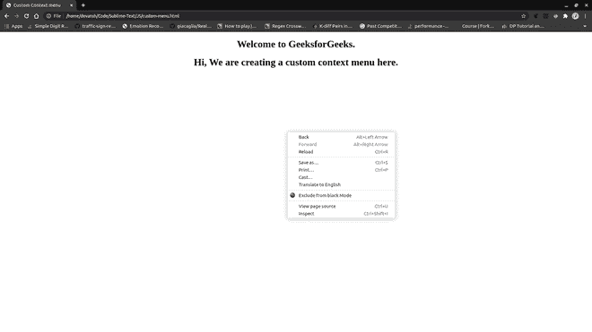
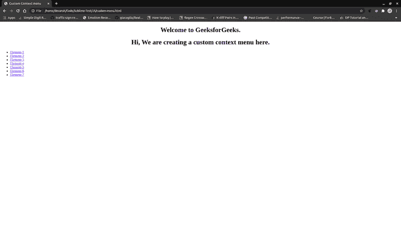
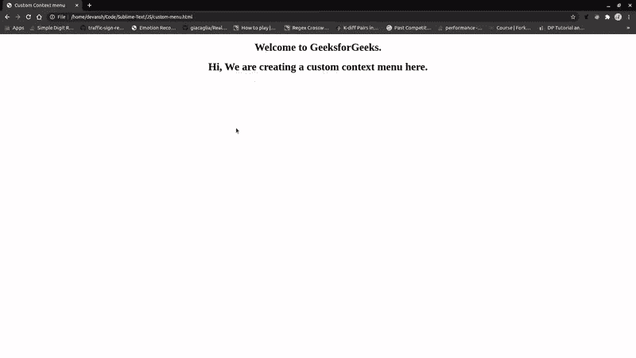

# 如何给网页添加自定义右键菜单？

> 原文:[https://www . geesforgeks . org/如何添加自定义-右键-菜单-转到网页/](https://www.geeksforgeeks.org/how-to-add-a-custom-right-click-menu-to-a-webpage/)

浏览器中的右键菜单或上下文菜单是在鼠标右键操作时出现的具有多个选项的菜单。它提供了与特定环境相关的多种功能。有时，我们希望上下文菜单有更多的选项或功能，但我们不能修改默认的上下文菜单。所以，我们必须创建一个自定义菜单。将自定义上下文菜单添加到您的网站或网页会使其看起来更加自定义和与上下文相关，并为您提供向其添加所需功能的自由。

在本文中，我们将为网页创建一个自定义上下文菜单。主要涉及两个步骤。

*   防止单击鼠标右键时弹出默认上下文菜单。
*   用 HTML 和 CSS 创建我们自己的自定义上下文菜单，并在右击时显示。

让我们一步一步地来看一遍。

**HTML 代码:**下面的 HTML 代码片段只显示了带有默认菜单的 HTML 页面，该菜单显示在右键事件上。

## 超文本标记语言

```htmlhtml
<!DOCTYPE html>
<html>

<body>
    <h1 style="text-align: center;">
        Welcome to GeeksforGeeks.
    </h1>
    <h1 style="text-align: center;">
        Hi, We are creating a 
        custom context menu here.
    </h1>
</body>

</html>
```

如果我们右击这个页面，默认菜单就会弹出。



JavaScript 代码用于阻止这个默认菜单，然后我们将创建我们的自定义上下文菜单。为了阻止默认菜单，我们将添加一个事件处理程序来处理网页上的右击事件。我们将使用 *oncontextmenu* 属性来监听右键单击事件。

我们将创建一个**右击()**函数。在这个函数中，我们将调用鼠标点击事件的 **preventDefault()** 方法，该方法将取消右键点击事件的默认行为。我们也可以返回“假”来取消活动。现在，鼠标右键不会弹出默认菜单。

**HTML 代码:**下面的 HTML 代码演示了如何防止默认的右键点击事件。

## 超文本标记语言

```htmlhtml
<!DOCTYPE html>
<html>

<body>
    <h1 style="text-align: center;">
        Welcome to GeeksforGeeks.
    </h1>
    <h1 style="text-align: center;">
        Hi, We are creating a 
        custom context menu here.
    </h1>
    <script type="text/javascript">
        document.oncontextmenu = rightClick;

        function rightClick(clickEvent) {
            clickEvent.preventDefault();
            // return false;
        }
    </script>
</body>

</html>
```

默认菜单被阻止。让我们创建自己的自定义上下文菜单。我们将要创建的上下文菜单将是一个 HTML 列表。我们还将添加一些 CSS，使其看起来很好。

我们正在 id 和类的“div”标签中创建一个无序列表。向列表中添加一些选项。我们将通过将“显示”属性的值设置为*无*来将其隐藏。

## 超文本标记语言

```htmlhtml
<div id="contextMenu" class="context-menu" 
    style="display: none">
    <ul>
        <li><a href="#">Element-1</a></li>
        <li><a href="#">Element-2</a></li>
        <li><a href="#">Element-3</a></li>
        <li><a href="#">Element-4</a></li>
        <li><a href="#">Element-5</a></li>
        <li><a href="#">Element-6</a></li>
        <li><a href="#">Element-7</a></li>
    </ul>
</div>
```

我们将添加一些 JavaScript 代码来显示右键菜单。我们还将修改**右键()**功能，增加鼠标点击事件显示和隐藏菜单的功能。

我们将为点击事件添加一个事件处理程序，并将其与 **hideMenu()** 函数绑定，这样，如果用户点击页面上的任何地方，并且上下文菜单已经显示，它就会隐藏。此外，我们必须将菜单放在点击右键的地方。为此，我们将使用鼠标点击事件的两个属性 *pageX* 和 *pageY* ，这将给出点击右键的坐标。如果已经显示了上下文菜单，我们将隐藏它。

**JavaScript 代码:**

## 超文本标记语言

```htmlhtml
<script>
    document.onclick = hideMenu;
    document.oncontextmenu = rightClick;

    function hideMenu() {
        document.getElementById("contextMenu")
                .style.display = "none"
    }

    function rightClick(e) {
        e.preventDefault();

        if (document.getElementById("contextMenu")
                .style.display == "block")
            hideMenu();
        else{
            var menu = document.getElementById("contextMenu")

            menu.style.display = 'block';
            menu.style.left = e.pageX + "px";
            menu.style.top = e.pageY + "px";
        }
    }
</script>
```

**输出:**以下输出显示了出现在右键上的自定义上下文菜单。



右键单击时，菜单出现，但这不是我们想要的。我们希望它出现在按钮被点击的地方，实际上它应该看起来像一个菜单。

**CSS 代码:**为了菜单的正确定位和样式，我们将添加一些 CSS 属性。

## 超文本标记语言

```htmlhtml
<style type="text/css">
    .context-menu {
        position: absolute;
        text-align: center;
        background: lightgray;
        border: 1px solid black;
    }

    .context-menu ul {
        padding: 0px;
        margin: 0px;
        min-width: 150px;
        list-style: none;
    }

    .context-menu ul li {
        padding-bottom: 7px;
        padding-top: 7px;
        border: 1px solid black;
    }

    .context-menu ul li a {
        text-decoration: none;
        color: black;
    }

    .context-menu ul li:hover {
        background: darkgray;
    }
</style>
```

**最终代码:**以下是上述代码片段的组合。

## 超文本标记语言

```htmlhtml
<!DOCTYPE html>
<html>

<head>
    <style type="text/css">
        .context-menu {
            position: absolute;
            text-align: center;
            background: lightgray;
            border: 1px solid black;
        }

        .context-menu ul {
            padding: 0px;
            margin: 0px;
            min-width: 150px;
            list-style: none;
        }

        .context-menu ul li {
            padding-bottom: 7px;
            padding-top: 7px;
            border: 1px solid black;
        }

        .context-menu ul li a {
            text-decoration: none;
            color: black;
        }

        .context-menu ul li:hover {
            background: darkgray;
        }
    </style>

</head>

<body>
    <h1 style="text-align: center;">
        Welcome to GeeksforGeeks.
    </h1>
    <h1 style="text-align: center;">
        Hi, We are creating a 
        custom context menu here.
    </h1>

    <div id="contextMenu" class="context-menu" 
        style="display:none">
        <ul>
            <li><a href="#">Element-1</a></li>
            <li><a href="#">Element-2</a></li>
            <li><a href="#">Element-3</a></li>
            <li><a href="#">Element-4</a></li>
            <li><a href="#">Element-5</a></li>
            <li><a href="#">Element-6</a></li>
            <li><a href="#">Element-7</a></li>
        </ul>
    </div>

    <script>
        document.onclick = hideMenu;
        document.oncontextmenu = rightClick;

        function hideMenu() {
            document.getElementById(
                "contextMenu").style.display = "none"
        }

        function rightClick(e) {
            e.preventDefault();

            if (document.getElementById(
                "contextMenu").style.display == "block")
                hideMenu();
            else {
                var menu = document
                    .getElementById("contextMenu")

                menu.style.display = 'block';
                menu.style.left = e.pageX + "px";
                menu.style.top = e.pageY + "px";
            }
        }
    </script>
</body>

</html>
```

**Output:**


这是我们创建的基本上下文菜单。通过添加一些很酷的悬停效果、阴影效果、着色、边框等，你可以做得更多。