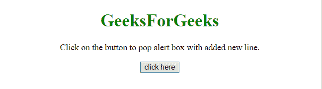
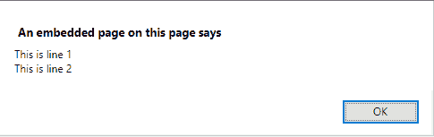
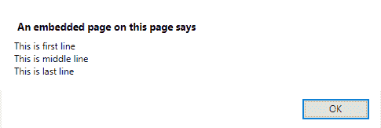

# 如何在预警框中新增一行？

> 原文:[https://www . geesforgeks . org/如何在警报框中添加新线路/](https://www.geeksforgeeks.org/how-to-add-a-new-line-in-the-alert-box/)

为了给**警告框**的内容添加新的一行，我们将使用 **\n** 反斜杠(n)。

**示例-1:** 本示例在**警告框**的文本中的两行之间添加了 **\n** 。

```
<!DOCTYPE HTML>
<html>

<head>
    <title>
        JavaScript |
      New line in alert box.
    </title>
</head>

<body style="text-align:center;"
      id="body">
    <h1 style="color:green;">  
            GeeksForGeeks  
        </h1>
    <p>
        Click on the button to pop 
      alert box with added new line.
    </p>
    <button onclick="gfg_Run()">
        click here
    </button>
    <script>
        var text =
            "This is line 1\nThis is line 2";

        function gfg_Run() {
            alert(text);
        }
    </script>
</body>

</html>
```

**输出:**

*   **点击按钮前:**
    
*   **点击按钮后:**
    

**示例-2:** 本示例在**提醒框**的文本中添加了 3 行中的 **\n** 。

```
<!DOCTYPE HTML>
<html>

<head>
    <title>
        JavaScript 
      | New line in alert box.
    </title>
</head>

<body style="text-align:center;" 
      id="body">
    <h1 style="color:green;">  
            GeeksForGeeks  
        </h1>
    <p>
        Click on the button to pop
      alert box with added new line.
    </p>
    <button onclick="gfg_Run()">
        click here
    </button>
    <script>
        var text = 
            "This is first line\nThis is "+
            "middle line\nThis is last line";

        function gfg_Run() {
            alert(text);
        }
    </script>
</body>

</html>
```

**输出:**

*   **点击按钮前:**
    
*   **点击按钮后:**
    