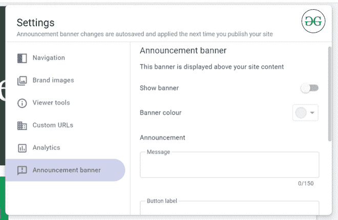

# 如何在新的谷歌网站中添加公告横幅？

> 原文:[https://www . geesforgeks . org/如何添加-公告-新横幅-谷歌-网站/](https://www.geeksforgeeks.org/how-to-add-announcement-banner-in-new-google-sites/)

有时你必须就一条新闻或一个产品发布会等发布一些公告。这可以在新的谷歌网站平台上实现。您可以设置一些公告，也可以决定它应该显示在哪里，即在所有页面上还是仅在主页上。

首先进入**站点设置**。

然后，转到设置中的**公告横幅**选项。

#### 公告横幅的属性:

1.  **显示横幅:**此按钮决定横幅在您的网站上的可见性。如果按钮被选中，那么你的横幅将显示在你的网站上，否则它不会。因此，这意味着您可以根据自己的喜好移除和添加横幅。
2.  **横幅颜色:**此字段将设置横幅的背景颜色。令人惊讶的事实是字体颜色会根据所选的背景颜色自动决定。为您选择最佳的颜色组合。
3.  **公告:**该字段包含三个子字段，即消息、按钮标签和链接。消息字段用于显示公告消息。如果公告必须包含任何按钮，按钮标签字段将被填充。将链接添加到按钮链接字段已填充。如果您想在新窗口中打开该字段，只需选中名为*的复选框在新窗口*中打开。
4.  **可见性:**该字段用于设置公告横幅的显示位置，即是在所有页面显示还是只在首页显示。

成功填写横幅信息后，它可能如下所示:

横幅显示在页面顶部。