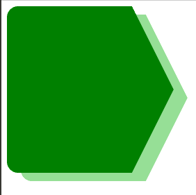

# 如何给剪辑路径对象添加框阴影？

> 原文:[https://www . geeksforgeeks . org/如何将盒子阴影添加到剪辑路径对象/](https://www.geeksforgeeks.org/how-to-add-box-shadow-to-the-clip-path-object/)

众所周知，我们可以使用 CSS 的 [Box-Shadow](https://www.geeksforgeeks.org/css-box-shadow-property/) 属性来应用阴影，但是如果我们使用 CSS 的 [Clip-Path()](https://www.geeksforgeeks.org/css-clip-path-property/) 功能将其应用在
裁剪对象上，则该属性无效。

**进场:**

*   我们将创建两个 div，一个用于主形状，另一个用于裁剪形状。
*   然后我们将使用[投影()](https://www.geeksforgeeks.org/css-drop-shadow-function/)功能来应用阴影效果。

**HTML 代码:**

1.  首先，创建一个 HTML 文件(index.html)。
2.  现在，在创建了我们的 HTML 文件之后，我们将使用
    <标题>标签为我们的网页赋予一个标题。应该放在<头>标签之间。
3.  然后，我们将提供所有背景图像的 CSS 文件链接到我们的 HTML。这也是放置在
    之间的 *<头>* 的标记。
4.  来到我们的 HTML 代码的主体部分。
    1.  首先，创建一个主 div 作为主框。
    2.  在该 div 中，再添加 1 个 div 来添加剪辑路径对象。

## index.html

```html
<!DOCTYPE html>
<html lang="en">

<head>
  <title>Document</title>
  <link rel="stylesheet" href="style.css">
</head>

<body>
  <div class="main_box">
      <div class="img"></div>
  </div>    
</body>

</html>
```

**CSS 代码:**以下是上述代码中使用的*【style . CSS】*文件的内容。CSS 被用来给我们的网页提供不同类型的动画和
效果，这样它看起来对所有用户都是交互式的。请考虑以下几点:

*   恢复所有浏览器效果。
*   使用类和标识给 HTML 元素赋予效果。

## Style.css

```html
.main_box{
  filter: drop-shadow(1.25em .75em 0px rgb(150, 223, 150));
 }

.img{
  border-radius: 1em;
  width: 15em;
  height: 15em;
  clip-path: polygon(75% 0%, 100% 50%,75% 100%,0% 100%,0% 0%);
  background-color: green;
 }
```

**完整代码:**这里我们将以上两部分合二为一。

## 超文本标记语言

```html
<!DOCTYPE html>
<html lang="en">

<head>
  <style>
    .main_box{
        filter: drop-shadow(1.25em .75em 0px rgb(150, 223, 150));
    }

    .img{
        border-radius: 1em;
        width: 15em;
        height: 15em;
        clip-path: polygon(75% 0%, 100% 50%,75% 100%,0% 100%,0% 0%);
        background-color: green;
    }
  </style>
</head>

<body>
    <div class="main_box">
        <div class="img"></div>
    </div>    
</body>

</html>
```

**输出:**

