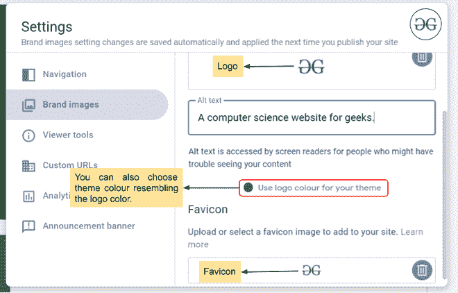

# 如何在新的谷歌网站中添加品牌形象？

> 原文:[https://www . geesforgeks . org/如何在新谷歌网站中添加品牌形象/](https://www.geeksforgeeks.org/how-to-add-brand-image-in-new-google-sites/)

每个网站都是不完整的，没有一个完美的标志或品牌形象。你可以成功地在你的谷歌网站上放置一个标志和一个图标。Favicon 是与网站或网页相关联的小图标。它增加了网页的美感。要添加品牌形象，请遵循以下步骤:

1.转到网站设置。

2.现在进入设置中的**品牌形象**选项。

3.现在我们要通过点击**上传按钮**上传 logo 和 favicon。您也可以通过点击**选择按钮**从网上选择。

之后，您的徽标和收藏夹图标将成功添加到您的谷歌网站网页中。此外，您还可以重新选择与徽标颜色相似的网页主题颜色。你也可以随时改变它们。